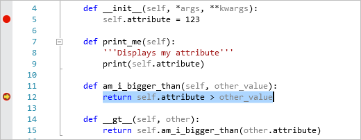
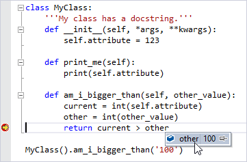
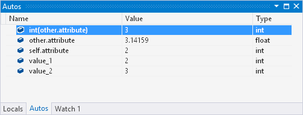
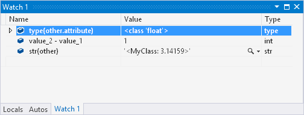
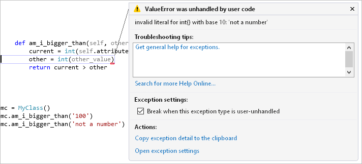
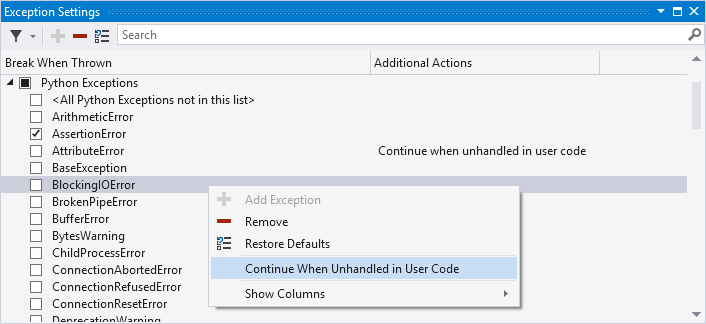

# Debugging Your Python Code

Python Tools for Visual Studio (PTVS) provides a comprehensive debugging experience for Python, including attaching to running processes, evaluating expressions in the Watch and Immediate windows, inspecting local variables, breakpoints, step in/out/over statements, Set Next Statement, and more. 

For a debugging overview, see [Getting Started with PTVS, Part 4: Debugging](https://youtu.be/bO7wpzgy74A?list=PLReL099Y5nRdLgGAdrb_YeTdEnd23s6Ff) (youtube.com, 3m30s).

In this topic:

- [Basic debugging](#basic-debugging)
- [Project debugging options](#project-debugging-options)
- [The Debug Interactive window](#the-debug-interactive-window)

Also see the following scenario-specific debugging topics:

- [Cross-platform remote debugging](debugging-cross-platform-remote.md)
- [Azure remote debugging](debugging-azure-remote.md)
- [Mixed-mode Python/C++ debugging](debugging-mixed-mode.md)
- [Symbols for mixed-mode debugging](debugging-symbols-for-mixed-mode.md)

> [!Tip]
> PTVS supports debugging without a project. With a stand-alone Python file open in Visual Studio right-click in the editor, select **Start with Debugging**, and PTVS launches the script with the global default environment (see [Python Environments](python-environments.md) and no arguments. But from then on, you have full debugging support.
>
> To control the environment and arguments, you'll need to create a project for the code. You can easily do this with the [From Existing Python Code](python-projects-in-visual-studio.md#creating-a-project-from-existing-files).

## Basic debugging

The basic debugging workflow involves settings breakpoints, stepping through code, inspecting values, and handling exceptions as described in the following sections. For complete details on the Visual Studio debugger, see [Debugging in Visual Studio](../debugger/debugging-in-visual-studio.md).

A debugging session starts with the **Debug > Start Debugging** command, the **Start** button on the toolbar, or the F5 key. This will launch your project's startup file (shown in bold in Solution Explorer) with the project's active environment and any command-line arguments or search paths that have been specified in Project Properties (see [Project debugging options](#project-debugging-options).

> [!Note]
> The debugger always starts with the active Python environment for the project. To change the environment, make a different one active as described on [Python Environments](python-environments.md).

### Breakpoints

Breakpoints stop execution of code at a marked point so you can inspect the program state. They're set by clicking in the left margin of the code editor or by right-clicking a line of code and selecting **Breakpoint > Insert Breakpoint**. A red dot appears on each line with a breakpoint.

Clicking the red dot or right-clicking the line of code and selecting **Breakpoint > Delete Breakpoint** removes the breakpoint. You can also disable it without removing it using the **Breakpoint > Disable Breakpoint** command.

> [!Note]
> Some breakpoints in Python can be surprising for those who are used to other languages. In Python, the entire file is executable code, so Python runs the file when it's loaded to process any top-level class or function definitions. If a breakpoint has been set, you may find the debugger breaking part-way through a class declaration. This is the correct, if sometimes surprising, behavior.

You can customize the conditions under which a breakpoint is triggered, such as breaking only when a variable has reached a certain value. To set conditions, right-click the breakpoint's red dot, select **Condition**, then create expressions using Python code. For full details on this feature in Visual Studio, see [Breakpoint conditions](../debugger/using-breakpoints.md#breakpoint-conditions)

When setting conditions, you can also set **Action** and create a message to log to the output window, optionally continuing execution automatically. This creates what is called a *tracepoint* without having to introduce logging code into your application directly:

### Stepping through code

Once stopped at a breakpoint, you have various ways to step through code or run blocks of code before breaking again. These commands are available in a number of places, including the top debug toolbar, the **Debug** menu, on the right-click context menu in the code editor, and through keyboard shortcuts (through not all commands are in all places):

| Feature | Keystroke | Description |
| --- | --- | --- |
| Continue | F5 | Runs code until the next breakpoint is reached. |
| Step Into | F11 | Runs the next statement and stops. If the next statement is a call to a function, the debugger stops at the first line of the function being called. |
| Step Over | F10 | Runs the next statement, including making a call to a function (running all its code) and applying any return value. Stepping over allows you to easily skip functions that you do not need to debug. |
| Step Out | Shift+F11 | Runs code until the end of the current function, then steps to the calling statement. This is useful when you don't need to debug the remainder of the current function. |
| Run to Cursor | Ctrl+F10 | Runs code up to the location of the caret in the editor. This allows you to easily skip over a segment of code that you don't need to debug. |
| Set Next Statement | Ctrl+Shift+F10 | Changes the current run point in the code to the location of the  caret. This allows you to omit a segment of code from being run at all, such as when you know it's faulty or produces and unwanted side-effect. |
| Show Next Statement | Alt+Num * | Returns you to the next statement that will be run. This is very helpful if you've been looking around in your code and don't know where the debugger is actually stopped. |

### Inspecting and modifying values

When stopped in the debugger, you can inspect and modify the values of variables. You can also use the Watch window to monitor individual variables as well as custom expressions. (See [Inspect Variables](../debugger/getting-started-with-the-debugger.md#BKMK_Inspect_Variables) for general details.)

To view a value using DataTips, simply hover the mouse over any variable in the editor. You can click on the value to change it:

The Autos window (**Debug > Windows > Autos**) contains variables and expressions that are close to the current statement. You can double-click in the value column or select and press F2 to edit the value:

The Locals window (**Debug > Windows > Locals**) displays all variables that are in the current scope, which can again be edited:

For more on using Autos and Locals, see [Inspecting Variables in the Autos and Locals Windows](../debugger/autos-and-locals-windows.md).

The Watch windows (**Debug > Windows > Watch > Watch 1-4**) allow you to enter arbitrary Python expressions and view the results. Expressions are reevaluated for each step:

For more on using Watch, see [Setting a Watch on Variables using the Watch and QuickWatch Windows](../debugger/watch-and-quickwatch-windows.md).

When inspected a string value(`str`, `unicode`, `bytes` and `bytearray` are all considered strings for this purpose), you'll see a magnifying glass icon on the right side of the value. Clicking this displays the unquoted string value in a popup dialog, with wrapping and scrolling, which is useful for long strings. In addition, clicking on the drop-down arrow on the icon will allow you to select plain text, HTML, XML, and JSON visualizations:

HTML, XML, and JSON visualizations appear in separate popup windows with syntax highlighting and tree views.

### Exceptions

If an error occurs while your program is being debugged, and you don't have an exception handler for it, the debugger breaks at the point of the exception:

At this poin tyou can inspect the program state, including the call stack. However, if you attempt to step through the code, the exception will continue being thrown until it is either handled or your program exits.

The **Debug > Windows > Exception Settings** menu command brings up a window in which you can expand **Python Exceptions**:

The checkbox for each exception controls whether the debugger *always* breaks when it is raised. You should check this box when you want to break more often for a particular exception.

By default, most exceptions will break when an exception handler cannot found in the source code. To change this behavior, right-click any exception and check or uncheck "Continue When Unhandled in User Code". You should uncheck this box when you want to break less often for an exception.

To configure an exception that does not appear in this list, click the **Add** button to add it. The name must match the full name of the exception.

## Project debugging options

By default, the debugger starts your program with the standard Python launcher, no command-line arguments, and no other special paths or conditions. These can be changed through the project's debug properties accessed by right-clicking your project in Solution Explorer, selecting **Properties**, and selecting the **Debug** tab.

### Launch mode options

The **Launch mode** options lets you choose between the following options, which enable different scenarios:

| Option | Description |
| --- | --- |
| Standard Python launcher | Uses debugging code written in portable Python that is compatible with CPython, IronPython, and variants such as Stackless Python. It provides the best experience for debugging pure Python code. When you attach to a running `python.exe` process, this launcher is used. This launcher also provides [mixed-mode debugging](debugging-mixed-mode.md) for CPython, allowing you to step seamlessly between C/C++ code and Python code. |
| Web launcher | Starts your default browser on launch and enables debugging of templates. See the [Web template debugging](template-web.md#debugging) section for more information. |
| Django Web launcher | Identical to the Web launcher and shown only for backwards compatibility. |
| IronPython (.NET) launcher | Uses the .NET debugger, which only works with IronPython but allows for stepping between any .NET language project, including C# and VB. This launcher is used if you attach to a running .NET process that is hosting IronPython. |

### Run options (search paths, startup arguments, and environment variables)

| Option | Description |
| --- | --- |
| Search Paths | These match what's shown in the project's Search Paths node in Solution Explorer. You can modify this value here, but it's easuer to use Solution Explorer that lets you browse folders and automatically converts paths to relative form. |
| Script Arguments | These are added to the command used to launch your script, appearing after your script's filename. The first item here will be available to your script as `sys.argv[1]`, the second as `sys.argv[2]`, and so on. |
| Interpreter Arguments | These are added to the launcher command line before the name of your script. Common arguments here are `-W ...` to control warnings, `-O` to slightly optimize your program, and `-u` to use unbuffered IO. IronPython users are likely to use this field to pass `-X` options, such as `-X:Frames` or `-X:MTA`. |
| Interpreter Path | Overrides the path associated with the current environment. This may be useful for launching your script with a non-standard interpreter. |
| Environment Variables | In this multi-line text box, add entries of the form `NAME=VALUE`. This setting is applied last, on top of any existing global environment variables, and after `PYTHONPATH` is set according to the Search Paths setting, and so it can be used to manually override any of those. |

## Immediate and interactive windows

There are two interactive windows you can use during a debugging session: the standard Visual Studio Immediate window, and the Python Debug Interactive window.

The Immediate window (**Debug > Windows > Immediate**) is used for quick evaluation of Python expressions and inspection or assignment of variables within the running program. See the general [Immediate Window](../ide/reference/immediate-window.md) topic for details.

The Python Debug Interactive window (**Debug > Windows > Python Debug Interactive**) is richer as it makes the full [Interactive REPL](interactive-repl.md) experience available while debugging, including writing and running code. It automatically connects to any process started in the debugger using the Standard Python launcher (including processes attached through **Debug > Attach to Process*). It's not, however, available when using mixed-mode C/C++ debugging.

The Debug Interactive window supports special meta-commands in addition to the [standard REPL commands](interactive-repl.md#meta-commands):

| Command | Arguments | Description |
| --- | --- | --- |
| `$continue`, `$cont`, `$c` | Starts running the program from the current statement. |
| `$down`, `$d` | Move the current frame one level down in the stack trace. |
| `$frame` | | Displays the current frame id.
| `$frame` | frame id | Switches the current frame to the specified frame id.
| `$load` | Loads commands from file and executes until complete |
| `$proc` |  | Displays the current process id. |
| `$proc` | process id | Switches the current process to the specified process id. |
| `$procs` | | Lists the processes currently being debugged. |
| `$stepin`, `$step`, `$s` | Steps into the next function call, if possible. |
| `$stepout`, `$return`, `$r` | Steps out of the current function. |
| `$stepover`, `$until`, `$unt` | Steps over the next function call. |
| `$thread` | | Displays the current thread id. |
| `$thread` | thread id | Switches the current thread to the specified thread id. |
| `$threads` | | Lists the threads currently being debugged. |
| `$up`, `$u` | | Move the current frame one level up in the stack trace. |
| `$where`, `$w`, `$bt` | Lists the frames for the current thread. |

Note that the standard debugger windows such as Processes, Threads and Call Stack are not synchronized with the Debug Interactive window. This means that changing the active process, thread, or frame in the Debug Interactive window will not affect the other debugger windows, and similarly, changing the active process, thread, or frame in the other debugger windows will not affect the Debug Interactive window.

The Debug Interactive window has its own set of options, which you can access through **Tools > Options > Python Tools >Debug Interactive Window**. Unlike the regular Python Interactive window, which has a separate instance for each Python environment, there is only one Debug Interactive window and it always uses the Python interpreter for the process being debugged.

