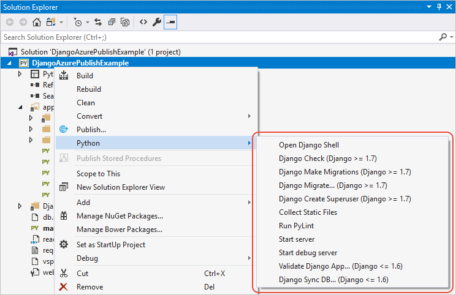
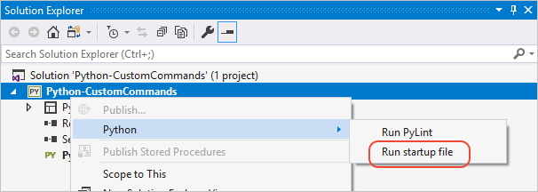
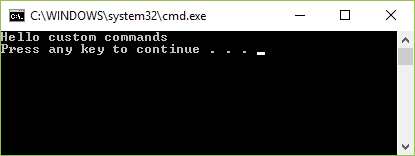

# Defining custom commands for Python projects

In the process of working with your Python projects, you may find it yourself switching to a command window to run specific scripts or modules, run pip commands, or run some other arbitrary tool. To improve your workflow, you can add custom commands to the **Python** submenu in the Python project context menu. Those commands can run in a console window or in the Visual Studio output window. You can also use regular expressions to instruct Visual Studio how to parse errors and warnings from the command's output.

By default, that menu contains only the single **Run Pylint** command:


Custom commands appear in this same context menu. Custom commands are added to a project file directly, where they apply to that individual project. You can also define custom commands in a `.targets` file that can easily be imported into multiple project files.

Certain Python project templates in Visual Studio already add custom commands of their own using their `.targets` file. For example, the Bottle Web Project and Flask Web Project templates both add two commands, **Start server** and **Start debug server**. The Django Web Project template adds these same commands plus quite a few more:



Each custom command can refer to a Python file, a Python module, inline Python code, an arbitrary executable, or a pip command. You can also specify how and where the command runs.

> [!Tip]
> Whenever you make changes to a project file in a text editor, it's necessary to reload the project in Visual Studio to apply those changes. For example, you must reload a project after adding custom command definitions for those commands to appear on the project's context menu.
>
> As you may know, Visual Studio provides a means to edit the project file direct. You first right-click the project file and select **Unload project**, then right-click again and select **Edit (project-name)** to open the project in the Visual Studio editor. You then make and save edits, right-click the project once more, and select **Reload project**, which also prompts you to confirm closing the project file in the editor.
>
> When developing a custom command, however, all these clicks can become tedious. For a more efficient workflow, load the project in Visual Studio and also open the `'.pyproj` file in a separate editor altogether (such as another instance of Visual Studio, Visual Studio Code, Notepad, etc.). When you save changes in the editor and switch to Visual Studio, Visual Studio detects changes and asks whether to reload the project ("The project (name) has been modified outside the environment."). Select **Reload** and your changes are immediately applied in just one step.

## Walkthrough: add a command to a project file

To familiarize yourself with custom commands, this section walks through a simple example that runs a project's startup file directly using python.exe. (Such a command is effectively the same as using **Debug > Start Without Debugging**.)

1. Create a new project named "Python-CustomCommands" using the "Python Application" template. (See [Quickstart: Create a Python project from a template](quickstart-02-project-from-template.md) for instructions if you're not already familiar with the process.)

1. In `Python_CustomCommands.py`, add the code `print("Hello custom commands")`.

1. Right-click the project in **Solution Explorer**, select **Python**, and notice that the only command that appears on the submenu is **Run PyLint**. Your custom commands appear on this same submenu.

1. As suggested in the introduction, open `Python-CustomCommands.pyproj` in a separate text editor. Then add the following lines at the end of the file just inside the closing `</Project>` and save the file.

    ```xml
    <PropertyGroup>
      <PythonCommands>
        $(PythonCommands);
      </PythonCommands>
    </PropertyGroup>
    ```

1. Switch back to Visual Studio and select **Reload** when it prompts you about the file change. Then check the **Python** menu again to see that **Run PyLint** is still the only item shown there because the lines you added only replicate the default `<PythonCommands>` property group containing the PyLint command.

1. Switch to the editor with the project file and add the following `<Target>` definition after the `<PropertyGroup>`. As explained later in this article, this `Target` element defines a custom command to run the startup file (identified by the "StartupFile" property) using `python.exe` in a console window. The attribute `ExecuteIn="consolepause"` uses a console that waits for you to press a key before closing.

    ```xml
    <Target Name="Example_RunStartupFile" Label="Run startup file" Returns="@(Commands)">
      <CreatePythonCommandItem
        TargetType="script"
        Target="$(StartupFile)"
        Arguments=""
        WorkingDirectory="$(MSBuildProjectDirectory)"
        ExecuteIn="consolepause">
        <Output TaskParameter="Command" ItemName="Commands" />
      </CreatePythonCommandItem>
    </Target>
    ```

1. Add the value of the Target's `Name` attribute to the `<PythonCommands>` property group added earlier, so that the element looks like the code below. Adding the name of the target to this list is what adds it to the **Python** menu.

    ```xml
      <PythonCommands>
        $(PythonCommands);
        Example_RunStartupFile
      </PythonCommands>
    ```

    If you want your command to appear before those defined in `$(PythonCommands)`, place them before that token.

1. Save the project file, switch to Visual Studio, and reload the project when prompted. Then right-click the "Python-CustomCommands" project and select **Python**. You should see a **Run startup file** item on the menu. If you don't see the menu item, check that you added the name to the `<PythonCommands>` element. Also see [Troubleshooting](#troubleshooting) later in this article.

    

1. Select the **Run startup file** command and you should see a command window appear with the text "Hello custom commands" followed by "Press any key to continue . . .".  Press a key to close the window.

    

1. Return to the editor with the project file and change the value of the `ExecuteIn` attribute to `output`. Save the file, switch to Visual Studio, reload the project, and invoke the command again. This time you see the program's output appear in Visual Studio's **Output** window:

    

1. To add more commands, define a suitable `<Target>` element for each command, add the name of the target into the `<PythonCommands>` property group, and reload the project in Visual Studio.

>[!Tip]
> If you invoke a command that uses project properties, such as `($StartupFile)`, and the command fails because the token is undefined, Visual Studio disables the command until you reload the project. Making changes to the project that would define the property, however, does not refresh the state of these commands, so you still need to reload the project in such cases.

## Command target structure

The general form of the `<Target>` element is shown in the following pseudo-code:

```xml
<Target Name="Name1" Label="Display Name" Returns="@(Commands)">
    <CreatePythonCommandItem Target="filename, module name, or code"
        TargetType="executable/script/module/code/pip"
        Arguments="..."
        ExecuteIn="console/consolepause/output/repl[:Display name]/none"
        WorkingDirectory="..."
        ErrorRegex="..."
        WarningRegex="..."
        RequiredPackages="...;..."
        Environment="...">

      <!-- Output always appears in this form, with these exact attributes -->
      <Output TaskParameter="Command" ItemName="Commands" />
    </CreatePythonCommandItem>
  </Target>
```

To refer to project properties or environment variables in attribute values, use the name within a `$()` token, such as `$(StartupFile)` and `$(MSBuildProjectDirectory)`. For more information, see [MSBuild properties](../msbuild/msbuild-properties.md).

### Target attributes

| Attribute | Required | Description |
| --- | --- | --- |
| Name | Yes | The identifier for the command within the Visual Studio project. This name must be added to the `<PythonCommands>` property group for the command to appear on the Python submenu. |
| Label | Yes | The UI display name that appears in the Python sub-menu. |
| Returns | Yes | Must contain `@(Commands)`, which identifies the target as a command. |

### CreatePythonCommandItem attributes

All attribute values are case-insensitive.

| Attribute | Required | Description |
| --- | --- | --- |
| TargetType | Yes | Specifies what the Target attribute contains and how it's used along with the Arguments attribute:<ul><li>**executable**: Run the executable named in Target, appending the value in Arguments, as if entered directly on the command line. The value must contain only a program name without arguments.</li><li>**script**: Run `python.exe` with the filename in Target, followed with the value in Arguments.</li><li>**module**: Run `python -m` followed by the module name in Target, followed with the value in Arguments.</li><li>**code**: Run the inline code contained in Target. The Arguments value is ignored.</li><li>**pip**: Run `pip` with the command in Target, followed by Arguments; is ExecuteIn is set to "output", however, pip assumes the `install` command and uses Target as the package name.</li></ul> |
| Target | Yes | The filename, module name, code, or pip command to use, depending on the TargetType. |
| Arguments | Optional | Specifies a string of arguments (if any) to give to the target. Note that when TargetType is `script`, the arguments are given to the Python program, not `python.exe`. Ignored for the `code` TargetType. |
| ExecuteIn | Yes | Specifies the environment in which to run the command:<ul><li>**console**: (Default) Runs Target and the arguments as if they are entered directly on the command line. A command window appears while the Target is running, then is closed automatically.</li><li>**consolepause**: Same a console, but waits for a keypress before closing the window.</li><li>**output**: Runs Target and displays its results in the Output window in Visual Studio. If TargetType is "pip", Visual Studio uses Target as the package name and appends Arguments.</li><li>**repl**: Runs Target in the [Python Interactive Window](interactive-repl.md); the optional display name is used for the title of the window.</li><li>**none**: behaves the same as console.</li></ul>|
| WorkingDirectory | Optional | The folder in which to run the command. |
| ErrorRegex<br>WarningRegEx | Optional | Used only when ExecuteIn is `output`. Both values specify a regular expression with which Visual Studio parses command output to show errors and warnings in its Error List window. If not specified, the command does not affect the Error List window. For more information on what Visual Studio expects, see [Named capture groups](#named-capture-groups-for-regular-expressions). |
| RequiredPackages | Optional | A list of package requirements for the command using the same format as [requirements.txt](https://pip.readthedocs.io/en/1.1/requirements.html) (pip.readthedocs.io). The **Run PyLint** command, for example specifies `pylint>=1.0.0`. Before running the command, Visual Studio checks that all packages in the list are installed. Visual Studio uses pip to install any missing packages. |
| Environment | Optional | A string of environment variables to define before running the command. Each variable uses of the form NAME=VALUE with multiple variables separated by semicolons. A variable with multiple values must be contained in single or double quotes, as in 'NAME=VALUE1;VALUE2'. |

#### Named capture groups for regular expressions

When parsing error and warnings from a command's output, Visual Studio expects that the regular expressions in the `ErrorRegex` and `WarningRegex` values use the following named groups:

- `(?<message>...)`: Text of the error
- `(?<code>...)`: Error code
- `(?<filename>...)`: Name of the file for which the error is reported
- `(?<line>...)`: Line number of the location in the file for which the error reported.
- `(?<column>...)`: Column number of the location in the file for which the error reported.

For example, PyLint produces warnings of the following form:

```output
************* Module hello
C:  1, 0: Missing module docstring (missing-docstring)
```

To allow Visual Studio to extract the right information from such warnings and show them in the **Error List** window, the `WarningRegex` value for the **Run Pylint** command is as follows:

```regex
^(?<filename>.+?)\((?<line>\d+),(?<column>\d+)\): warning (?<msg_id>.+?): (?<message>.+?)$]]
```

(Note that `msg_id` in the value should actually be `code`, see [Issue 3680](https://github.com/Microsoft/PTVS/issues/3680).)

## Creating a .targets file with custom commands

Defining custom commands in a project file makes the available to only that project file. To use commands in multiple project files, you instead define the `<PythonCommands>` property group and all your `<Target>` elements in a `.targets` file. You then import that file into individual project files.

The `.targets` file is formatted as follows:

```xml
<Project xmlns="http://schemas.microsoft.com/developer/msbuild/2003">
  <PropertyGroup>
    <PythonCommands>
      $(PythonCommands);
      <!-- Additional command names -->
    </PythonCommands>
  </PropertyGroup>

  <Target Name="..." Label="..." Returns="@(Commands)">
    <!-- CreatePythonCommandItem and Output elements... -->
  </Target>

  <!-- Any number of additional Target elements-->
</Project>
```

To load a `.targets` file into a project, place a `<Import Project="(path)">` element anywhere within the `<Project>` element. For example, if you have a file named `CustomCommands.targets` in a `targets` subfolder in your project, use the following code:

```xml
<Import Project="targets/CustomCommands.targets"/>
```

> [!Note]
> Whenever you change the `.targets` file, you need to reload the *solution* that contains a project, not just the project itself.

## Example commands

### Run PyLint (module target)

The following code appears in the `Microsoft.PythonTools.targets` file:

```xml
<PropertyGroup>
  <PythonCommands>$(PythonCommands);PythonRunPyLintCommand</PythonCommands>
  <PyLintWarningRegex>
    <![CDATA[^(?<filename>.+?)\((?<line>\d+),(?<column>\d+)\): warning (?<msg_id>.+?): (?<message>.+?)$]]>
  </PyLintWarningRegex>
</PropertyGroup>

<Target Name="PythonRunPyLintCommand"
        Label="resource:Microsoft.PythonTools.Common;Microsoft.PythonTools.Common.Strings;RunPyLintLabel"
        Returns="@(Commands)">
  <CreatePythonCommandItem Target="pylint.lint"
                           TargetType="module"
                           Arguments="&quot;--msg-template={abspath}({line},{column}): warning {msg_id}: {msg} [{C}:{symbol}]&quot; -r n @(Compile, ' ')"
                           WorkingDirectory="$(MSBuildProjectDirectory)"
                           ExecuteIn="output"
                           RequiredPackages="pylint&gt;=1.0.0"
                           WarningRegex="$(PyLintWarningRegex)">
    <Output TaskParameter="Command" ItemName="Commands" />
  </CreatePythonCommandItem>
</Target>
```

### Run pip install with a specific package (pip target)

The following command runs `pip install my-package` in the Output window. You might use such a command like when developing a package and testing its installation. Note that Target contains the package name rather than the `install` command, which is assumed when using `ExecuteIn="output"`.

```xml
<PropertyGroup>
  <PythonCommands>$(PythonCommands);InstallMyPackage</PythonCommands>
</PropertyGroup>

<Target Name="InstallMyPackage" Label="pip install my-package" Returns="@(Commands)">
  <CreatePythonCommandItem Target="my-package" TargetType="pip" Arguments=""
    WorkingDirectory="$(MSBuildProjectDirectory)" ExecuteIn="output">
    <Output TaskParameter="Command" ItemName="Commands" />
  </CreatePythonCommandItem>
</Target>
```

### Show outdated pip packages (pip target)

```xml
<PropertyGroup>
  <PythonCommands>$(PythonCommands);ShowOutdatedPackages</PythonCommands>
</PropertyGroup>

<Target Name="ShowOutdatedPackages" Label="Show outdated pip packages" Returns="@(Commands)">
  <CreatePythonCommandItem Target="list" TargetType="pip" Arguments="-o --format columns"
    WorkingDirectory="$(MSBuildProjectDirectory)" ExecuteIn="consolepause">
    <Output TaskParameter="Command" ItemName="Commands" />
  </CreatePythonCommandItem>
</Target>
```

### Run an executable with consolepause

The following command simply runs `where` to show Python files starting in the project folder:

```xml
<PropertyGroup>
  <PythonCommands>$(PythonCommands);ShowAllPythonFilesInProject</PythonCommands>
</PropertyGroup>

<Target Name="ShowAllPythonFilesInProject" Label="Show Python files in project" Returns="@(Commands)">
  <CreatePythonCommandItem Target="where" TargetType="executable" Arguments="/r . *.py"
    WorkingDirectory="$(MSBuildProjectDirectory)" ExecuteIn="output">
    <Output TaskParameter="Command" ItemName="Commands" />
  </CreatePythonCommandItem>
</Target>
```

### Run server and run debug server commands

To explore how the **Start server** and **Start debug server** commands for web projects are defined, examine the [Microsoft.PythonTools.Web.targets](https://github.com/Microsoft/PTVS/blob/master/Python/Product/BuildTasks/Microsoft.PythonTools.Web.targets) (GitHub).

### Install package for development

```xml
<PropertyGroup>
  <PythonCommands>PipInstallDevCommand;$(PythonCommands);</PythonCommands>
</PropertyGroup>

<Target Name="PipInstallDevCommand" Label="Install package for development" Returns="@(Commands)">
    <CreatePythonCommandItem Target="pip" TargetType="module" Arguments="install --editable $(ProjectDir)"
        WorkingDirectory="$(WorkingDirectory)" ExecuteIn="Repl:Install package for development">
      <Output TaskParameter="Command" ItemName="Commands" />
    </CreatePythonCommandItem>
  </Target>
```

*From [fxthomas/Example.pyproj.xml](https://gist.github.com/fxthomas/5c601e3e0c1a091bcf56aed0f2960cfa) (GitHub), used with permission.*

### Generate Windows installer

```xml
<PropertyGroup>
  <PythonCommands>$(PythonCommands);BdistWinInstCommand;</PythonCommands>
</PropertyGroup>

<Target Name="BdistWinInstCommand" Label="Generate Windows Installer" Returns="@(Commands)">
    <CreatePythonCommandItem Target="$(ProjectDir)setup.py" TargetType="script"
        Arguments="bdist_wininst --user-access-control=force --title &quot;$(InstallerTitle)&quot; --dist-dir=&quot;$(DistributionOutputDir)&quot;"
        WorkingDirectory="$(WorkingDirectory)" RequiredPackages="setuptools"
        ExecuteIn="Repl:Generate Windows Installer">
      <Output TaskParameter="Command" ItemName="Commands" />
    </CreatePythonCommandItem>
  </Target>
```

*From [fxthomas/Example.pyproj.xml](https://gist.github.com/fxthomas/5c601e3e0c1a091bcf56aed0f2960cfa) (GitHub), used with permission.*

### Generate wheel package

```xml
<PropertyGroup>
  <PythonCommands>$(PythonCommands);BdistWheelCommand;</PythonCommands>
</PropertyGroup>

<Target Name="BdistWheelCommand" Label="Generate Wheel Package" Returns="@(Commands)">

  <CreatePythonCommandItem Target="$(ProjectDir)setup.py" TargetType="script"
      Arguments="bdist_wheel --dist-dir=&quot;$(DistributionOutputDir)&quot;"
      WorkingDirectory="$(WorkingDirectory)" RequiredPackages="wheel;setuptools"
      ExecuteIn="Repl:Generate Wheel Package">
    <Output TaskParameter="Command" ItemName="Commands" />
  </CreatePythonCommandItem>
</Target>
```

*From [fxthomas/Example.pyproj.xml](https://gist.github.com/fxthomas/5c601e3e0c1a091bcf56aed0f2960cfa) (GitHub), used with permission.*

## Troubleshooting

### Message: "The project file could not be loaded"

Indicates that you have syntax errors in the project file. The message includes the specific error with a line number and character position.

### Console window closes immediately after command is run

Use `ExecuteIn="consolepause"` instead of `ExecuteIn="console"`.

### Command does not appear on the menu

Check that the command is included in the `<PythonCommands>` property group, and that the name in the command list matches the name specified in the `<Target>` element.

For example, in the following elements, the "Example" name in the property group does not match the name "ExampleCommand" in the target. Visual Studio does not find a command named "Example", so no command appears. Either use "ExampleCommand" in the command list, or change the name of the target to "Example" only.

```xml
  <PropertyGroup>
    <PythonCommands>$(PythonCommands);Example</PythonCommands>
  </PropertyGroup>
  <Target Name="ExampleCommand" Label="Example Command" Returns="@(Commands)">
    <!-- ... -->
  </Target>
```

### Message: An error occurred while running (command name). Failed to get command (target-name) from project.

Indicates that the contents of the `<Target>` or `<CreatePythonCommandItem>` elements are incorrect. Possible reasons include:

- The required `Target` attribute is empty.
- The required `TargetType` attribute is empty or contains an unrecognized value.
- The required `ExecuteIn` attribute is empty or contains an unrecognized value.
- `ErrorRegex` or `WarningRegex` is specified without setting `ExecuteIn="output"`.
- Unrecognized attributes exist in the element. For example, you may have used `Argumnets` (misspelled) instead of `Arguments`.

Attribute values can be empty if you refer to a property that's not defined. For example, if you use the token `$(StartupFile)` but no startup file has been defined in the project, then the token resolves to an empty string. In such cases, you may want to define a default value. For example, the **Run server** and **Run debug server** commands defined in the Bottle, Flask, and Django project templates default to `manage.py` if you haven't otherwise specified a server startup file in the project properties.

### Visual Studio hangs and crashes when running the command

You're likely attempting to run a console command with `ExecuteIn="output"`, in which case Visual Studio may crash trying to parse the output. Use `ExecuteIn="console"` instead. (See [Issue 3682](https://github.com/Microsoft/PTVS/issues/3681).)

### Executable command "is not recognized as an internal or external command, operate program or batch file"

When using `TargetType="executable"`, the value in `Target` must be *only* the program name without any arguments, such as "python" or "python.exe" only. Move any arguments to the `Arguments` attribute.
