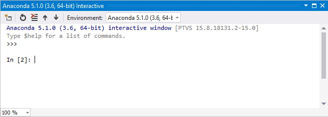
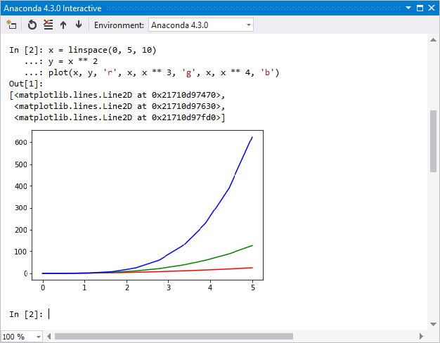
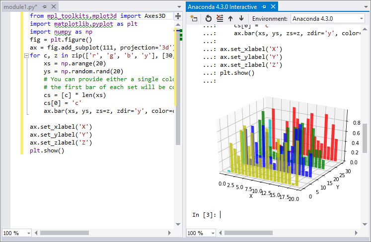

# Using the IPython REPL

The IPython interactive window is an advanced yet user-friendly interactive development environment that's cross-platform and has Interactive Parallel Computing features. In this topic we'll walk through using IPython with the Python Tools for Visual Studio (PTVS), using the [Scipy Stack package](http://www.lfd.uci.edu/~gohlke/pythonlibs/#scipy-stack) from UCI's Python Extensions page. The steps here also work if installed Anaconda, which includes IPython.

> [!Note]
> IronPython does not support IPython, despite the fact that you can select it on the Interactive Options form. You can upvote the [feature request](https://github.com/Microsoft/PTVS/issues/84) or implement it if you'd like.

1. Make sure the IPython package is installed correctly by going to your Python installation directory and starting IPython in Pylab mode:

    ```bash
        ipython --pylab
    ```

1. Enter the following:

    ```python
        x = linspace(0, 5, 10)
        y = x ** 2
        plot(x, y, 'r')
    ```

1. If everything is configured properly, you should see something like this:

    

1. Open Visual Studio, switch to the Python Environments window, and select your Python environment.
1. Look at the **pip** tab and ensure that `IPython` and `matplotlib` are listed. If not, install them here.
1. Select the **Overview** tab, select **Configure interactive options**, set **Interactive Mode** to IPython, and select **OK**:

    

1. Select **Open interactive window** to bring up the interactive window in IPython mode with PyLab. You may need to reset the window if you have just changed the interactive mode:

    

1. Enter the following code:

    ```python
        x = linspace(0, 5, 10)
        y = x ** 2
        plot(x, y, 'r', x, x ** 3, 'g', x, x ** 4, 'b')
    ```

1. After entering the last line, you should see an inline graph (which you can resize by dragging on the lower right-hand corner) if desired.

    

1. Instead of typing in the REPL, you can instead write code in the editor, select it, right-click, and select the **Send to interactive** command (Ctrl-E,E). Try pasting the code below into the editor, selecting it with Ctrl-A, then sending to the interactive window. (Note that when PTVS sends code to the interactive window, it sends it as one unit to avoid giving you intermediate or partial graphs.)

    ```python
        from mpl_toolkits.mplot3d import Axes3D
        import matplotlib.pyplot as plt
        import numpy as np
        fig = plt.figure()
        ax = fig.add_subplot(111, projection='3d')
        for c, z in zip(['r', 'g', 'b', 'y'], [30, 20, 10, 0]):
            xs = np.arange(20)
            ys = np.random.rand(20)
            # You can provide either a single color or an array. To demonstrate this,
            # the first bar of each set will be colored cyan.
            cs = [c] * len(xs) 
            cs[0] = 'c' 
            ax.bar(xs, ys, zs=z, zdir='y', color=cs, alpha=0.8)

        ax.set_xlabel('X') 
        ax.set_ylabel('Y') 
        ax.set_zlabel('Z') 
        plt.show()
    ```

    

1. To see the graphs outside of the interactive window, run the code instead using the **Debug > Start without Debugging** command.
    
1. IPython has a number of useful features such as escaping to the system shell, variable substitution, capturing output, etc. Please refer to the IPython reference guide for further information:

    

1. You can also use IPython in "notebook" mode where you can use any browser on any OS as the canvas. The back-end IPython engine can be local on your machine, or remote. Windows Azure has support for running IPython on a Windows or Linux VM.

    

    For a video walkthrough (5m22s), see [IPython on Windows Azure demo](http://www.youtube.com/watch?v=ljrSOkMs7DQ); refer also to the [IPython Notebook](https://docs.microsoft.com/en-us/azure/virtual-machines/virtual-machines-linux-jupyter-notebook) in the Azure documentation.
