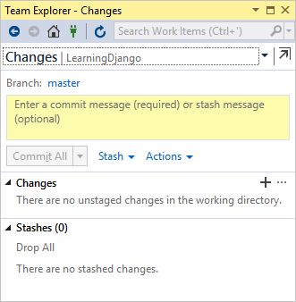
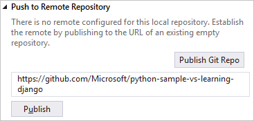
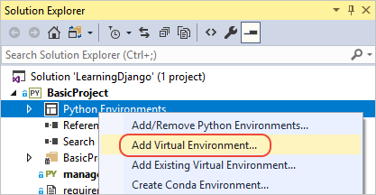
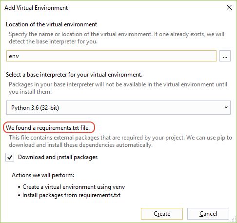
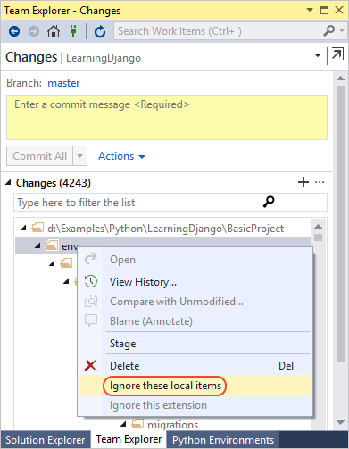
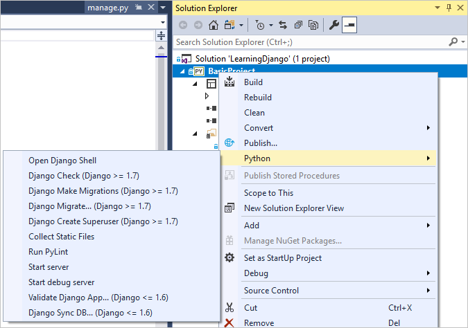
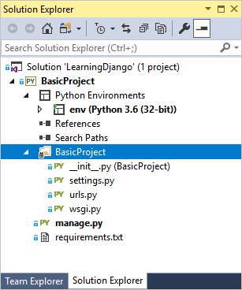

# Tutorial: Get started with the Django web framework in Visual Studio

[Django](https://www.djangoproject.com/) is a high-level Python framework designed for rapid, secure, and scalable web development. This tutorial explores the Django framework in the context of the project templates that Visual Studio provides to streamline the creation of Django-based web apps.

In this tutorial, you learn how to:

> [!div class="checklist"]
> - Create a basic Django project in a Git repository using the "Blank Django Web Project" template (step 1)
> - Create a Django app with one page and render that page using a template (step 2)
> - Serve static files, add pages, and use template inheritance (step 3)
> - Use the Django Web Project template to create an app with multiple pages and responsive design (step 4)
> - Authenticate users (step 5)
> - Use the Polls Django Web Project template to create an app that uses models, database migrations, and customizations to the administrative interface (step 6)

## Prerequisites

- Visual Studio 2017 on Windows with the following options:
  - The **Python development** workload (**Workload** tab in the installer). For instructions, see [Install Python support in Visual Studio](installing-python-support-in-visual-studio.md).
  - **Git for Windows** and **GitHub Extension for Visual Studio** on the **Individual components** tab under **Code tools**.

Django project templates are also included with all earlier versions of Python Tools for Visual Studio, though details may differ from what's discussed in this tutorial (especially different with earlier versions of the Django framework).

Python development is not presently supported in Visual Studio for Mac. On Mac and Linux, use the [Python extension in Visual Studio Code](https://code.visualstudio.com/docs/python/python-tutorial).

### "Visual Studio projects" and "Django projects"

In Django terminology, a "Django project" is composed of several site-level configuration files along with one or more "apps" that you deploy to a web host to create a full web application. A Django project can contain multiple apps, and the same app can be in multiple Django projects.

A Visual Studio project, for its part, can contain the Django project along with multiple apps. For the sake of simplicity, whenever this tutorial refers to just a "project," it's referring to the Visual Studio project. When it refers to the "Django project" portion of the web application, it uses "Django project" specifically.

Over the course of this tutorial you'll create a single Visual Studio solution that contains three separate Django projects, each of which contains a single Django app. By keeping the projects in the same solution, you can easily switch back and forth between different files for comparison.

## Step 1-1: Create a Visual Studio project and solution

When working with Django from the command line, you typically start a project by running the `django-admin startproject <project_name>` command. In Visual Studio, using the "Blank Django Web Project" template provides the same structure within a Visual Studio project and solution.

1. In Visual Studio, select **File** > **New** > **Project**, search for "Django", and select the **Blank Django Web Project** template. (The template is also found under **Python** > **Web** in the left-hand list.)

    

1. In the fields at the bottom of the dialog, enter the following information (as shown in the previous graphic), then select **OK**:

    - **Name**: set the name of the Visual Studio project to **BasicProject**. This name is also used for the Django project.
    - **Location**: specify a location in which to create the Visual Studio solution and project.
    - **Solution**: leave this control set to default **Create new solution** option.
    - **Solution name**: set to **LearningDjango**, which is appropriate for the solution as a container for multiple projects in this tutorial.
    - **Create directory for solution**: Leave set (the default).
    - **Create new Git repository**: Select this option (which is clear by default) so that Visual Studio creates a local Git repository when it creates the solution. If you don't see this option, run the Visual Studio 2017 installer and add the **Git for Windows** and **GitHub Extension for Visual Studio** on the **Individual components** tab under **Code tools**.

1. After a moment, Visual Studio prompts you with a dialog saying **This project requires external packages** (shown below). This dialog appears because the template includes a *requirements.txt* file referencing the latest Django 1.x package. (Select **Show required packages** to see the exact dependencies.)

    

1. Select the option **I will install them myself**. You create the virtual environment shortly to make sure it's excluded from source control. (The environment can always be created from *requirements.txt*.)

## Step 1-2: Examine the Git controls and publish to a remote repository

Because you selected the **Create new Git repository** in the **New Project** dialog, the project is already committed to local source control as soon as the creation process is complete. In this step, you familiarize yourself with Visual Studio's Git controls and the **Team Explorer** window in which you work with source control.

1. Examine the Git controls on the bottom corner of the Visual Studio main window. From left to right, these controls show unpushed commits, uncommitted changes, the name of the repository, and the current branch:

    

    > [!Note]
    > If you don't select the **Create new Git repository** in the **New Project** dialog, the Git controls show only an **Add to source control** command that creates a local repository.
    >
    > 

1. Select the changes button, and Visual Studio opens its **Team Explorer** window on the **Changes** page. Because the newly created project is already committed to source control automatically, you don't see any pending changes.

    

1. On the Visual Studio status bar, select the unpushed commits button (the up arrow with **2**) to open the **Synchronization** page in **Team Explorer**. Because you have only a local repository, the page provides easy options to publish the repository to different remote repositories.

    

    You can choose whichever service you want for your own projects. This tutorial shows the use of GitHub, where the completed sample code for the tutorial is maintained in the [Microsoft/python-sample-vs-learning-django](https://github.com/Microsoft/python-sample-vs-learning-django) repository.

1. When selecting any of the **Publish** controls, **Team Explorer** prompts you for more information. For example, when publishing the sample for this tutorial, the repository itself had to be created first, in which case the **Push to Remote Repository** option was used with the repository's URL.

    

    If you don't have an existing repository, the **Publish to GitHub** and **Push to Visual Studio Team Services** options let you create one directly from within Visual Studio.

1. As you work through this tutorial, get into the habit of periodically using the controls in Visual Studio to commit and push changes. This tutorial reminds you at appropriate points.

> [!Tip]
> To quickly navigate within **Team Explorer**, select the header (that reads **Changes** or **Push** in the images above) to see a pop-up menu of the available pages.

### Question: What are some advantages of using source control from the beginning of a project?

Answer: First of all, using source control from the start, especially if you also use a remote repository, provides a regular offsite backup of your project. Unlike maintaining a project just on a local file system, source control also provides a complete change history and the easy ability to revert a single file or the whole project to a previous state. That change history helps determine the cause of regressions (test failures). Furthermore, source control is essential if multiple people are working on a project, as it manages overwrites and provides conflict resolution. Finally, source control, which is fundamentally a form of automation, sets you up well for automating builds, testing, and release management. It's really the first step in using DevOps for a project, and because the barriers to entry are so low, there's really no reason to not use source control from the beginning.

For further discussion on source control as automation, see [The Source of Truth: The Role of Repositories in DevOps](https://msdn.microsoft.com/magazine/mt763232), an article in MSDN Magazine written for mobile apps that applies also to web apps.

### Question: Can I prevent Visual Studio from auto-committing a new project?

Answer: Yes. To disable auto-commit, go to the **Settings** page in **Team Explorer**, select **Git** > **Global settings**, clear the option labeled **Commit changes after merge by default**, then select **Update**.

## Step 1-3: Create the virtual environment and exclude it from source control

Now that you've configured source control for your project, you can create the virtual environment that contains the necessary Django packages for the project. You can then use **Team Explorer** to exclude the environment's folder from source control.

1. In **Solution Explorer**, right-click the **Python Environments** node and select **Add Virtual Environment**.

    

1. An **Add Virtual Environment** dialog appears, with a message saying **We found a requirements.txt file.** This message indicates that Visual Studio uses that file to configure the virtual environment.

    

1. Select **Create** to accept the defaults. (You can change the name of the virtual environment if you want, which just changes the name of its subfolder, but `env` is a standard convention.)

1. Consent to administrator privileges if prompted, then be patient for a few minutes while Visual Studio downloads and installs packages, which for Django means expanding several thousand files in about as many subfolders! You can see progress in the Visual Studio **Output** window. While you're waiting, ponder the Question sections that follow.

1. On the Visual Studio Git controls (on the status bar), select the changes indicator (that shows **99&#42;**) which opens the **Changes** page in **Team Explorer**.

    Creating the virtual environment brought in thousands of changes, but you don't need to include any of them in source control because you (or anyone else cloning the project) can always recreate the environment from *requirements.txt*.

    To exclude the virtual environment, right-click the **env** folder and select **Ignore these local items**.

    

1. After excluding the virtual environment, the only remaining changes are to the project file and *.gitignore*. The *.gitignore* file contains an added entry for the virtual environment folder. You can double-click the file to see a diff.

1. Enter a commit message and select the **Commit All** button, then push the commits to your remote repository if you like.

### Question: Why do I want to create a virtual environment?

Answer: A virtual environment is a great way to isolate your app's exact dependencies. Such isolation avoids conflicts within a global Python environment, and aids both testing and collaboration. Over time, as you develop an app, you invariably bring in many helpful Python packages. By keeping packages in a project-specific virtual environment, you can easily update the project's *requirements.txt* file that describes that environment, which is included in source control. When the project is copied to any other computers, including build servers, deployment servers, and other development computers, it's easy to recreate the environment using only *requirements.txt* (which is why the environment doesn't need to be in source control). For more information, see [Use virtual environments](selecting-a-python-environment-for-a-project.md#using-virtual-environments).

### Question: How do I remove a virtual environment that's already committed to source control?

Answer: First, edit your *.gitignore* file to exclude the folder: find the section at the end with the comment `# Python Tools for Visual Studio (PTVS)` and add a new line for the virtual environment folder, such as `/BasicProject/env`. (Because Visual Studio doesn't show the file in **Solution Explorer**, open it directly using the **File** > **Open** > **File** menu command. You can also open the file from **Team Explorer**: on the **Settings** page, select **Repository Settings**, go to the **Ignore & Attributes Files** section, then select the **Edit** link next to **.gitignore**.)

Second, open a command window, navigate to the folder like *BasicProject* that contains the virtual environment folder such as *env*, and run `git rm -r env`. Then commit those changes from the command line (`git commit -m 'Remove venv'`) or commit from the **Changes** page of **Team Explorer**.

## Step 1-4: Examine the boilerplate code

Once project creation completes, examine the boilerplate Django project code (which is again the same as generated by the CLI command `django-admin startproject <project_name>`).

1. In your project root is *manage.py*, the Django command-line administrative utility that Visual Studio automatically sets as the project startup file. You run the utility on the command line using `python manage.py <command> [options]`. For common Django tasks, Visual Studio provides convenient menu commands. Right-click the project in **Solution Explorer** and select **Python** to see the list. You encounter some of these commands in the course of this tutorial.

    

1. In your project is a folder named the same as the project. It contains the basic Django project files:

    - *__init.py*: an empty file that tells Python that this folder is a Python package.
    - *wsgi.py*: an entry point for WSGI-compatible web servers to serve your project. You typically leave this file as-is as it provides the hooks for production web servers.
    - *settings.py*: contains settings for Django project, which you modify in the course of developing a web app.
    - *urls.py*: contains a table of contents for the Django project, which you also modify in the course of development.

    

1. As noted earlier, the Visual Studio template also adds a *requirements.txt* file to your project specifying the Django package dependency. The presence of this file is what invites you to create a virtual environment when first creating the project.

### Question: Can Visual Studio generate a requirements.txt file from a virtual environment after I install other packages?

Answer: Yes. Expand the **Python Environments** node, right-click your virtual environment, and select the **Generate requirements.txt** command. It's good to use this command periodically as you modify the environment, and commit changes to *requirements.txt* to source control along with any other code changes that depend on that environment. If you set up continuous integration on a build server, you should generate the file and commit changes whenever you modify the environment.

## Step 1-5: Run the empty Django project

1. In Visual Studio, select **Debug** > **Start Debugging** (**F5**) or use the **Web Server** button on the toolbar (the browser you see may vary):

    

1. Running the server means running the command `manage.py runserver <port>`, which starts Django's built-in development server. If Visual Studio says **Failed to start debugger** with a message about having no startup file, right-click **manage.py** in **Solution Explorer** and select **Set as Startup File**.

1. When you start the server, you see a console window open that also displays the server log. Visual Studio automatically opens a browser to `http://localhost:<port>`. Because the Django project has no apps, however, Django shows only a default page to acknowledge that what you have so far is working fine:

    

1. When you're done, stop the server by closing the console window, or by using the **Debug** > **Stop Debugging** command in Visual Studio.

### Question: Is Django a web server as well as a framework?

Answer: Yes and no. Django does have a built-in web server that's used for development purposes. This web server is what gets used when you run the web app locally, such as when debugging in Visual Studio. When you deploy to a web host, however, Django uses the host's web server instead. The *wsgi.py* module in the Django project takes care of hooking into the production servers.

### Question: What's the difference between using the Debug menu commands and the server commands on the project's Python submenu?

Answer: In addition to the **Debug** menu commands and toolbar buttons, you can also launch the server using the **Python** > **Run server** or **Python** > **Run debug server** commands on the project's context menu. Both commands open a console window in which you see the local URL (localhost:port) for the running server. However, you must manually open a browser with that URL, and running the debug server does not automatically start the Visual Studio debugger. You can attach a debugger to the running process later, if you want, using the **Debug** > **Attach to Process** command.

## Next steps

At this point, the basic Django project does not contain any apps. You create an app in the next step. Because you typically work with Django apps more than the Django project, you won't need to know much more about the boilerplate files at present.

> [!div class="nextstepaction"]
> [Create a Django app with views and page templates](learn-django-in-visual-studio-step-02-create-an-app.md)

## Go deeper

- Django project code: [Writing your first Django app, part 1](https://docs.djangoproject.com/en/2.0/intro/tutorial01/) (docs.djangoproject.com)
- Administrative utility: [django-admin and manage.py](https://docs.djangoproject.com/en/2.0/ref/django-admin/) (docs.djangoproject.com)
- Tutorial source code on GitHub: [Microsoft/python-sample-vs-learning-django](https://github.com/Microsoft/python-sample-vs-learning-django)
