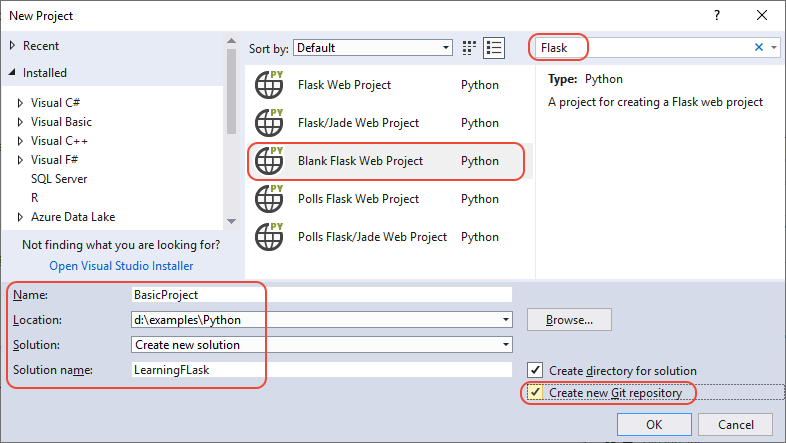
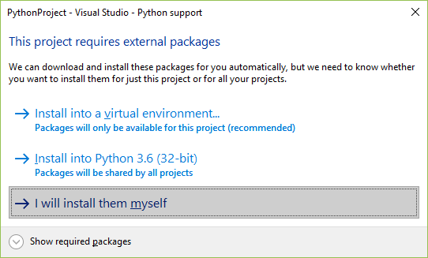
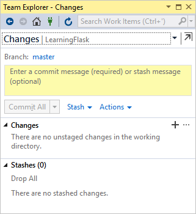
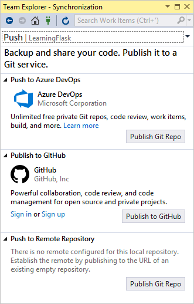
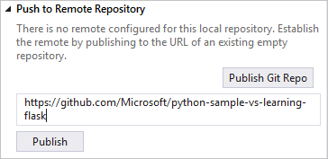
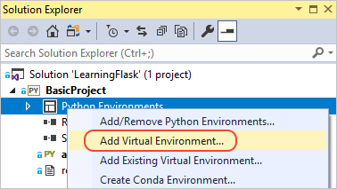
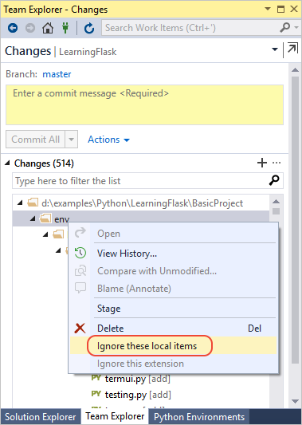
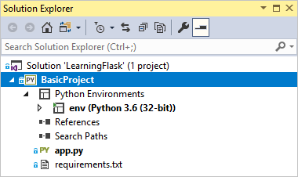
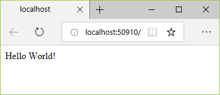

# Tutorial: Get started with the Flask web framework in Visual Studio

[Flask](http://flask.pocoo.org/) is a lightweight Python framework for web applications that provides the basics for URL routing and page rendering.

Flask is called a "micro" framework because it doesn't directly provide features like form validation, database abstraction, authentication, and so on. Such features are instead provided by special Python packages called Flask *extensions*. The extensions integrate seamlessly with Flask so that they appear as if they are part of Flask itself. For example, Flask itself doesn't provide a page template engine. Templating is provided by extensions such as Jinja and Jade, as demonstrated in this tutorial.

In this tutorial, you learn how to:

> [!div class="checklist"]
> - Create a basic Flask project in a Git repository using the "Blank Flask Web Project" template (step 1)
> - Create a Flask app with one page and render that page using a template (step 2)
> - Serve static files, add pages, and use template inheritance (step 3)
> - Use the Flask Web Project template to create an app with multiple pages and responsive design (step 4)
> - Use the Polls Flask Web Project template to create an polling app that uses a variety of storage options (Azure storage, MongoDB, or memory).

Over the course of these steps you create a single Visual Studio solution that contains three separate projects. You create the project using different Flask project templates that are included with Visual Studio. By keeping the projects in the same solution, you can easily switch back and forth between different files for comparison.

> [!Note]
> This tutorial differs from the [Flask Quickstart](../ide/quickstart-python.md?context=visualstudio/python/default) in that you learn more about Flask as well as how to use the different Flask project templates that provide a more extensive starting point for your own projects. For example, the project templates automatically install the Flask package when creating a project, rather than needing you to install the package manually as shown in the Quickstart.

## Prerequisites

- Visual Studio 2017 on Windows with the following options:
  - The **Python development** workload (**Workload** tab in the installer). For instructions, see [Install Python support in Visual Studio](installing-python-support-in-visual-studio.md).
  - **Git for Windows** and **GitHub Extension for Visual Studio** on the **Individual components** tab under **Code tools**.

Flask project templates are included with all earlier versions of Python Tools for Visual Studio, though details may differ from what's discussed in this tutorial.

Python development is not presently supported in Visual Studio for Mac. On Mac and Linux, use the [Python extension in Visual Studio Code](https://code.visualstudio.com/docs/python/python-tutorial).

## Step 1-1: Create a Visual Studio project and solution

1. In Visual Studio, select **File** > **New** > **Project**, search for "Flask", and select the **Blank Flask Web Project** template. (The template is also found under **Python** > **Web** in the left-hand list.)

    

1. In the fields at the bottom of the dialog, enter the following information (as shown in the previous graphic), then select **OK**:

    - **Name**: set the name of the Visual Studio project to **BasicProject**. This name is also used for the Flask project.
    - **Location**: specify a location in which to create the Visual Studio solution and project.
    - **Solution name**: set to **LearningFlask**, which is appropriate for the solution as a container for multiple projects in this tutorial.
    - **Create directory for solution**: Leave set (the default).
    - **Create new Git repository**: Select this option (which is clear by default) so that Visual Studio creates a local Git repository when it creates the solution. If you don't see this option, run the Visual Studio 2017 installer and add the **Git for Windows** and **GitHub Extension for Visual Studio** on the **Individual components** tab under **Code tools**.

1. After a moment, Visual Studio prompts you with a dialog saying **This project requires external packages** (shown below). This dialog appears because the template includes a *requirements.txt* file referencing the latest Flask 1.x package. (Select **Show required packages** to see the exact dependencies.)

    

1. Select the option **I will install them myself**. You create the virtual environment shortly to make sure it's excluded from source control. (The environment can always be created from *requirements.txt*.)

## Step 1-2: Examine the Git controls and publish to a remote repository

Because you selected the **Create new Git repository** in the **New Project** dialog, the project is already committed to local source control as soon as the creation process is complete. In this step, you familiarize yourself with Visual Studio's Git controls and the **Team Explorer** window in which you work with source control.

1. Examine the Git controls on the bottom corner of the Visual Studio main window. From left to right, these controls show unpushed commits, uncommitted changes, the name of the repository, and the current branch:

    

    > [!Note]
    > If you don't select the **Create new Git repository** in the **New Project** dialog, the Git controls show only an **Add to source control** command that creates a local repository.
    >
    > 

1. Select the changes button, and Visual Studio opens its **Team Explorer** window on the **Changes** page. Because the newly created project is already committed to source control automatically, you don't see any pending changes.

    

1. On the Visual Studio status bar, select the unpushed commits button (the up arrow with **2**) to open the **Synchronization** page in **Team Explorer**. Because you have only a local repository, the page provides easy options to publish the repository to different remote repositories.

    

    You can choose whichever service you want for your own projects. This tutorial shows the use of GitHub, where the completed sample code for the tutorial is maintained in the [Microsoft/python-sample-vs-learning-flask](https://github.com/Microsoft/python-sample-vs-learning-flask) repository.

1. When selecting any of the **Publish** controls, **Team Explorer** prompts you for more information. For example, when publishing the sample for this tutorial, the repository itself had to be created first, in which case the **Push to Remote Repository** option was used with the repository's URL.

    

    If you don't have an existing repository, the **Publish to GitHub** and **Push to Azure DevOps** options let you create one directly from within Visual Studio.

1. As you work through this tutorial, get into the habit of periodically using the controls in Visual Studio to commit and push changes. This tutorial reminds you at appropriate points.

> [!Tip]
> To quickly navigate within **Team Explorer**, select the header (that reads **Changes** or **Push** in the images above) to see a pop-up menu of the available pages.

### Question: What are some advantages of using source control from the beginning of a project?

Answer: First of all, using source control from the start, especially if you also use a remote repository, provides a regular offsite backup of your project. Unlike maintaining a project just on a local file system, source control also provides a complete change history and the easy ability to revert a single file or the whole project to a previous state. That change history helps determine the cause of regressions (test failures). Furthermore, source control is essential if multiple people are working on a project, as it manages overwrites and provides conflict resolution. Finally, source control, which is fundamentally a form of automation, sets you up well for automating builds, testing, and release management. It's really the first step in using DevOps for a project, and because the barriers to entry are so low, there's really no reason to not use source control from the beginning.

For further discussion on source control as automation, see [The Source of Truth: The Role of Repositories in DevOps](https://msdn.microsoft.com/magazine/mt763232), an article in MSDN Magazine written for mobile apps that applies also to web apps.

### Question: Can I prevent Visual Studio from auto-committing a new project?

Answer: Yes. To disable auto-commit, go to the **Settings** page in **Team Explorer**, select **Git** > **Global settings**, clear the option labeled **Commit changes after merge by default**, then select **Update**.

## Step 1-3: Create the virtual environment and exclude it from source control

Now that you've configured source control for your project, you can create the virtual environment the necessary Flask packages that the project requires. You can then use **Team Explorer** to exclude the environment's folder from source control.

1. In **Solution Explorer**, right-click the **Python Environments** node and select **Add Virtual Environment**.

    

1. An **Add Virtual Environment** dialog appears, with a message saying **We found a requirements.txt file.** This message indicates that Visual Studio uses that file to configure the virtual environment.

    

1. Select **Create** to accept the defaults. (You can change the name of the virtual environment if you want, which just changes the name of its subfolder, but `env` is a standard convention.)

1. Consent to administrator privileges if prompted, then be patient for a few minutes while Visual Studio downloads and installs packages, which for Flask and its dependencies means expanding about a thousand files in over 100 subfolders. You can see progress in the Visual Studio **Output** window. While you're waiting, ponder the Question sections that follow. You can also see a description of Flask's dependencies on the [Flask installation](http://flask.pocoo.org/docs/1.0/installation/#installation) page (flask.pcocoo.org).

1. On the Visual Studio Git controls (on the status bar), select the changes indicator (that shows **99&#42;**) which opens the **Changes** page in **Team Explorer**.

    Creating the virtual environment brought in hundreds of changes, but you don't need to include any of them in source control because you (or anyone else cloning the project) can always recreate the environment from *requirements.txt*.

    To exclude the virtual environment, right-click the **env** folder and select **Ignore these local items**.

    

1. After excluding the virtual environment, the only remaining changes are to the project file and *.gitignore*. The *.gitignore* file contains an added entry for the virtual environment folder. You can double-click the file to see a diff.

1. Enter a commit message and select the **Commit All** button, then push the commits to your remote repository if you like.

### Question: Why do I want to create a virtual environment?

Answer: A virtual environment is a great way to isolate your app's exact dependencies. Such isolation avoids conflicts within a global Python environment, and aids both testing and collaboration. Over time, as you develop an app, you invariably bring in many helpful Python packages. By keeping packages in a project-specific virtual environment, you can easily update the project's *requirements.txt* file that describes that environment, which is included in source control. When the project is copied to any other computers, including build servers, deployment servers, and other development computers, it's easy to recreate the environment using only *requirements.txt* (which is why the environment doesn't need to be in source control). For more information, see [Use virtual environments](selecting-a-python-environment-for-a-project.md#use-virtual-environments).

### Question: How do I remove a virtual environment that's already committed to source control?

Answer: First, edit your *.gitignore* file to exclude the folder: find the section at the end with the comment `# Python Tools for Visual Studio (PTVS)` and add a new line for the virtual environment folder, such as `/BasicProject/env`. (Because Visual Studio doesn't show the file in **Solution Explorer**, open it directly using the **File** > **Open** > **File** menu command. You can also open the file from **Team Explorer**: on the **Settings** page, select **Repository Settings**, go to the **Ignore & Attributes Files** section, then select the **Edit** link next to **.gitignore**.)

Second, open a command window, navigate to the folder like *BasicProject* that contains the virtual environment folder such as *env*, and run `git rm -r env`. Then commit those changes from the command line (`git commit -m 'Remove venv'`) or commit from the **Changes** page of **Team Explorer**.

## Step 1-4: Examine the boilerplate code

1. Once project creation completes, you see the solution and project in **Solution Explorer**, where the project contains only two files, *app.py* and *requirements.txt*:

    

1. As noted earlier, the *requirements.txt* file specifies the Flask package dependency. The presence of this file is what invites you to create a virtual environment when first creating the project.

1. The single *app.py* file contains three parts. First is an `import` statement for Flask, creating an instance of the `Flask` class, which is assigned to the variable `app`, and then assigning a `wsgi_app` variable (which is useful when deploying to a web host, but not used at present):

    ```python
    from flask import Flask
    app = Flask(__name__)

    # Make the WSGI interface available at the top level so wfastcgi can get it.
    wsgi_app = app.wsgi_app
    ```

1. The second part, at the end of the file, is a bit of optional code that starts the Flask development server with specific host and port values taken from environment variables (defaulting to localhost:5555):

    ```python
    if __name__ == '__main__':
        import os
        HOST = os.environ.get('SERVER_HOST', 'localhost')
        try:
            PORT = int(os.environ.get('SERVER_PORT', '5555'))
        except ValueError:
            PORT = 5555
        app.run(HOST, PORT)
    ```

1. Third is a short bit of code that assigns a function to a URL route, meaning that the function provides the resource identified by the URL. You define routes using Flask's `@app.route` decorator, whose argument is the relative URL from the site root. As you can see in the code, the function here returns only a text string, which is enough for a browser to render. In the steps that follow you render richer pages with HTML.

    ```python
    @app.route('/')
    def hello():
        """Renders a sample page."""
        return "Hello World!"
    ```

### Question: What is the purpose of the __name__ argument to the Flask class?

Answer: The argument is the name of the app's module or package, and tells Flask where to look for templates, static files, and other resources that belong to the app. For apps contained in a single module, `__name__` is always the proper value. It's also important for extensions that need debugging information. For more information, and additional arguments, see the [Flask class documentation](http://flask.pocoo.org/docs/1.0/api/#flask.Flask) (flask.pocoo.org).

### Question: Can a function have more than one route decorator?

Answer: Yes, you can use as many decorators as you want if the same function serves multiple routes. For example, to use the `hello` function for both "/" and "/hello", use the following code:

```python
@app.route('/')
@app.route('/hello')
def hello():
    """Renders a sample page."""
    return "Hello World!"
```

<a name="qa-url-variables"></a>

### Question: How does Flask work with variable URL routes and query parameters?

Answer: In a route, you mark any variable with `<variable_name>`, and Flask passes the variable to the function using a named argument. The variable can be part of the URL path or in a query parameter. For example, a route in the form of `'/hello/<name>` generates a string argument called `name` to the function, and using `?message=<msg>` in the route parses the value given for the "message=" query parameter and passes it to the function as `msg`:

```python
@app.route('/hello/<name>?message=<msg>')
def hello(name, msg):
    return "Hello " + name + "! Message is " + msg + "."
```

To change the type, prefix the variable with `int`, `float`, `path` (which accepts slashes to delineate folder names), and `uuid`. For details, see [Variable rules](http://flask.pocoo.org/docs/1.0/quickstart/#variable-rules) in the Flask documentation.

Query parameters are also available through the `request.args` property, specifically through the `request.args.get` method. For more information, see [The Request object](http://flask.pocoo.org/docs/1.0/quickstart/#the-request-object) in the Flask documentation.

### Question: Can Visual Studio generate a requirements.txt file from a virtual environment after I install other packages?

Answer: Yes. Expand the **Python Environments** node, right-click your virtual environment, and select the **Generate requirements.txt** command. It's good to use this command periodically as you modify the environment, and commit changes to *requirements.txt* to source control along with any other code changes that depend on that environment. If you set up continuous integration on a build server, you should generate the file and commit changes whenever you modify the environment.

## Step 1-5: Run the project

1. In Visual Studio, select **Debug** > **Start Debugging** (**F5**) or use the **Web Server** button on the toolbar (the browser you see may vary):

    

1. Either command assigns a random port number to the PORT environment variable, then runs `python app.py`. The code starts the app using that port within Flask's development server. If Visual Studio says **Failed to start debugger** with a message about having no startup file, right-click **app.py** in **Solution Explorer** and select **Set as Startup File**.

1. When the server starts, you see a console window open that displays the server log. Visual Studio then automatically opens a browser to `http://localhost:<port>`, where you should see the message rendered by the `hello` function:

    

1. When you're done, stop the server by closing the console window, or by using the **Debug** > **Stop Debugging** command in Visual Studio.

### Question: What's the difference between using the Debug menu commands and the server commands on the project's Python submenu?

Answer: In addition to the **Debug** menu commands and toolbar buttons, you can also launch the server using the **Python** > **Run server** or **Python** > **Run debug server** commands on the project's context menu. Both commands open a console window in which you see the local URL (localhost:port) for the running server. However, you must manually open a browser with that URL, and running the debug server does not automatically start the Visual Studio debugger. You can attach a debugger to the running process later, if you want, using the **Debug** > **Attach to Process** command.

## Next steps

At this point, the basic Flask project contains the startup code and page code in the same file. It's best to separate these two concerns, and to also separate HTML and data by using templates.

> [!div class="nextstepaction"]
> [Create a Flask app with views and page templates](learn-flask-visual-studio-step-02-create-app.md)

## Go deeper

- [Flask Quickstart](http://flask.pocoo.org/docs/1.0/quickstart/) (flask.pocoo.org)
- Tutorial source code on GitHub: [Microsoft/python-sample-vs-learning-flask](https://github.com/Microsoft/python-sample-vs-learning-flask)
