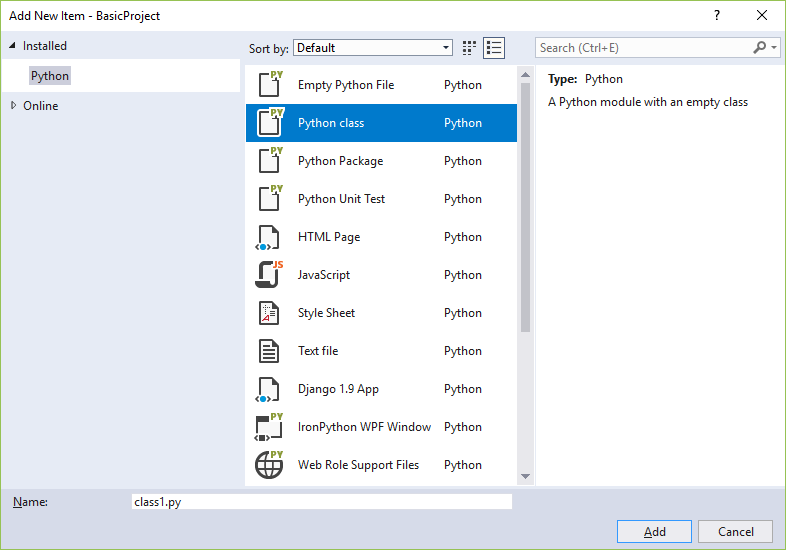
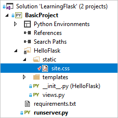
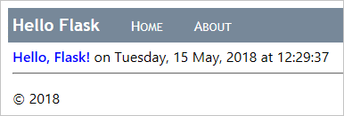

# Tutorial step 3: Serve static files, add pages, and use template inheritance

**Previous step: [Create a Flask app with views and page templates](learn-flask-visual-studio-step-02-create-app.md)**

In the previous steps of this tutorial, you've learned how to create a minimal Flask app with a single page of self-contained HTML. Modern web apps, however, are typically composed of many pages, and make use of shared resources like CSS and JavaScript files to provide consistent styling and behavior.

In this step, you learn how to:

> [!div class="checklist"]
> - Use Visual Studio item templates to quickly new files of different types with convenient boilerplate code (step 3-1)
> - Serve static files from code (step 3-2, optional)
> - Add additional pages to the app (step 3-3)
> - Use template inheritance to create a header and nav bar that's used across pages (step 3-4)

## Step 3-1: Become familiar with item templates

As you develop a Flask app, you typically add many more Python, HTML, CSS, and JavaScript files. For each file type (as well as other files like `web.config` that you may need for deployment), Visual Studio provides convenient [item templates](python-item-templates.md) to get you started.

To see available templates, go to **Solution Explorer**, right-click the folder in which you want to create the item, select **Add** > **New Item**:



To use a template, select the desired template, specify a name for the file, and select **OK**. Adding an item in this manner automatically adds the file to your Visual Studio project and marks the changes for source control.

### Question: how does Visual Studio know which item templates to offer?

Answer: The Visual Studio project file (`.pyproj`) contains a project type identifier that marks it as a Python project. Visual Studio uses this type identifier to show only those item templates that are suitable for the project type. This way, Visual Studio can supply a rich set of item templates for many project types without asking you to sort through them every time.

## Step 3-2: Serve static files from your app

In a web app built with Python (using any framework), your Python files always run on the web host's server and are never transmitted to a user's computer. Other files, however, such as CSS and JavaScript, are used exclusively by the browser, so the host server simply delivers them as-is whenever they're requested. Such files are referred to as "static" files, and Flask can deliver them automatically without you needing to write any code. Within HTML files, for example, you can just refer to static files using a relative path in the project. The first section in this step adds a CSS file to your existing page template.

When you need to deliver a static file from code, such as through an API endpoint implementation, Flask provides a convenient method that lets you refer to files using relative paths within a folder named `static` (in the project root). The second section in this step demonstrates that method using a simple static data file.

In either case, you can organize files under `static` however you like.

### Use a static file in a template

1. In **Solution Explorer**, right-click the "HelloFlask" folder in the Visual Studio project, select **Add** > **New folder**, and name the folder `static`.

1. Right-click the `static` folder and select **Add** > **New item**. In the dialog that appears, select the "Stylesheet" template, name the file `site.css`, and select **OK**. The `site.css` file appears in the project and is opened in the editor. Your folder structure should appear similar to the following image:

    

1. Replace the contents of `site.css` with the following code and save the file:

    ```css
    .message {
        font-weight: 600;
        color: blue;
    }
    ```

1. Replace the contents of the app's `templates/index.html` file with the following code, which replaces the `<strong>` element used in step 2 with a `<span>` that references the `message` style class. Using a style class in this way gives you much more flexibility in styling the element.

    ```html
    <html>
        <head>
            <title>{{ title }}</title>
            <link rel="stylesheet" type="text/css" href="/static/site.css" />
        </head>
        <body>
            <span class="message">{{ message }}</span>{{ content }}
        </body>
    </html>
    ```

1. Run the project to observe the results. Stop the app when done, and commit your changes to source control if you like (as explained in [step 2](learn-flask-visual-studio-step-02-create-app.md#commit-to-source-control)).

### Serve a static file from code

Flask provides a function called `serve_static_file` that you can call from code to refer to any file within the project's `static` folder. The following process creates a simple API endpoint that returns a static data file).

1. If you haven't done so already, create a `static` folder: in **Solution Explorer**, right-click the "HelloFlask" folder in the Visual Studio project, select **Add** > **New folder**, and name the folder `static`.

1. In the `static` folder, create a static JSON data file named `data.json` with the following contents (which are meaningless sample data):

    ```json
    {
        "01": {
            "note" : "Data is very simple because we're demonstrating only the mechanism."
        }
    }
    ```

1. In `views.py`, add a function with the route /api/data that returns the static data file using the `send_static_file` method:

    ```python
    @app.route('/api/data')
    def get_data():
      return app.send_static_file('data.json')
    ```

1. Run the app and navigate to the /api/data endpoint to see that the static file is returned. Stop the app when you're done.

### Question: are there any conventions for organizing static files?

Answer: You can add other CSS, JavaScript, and HTML files in your `static` folder however you want. A typical way to organize static files is to create subfolders named `fonts`, `scripts`, and `content` (for stylesheets and any other files).

### Question: how do I handle URL variables and query parameters in an API?

Answer: See the answer in step 1-4 for [Question: how does Flask work with variable URL routes and query parameters?](learn-flask-visual-studio-step-01-project-solution.md#qa-url-variables)

## Step 3-3: Add a page to the app

Adding another page to the app means the following:

- Add a Python function that defines the view.
- Add a template for the page's markup.
- Add the necessary routing to the Django project's `urls.py` file.

The following steps add an "About" page to the "HelloFlask" project, and links to that page from the home page:

1. In **Solution Explorer**, right-click the `templates` folder, select **Add** > **New item**, select the "HTML Page" item template, name the file `about.html`, and select **OK**.

    > [!Tip]
    > If the **New Item** command doesn't appear on the **Add** menu, make sure that you've stopped the app so that Visual Studio exits debugging mode.

1. Replace the contents of `about.html` with the following markup (you replace the explicit link to the home page with a simple navigation bar in step 3-4):

    ```html
    <html>
        <head>
            <title>{{ title }}</title>
            <link rel="stylesheet" type="text/css" href="/static/site.css" />
        </head>
        <body>
            <div><a href="home">Home</a></div>
            {{ content }}
        </body>
    </html>
    ```

1. Open the app's `views.py` file and add a function named `about` that uses the template:

    ```python
    @app.route('/about')
    def about():
        return render_template(
            "about.html",
            title = "About HelloFlask",
            content = "Example app page for Flask.")
    ```

1. Open the `templates/index.html` file and add the following line immediately within the `<body>` element to link to the About page (again, you replace this link with a nav bar in step 3-4):

    ```html
    <div><a href="about">About</a></div>
    ```

1. Save all the files using the **File** > **Save All** menu command, or just press or Ctrl+Shift+S. (Technically, this step isn't needed as running the project in Visual Studio saves files automatically. Nevertheless, it's a good command to know about!)

1. Run the project to observe the results and check navigation between pages. Stop the app when done.

### Question: Does the name of a page function matter to Flask?

Answer: No, because it's the `@app.route` decorator that determines the URLs for which Flask calls the function to generate a response. Developers typically match the function name to the route, but such matching isn't required.

## Step 3-4: Use template inheritance to create a header and nav bar

Instead of having explicit navigation links on each page, modern web apps typically use a branding header and a navigation bar that provides the most important page links, popup menus, and so on. To make sure the header and nav bar are the same across all pages, however, you don't want to repeat the same code in every page template. You instead want to define the common parts of all your pages in one place.

Flask's templating system (Jinja by default) provides two means for reusing specific elements across multiple templates: includes and inheritance.

- *Includes* are other page templates that you insert at a specific place in the referring template using the syntax ``. You can also use a variable if you want to change the path dynamically in code. Includes are typically used in the body of a page to pull in the shared template at a specific location on the page.

- *Inheritance* uses the `` at the beginning of a page template to specify a shared base template that the referring template then builds upon. Inheritance is commonly used to define a shared layout, nav bar, and other structures for an app's pages, such that referring templates need only add or modify specific areas of the base template called *blocks*.

In both cases, `<template_path>` is relative to the app's `templates` folder (`../` or `./` are also allowed).

A base template delineates *blocks* using `` and `` tags. If a referring template then uses tags with the same block name, its block content override that of the base template.

The following steps demonstrate inheritance:

1. In the app's `templates` folder, create a new HTML file (using the **Add** > **New item** context menu or **Add** > **HTML Page**) called `layout.html`, and replace its contents with the markup below. You can see that this template contains a block named "content" that is all that the referring pages need to replace:

    ```html
    <!DOCTYPE html>
    <html>
    <head>
        <meta charset="utf-8" />
        <title>{{ title }}</title>
        <link rel="stylesheet" type="text/css" href="/static/site.css" />
    </head>

    <body>
        <div class="navbar">
            <a href="/" class="navbar-brand">Hello Flask</a>
            <a href="{{ url_for('home') }}" class="navbar-item">Home</a>
            <a href="{{ url_for('about') }}" class="navbar-item">About</a>
        </div>

        <div class="body-content">
            
            
            <hr/>
            <footer>
                <p>&copy; 2018</p>
            </footer>
        </div>
    </body>
    </html>
    ```

1. Add the following styles to the app's `static/site.css` file (this walkthrough isn't attempting to demonstrate responsive design here; these styles are simply to generate an interesting result):

    ```css
    .navbar {
        background-color: lightslategray;
        font-size: 1em;
        font-family: 'Trebuchet MS', 'Lucida Sans Unicode', 'Lucida Grande', 'Lucida Sans', Arial, sans-serif;
        color: white;
        padding: 8px 5px 8px 5px;
    }

    .navbar a {
        text-decoration: none;
        color: inherit;
    }

    .navbar-brand {
        font-size: 1.2em;
        font-weight: 600;
    }

    .navbar-item {
        font-variant: small-caps;
        margin-left: 30px;
    }

    .body-content {
        padding: 5px;
        font-family:'Segoe UI', Tahoma, Geneva, Verdana, sans-serif;
    }
    ```

1. Modify `templates/index.html` to refer to the base template and override the content block. You can see that by using inheritance, this template becomes simple:

    ```html
    
    
    <span class="message">{{ message }}</span>{{ content }}
    
    ```

1. Modify `templates/about.html` to also refer to the base template and override the content block:

    ```html
    
    
    {{ content }}
    
    ```

1. Run the server to observe the results. Close the server when done.

    

1. Because you made substantial changes to the app, it's again a good time to [commit your changes to source control](learn-django-in-visual-studio-step-02-create-an-app.md#commit-to-source-control).

## Next steps

> [!div class="nextstepaction"]
> [Use the full Flask Web Project template](learn-flask-visual-studio-step-04-full-flask-project-template.md)

## Going deeper

- For more capabilities of Jinja templates, such as control flow, see [Jinja Template Designer Documentation](http://jinja.pocoo.org/docs/2.10/templates) (jinja.pocoo.org)
- For  details on using `url_for`, see [url_for](http://flask.pocoo.org/docs/1.0/api/?highlight=url_for#flask.url_for) within the Flask Application object documentation (flask.pocoo.org)
- Tutorial source code on GitHub: [Microsoft/python-sample-vs-learning-flask](https://github.com/Microsoft/python-sample-vs-learning-flask)