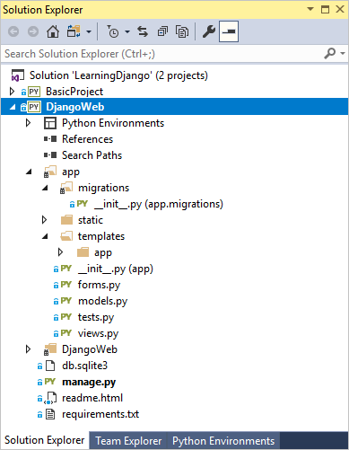
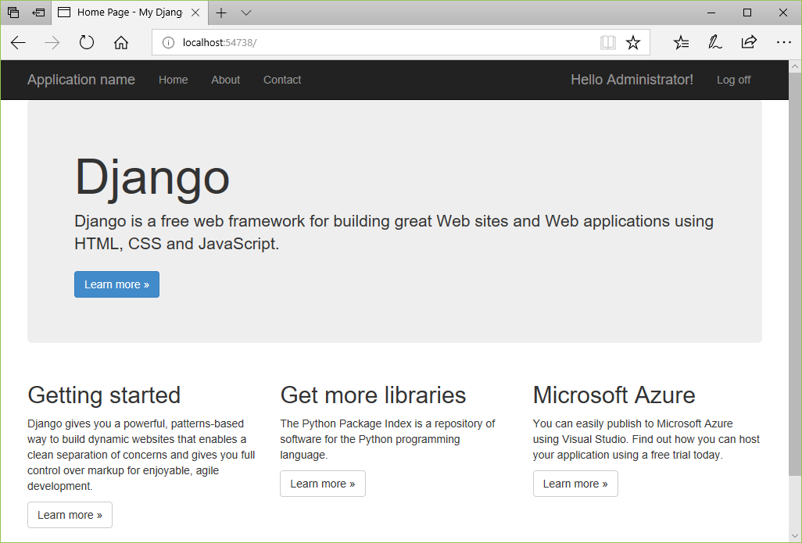
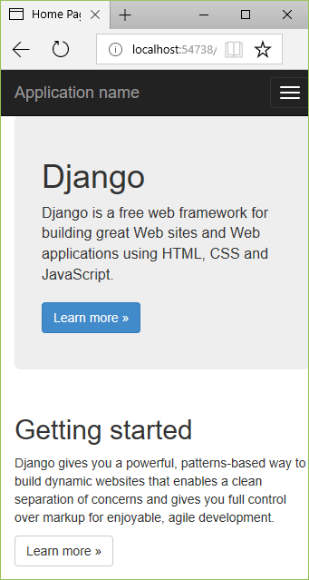

# Tutorial step 4: Use the full Django Web Project template

**Previous step: [Serve static files, add pages, and use template inheritance](learning-django-in-visual-studio-step-03-serve-static-files-and-add-pages.md)**

Now that you've explored the basics of Django by building an app upon the "Blank Django App Project" template in Visual Studio, you can easily understand the fuller app that's produced by the "Django Web Project" template.

In this step you now:

> [!div class="checklist"]
> - Create a fuller Django web app using the "Django Web Project" template and examine the project structure (step 4-1)
> - Understand the views and page templates created by the project template, which consist of three pages that inherit from a base page template and that employs static JavaScript libraries like jQuery and Bootstrap (step 4-2)
> - Understand the URL routing provided by the template (step 4-3)

The template also provides basic authentication, which is covered in the Step 5.

## Step 4-1: Create a project from the template

1. In Visual Studio, go to **Solution Explorer**, right-click the "LearningDjango" solution created earlier in this tutorial, and select **Add** > **New Project**. (Alternately, if you want to use a new solution, select **File** > **New** > **Project** instead.)

1. In the new project dialog, search for and select the "Django Web Project" template, call the project "DjangoWeb", and select **OK**.

1. Because the template again includes a `requirements.txt` file, Visual Studio prompts asks where to install those dependencies. Choose the option, **Install into a virtual environment**, and in the **Add Virtual Environment** dialog select **Create** to accept the defaults.

1. Once Python finishes setting up the virtual environment, follow the instructions in the displayed `readme.html` to create a Django super user (that is, an administrator). Just right-click the Visual Studio project and select the **Python** > **Django Create Superuser** command, then follow the prompts. Make sure to record your username and password as you use it when exercising the authentication features of the app.

1. Set the "DjangoWeb" project to be the default for the Visual Studio solution by right-clicking that project in **Solution Explorer** and selecting **Set as Startup Project**. The startup project, which is shown in bold, is what's run when you start the debugger.

    

1. Select **Debug** > **Start Debugging** (F5) or use the **Web Server** button on the toolbar to run the server:

    

1. The app created by the template has three pages, Home, About, and Contact, which you navigate between using the nav bar. Take a minute or two to examine different parts of the app. To authenticate with the app through the **Log in** command, use the superuser credentials created earlier.

    

1. The app created by the "Django Web Project" template uses Bootstrap for responsive layout that accommodates mobile form factors. To see this responsiveness, resize the browser to a narrow view so that the content renders vertically and the nav bar turns into a menu icon:

    

1. You can leave the app running for the sections that follow.

    If you want to stop the app and [commit changes to source control](learning-django-in-visual-studio-step-02-create-an-app.md#commit-to-source-control), first open the **Changes** page in **Team Explorer**, right-click the folder for the virtual environment (probably `env`), and select **Ignore these local items**.

### Examine what the template creates

At the broadest level, the "Django Web Project" template creates the following structure:

- Files in the project root:
  - `manage.py`, the Django administrative utility.
  - `db.sqlite3`, a default SQLite database.
  - `requirements.txt` containing a dependency on Django 1.x.
  - `readme.html`, a file that's displayed in Visual Studio after creating the a project. As noted in the previous section, follow the instructions here to create a super user (administrator) account for the app.
- The `app` folder contains all the app files, including views, models, tests, forms, templates and static files (see step 4-2).
- The `DjangoWeb` (Django project) folder contains the typical Django project files: `__init.py__`, `settings.py`, `urls.py`, and `wsgi.py`. By using the project template, `settings.py` is already configured for the app and the database file, and `urls.py` is already configured with routes to all the app pages, including the login form.

### Question: Is it possible to share a virtual environment between Visual Studio projects?

Answer: Yes, but do so with the awareness that different projects likely use different packages over time, and therefore a shared virtual environment must contain all the packages for all projects that use it.

Nevertheless, to use an existing virtual environment, do the following:

1. When prompted to install dependencies in Visual Studio, select **I will install them myself** option.
1. In **Solution Explorer**, right-click the **Python Environments** node and select **Add Existing Virtual Environment**.
1. Navigate to and select the folder containing the virtual environment, then select **OK**.

## Step 4-2: Understand the views and page templates created by the project template

As you observe when you run the project, the app contains three views: Home, About, and Contact. The code for these views are found in the `app/views` folder. Each view function simply calls `django.shortcuts.render` with the path to a template and a simple dictionary object. For example, the About page is handled by the `about` function:

```python
def about(request):
    """Renders the about page."""
    assert isinstance(request, HttpRequest)
    return render(
        request,
        'app/about.html',
        {
            'title':'About',
            'message':'Your application description page.',
            'year':datetime.now().year,
        }
    )
```

Templates are located in the app's `templates/app` folder. The base template, `layout.html`, is the most extensive. It refers to all the necessary static files (JavaScript and CSS), defines a block named "content" that other pages override, and provides another block named "scripts". The following annotated excerpts from `layout.html` show these specific areas:

```html
<!DOCTYPE html>
<html>
<head>
    <meta charset="utf-8" />

    <!-- Define a viewport for Bootstrap's responsive rendering -->
    <meta name="viewport" content="width=device-width, initial-scale=1.0">
    <title>{{ title }} - My Django Application</title>

    
    <link rel="stylesheet" type="text/css" href="" />
    <link rel="stylesheet" type="text/css" href="" />
    <script src=""></script>
</head>
<body>
    <!-- Navbar omitted -->

    <div class="container body-content">

<!-- "content" block that pages are expected to override -->

        <hr/>
        <footer>
            <p>&copy; {{ year }} - My Django Application</p>
        </footer>
    </div>

<!-- Additional scripts; use the "scripts" block to add page-specific scripts.  -->
    <script src=""></script>
    <script src=""></script>
    <script src=""></script>


</body>
</html>
```

The individual page templates, `about.html`, `contact.html`, and `index.html`, each extend the base template `layout.html`. `about.html` is the simplest and shows the `` and `` tags:

```html




<h2>{{ title }}.</h2>
<h3>{{ message }}</h3>

<p>Use this area to provide additional information.</p>


```

`index.html` and `contact.html` use the same structure and provide lengthier content in the "content" block.

In the `templates/app` folder you also find a fourth page `login.html`, along with `loginpartial.html` that's brought into `layout.html` using ``. These template files are discussed in step 5 on authentication.

### Question: can  and  be indented in the template?

Answer: Yes, Django page templates work just fine if you indent block tags, perhaps to align them within their appropriate parent elements. They're not indented in the page templates generated by the Visual Studio project template so that you can clearly see where they are placed.

## Step 4-3: Understand the URL routing created by the template

The Django project's `urls.py` file as created by the "Django Web Project" template contains the following code:

    ```python
    from datetime import datetime
    from django.conf.urls import url
    import django.contrib.auth.views

    import app.forms
    import app.views

    urlpatterns = [
        url(r'^$', app.views.home, name='home'),
        url(r'^contact$', app.views.contact, name='contact'),
        url(r'^about$', app.views.about, name='about'),
        url(r'^login/$',
            django.contrib.auth.views.login,
            {
                'template_name': 'app/login.html',
                'authentication_form': app.forms.BootstrapAuthenticationForm,
                'extra_context':
                {
                    'title': 'Log in',
                    'year': datetime.now().year,
                }
            },
            name='login'),
        url(r'^logout$',
            django.contrib.auth.views.logout,
            {
                'next_page': '/',
            },
            name='logout'),
    ]
    ```

The first three URL patterns map directly to the `home`, `contact`, and `about` views in the app's `views.py` file. The patterns `^login/$` and `^logout$`, on the other hand, use built-in Django views instead of app-defined views. The calls to the `url` method also include extra data to customize the view. To see how those work, continue to Step 5 to explore authentication.

### Question: in the project I created, why does the "about" URL pattern uses '^about' instead of '^about$' as shown here?

Answer: The lack of the trailing '$' in the regular expression was a simple oversight in many versions of the project template. The URL pattern works perfectly well for a page named "about", but without the trailing '$' the URL pattern also matches URLs like "about=django", "about09876", "aboutoflaughter"and so on. The trailing '$' is shown here to create a URL pattern that matches *only* "about".

## Next steps

> [!div class="nextstepaction"]
> [Authenticate users in Django](learning-django-in-visual-studio-step-05-django-authentication.md)

## Going deeper

- [Writing your first Django app, part 4 - forms and generic views](https://docs.djangoproject.com/en/2.0/intro/tutorial04/) (docs.djangoproject.com)
- Tutorial source code on GitHub: [Microsoft/python-sample-vs-learning-django](https://github.com/Microsoft/python-sample-vs-learning-django)