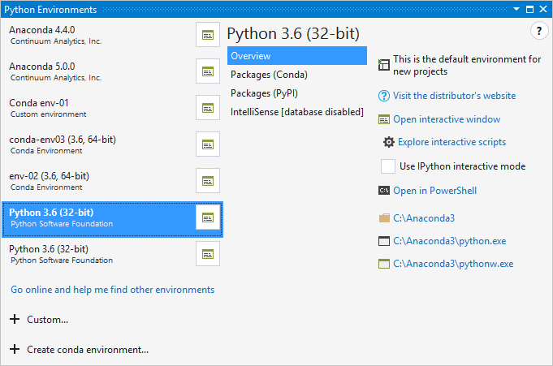
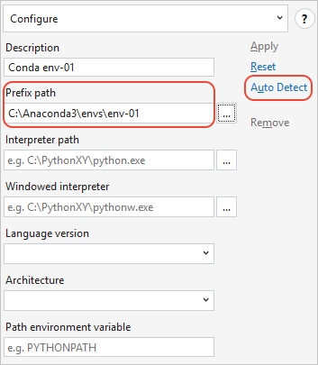
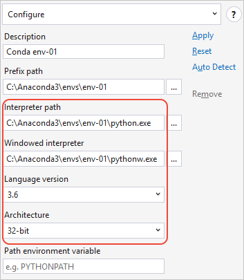
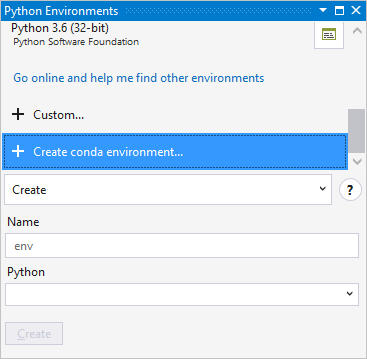
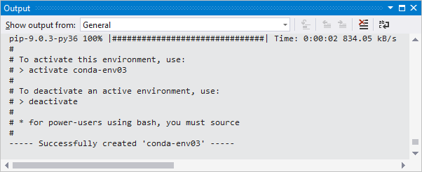

# How to create and manage Python environments in Visual Studio

A Python *environment* is a context in which you run Python code and includes global, virtual, and conda environments. An environment consists of an interpreter, a library (typically the Python Standard Library), and a set of installed packages. These components together determine which language constructs and syntax are valid, what operating-system functionality you can access, and which packages you can use.

In Visual Studio on Windows, the [Python Environments window](#the-python-environments-window) window, as described in this article, is where you manage these environments and select one as the default for new projects. For any given project, you can also select a specific environment rather than use the default.

**Note**: if you're new to Python in Visual Studio, see the following articles for necessary background:

- [Working with Python in Visual Studio](overview-of-python-tools-for-visual-studio.md)
- [Installing Python support in Visual Studio](installing-python-support-in-visual-studio.md)

Also note that you cannot manage environments for Python code that is opened only as a folder using the **File** > **Open** > **Folder** command. Instead, [Create a Python project from existing code](quickstart-01-python-in-visual-studio-project-from-existing-code.md) to enjoy the environment features of Visual Studio.

If you want to install packages in an environment, refer to the [Packages tab](python-environments-window-tab-reference.md#packages-tab).

## Types of environments

### Global environments

Each Python installation (for example, Python 2.7, Python 3.6, Anaconda 4.4.0, etc., see [selecting and installing Python interpreters](installing-python-interpreters.md)) maintains its own global environment. Each environment is composed of the specific Python interpreter, its standard library, and a set of pre-installed packages. Installing a package into a global environment makes it available to all projects using that environment. If the environment is located in a protect area of the file system (within `c:\program files`, for example), then installing packages requires administrator privileges.

Global environments are available to all projects on the computer. In Visual Studio, you select one global environment as the default, which is used for all projects unless you specifically choose a different one for a project. For more information, see [Selecting an environment for a project](selecting-a-python-environment-for-a-project.md).

### Virtual environments

Because packages installed into a global environment are available to all projects that use that environment, conflicts may occur when two projects require incompatible packages or different versions of the same package. Virtual environments avoid such conflicts by using the interpreter and standard library from a global environment but maintaining their own package stores in isolated folders.

In Visual Studio, you can create a virtual environment for a specific project, which is stored in a subfolder in the project. Visual Studio provides a command to generate a `requirements.txt` file from the virtual environment, making it easy to recreate the environment on other computers. For more information, see [Using virtual environments](selecting-a-python-environment-for-a-project.md#using-virtual-environments).

### Conda environments

A conda environment is one created using the `conda` tool, or with integrated conda management in Visual Studio 2017 version 15.7 and higher. (Requires Anaconda or Miniconda; Anaconda is available through the Visual Studio installer, see [Installation - Visual Studio 2017](installing-python-support-in-visual-studio.md#visual-studio-2017).)

> [!Note]
> For best results with conda environments, use conda 4.4.8 or later (conda versions are different from Anaconda versions). Installing Anaconda 5.1 from the Visual Studio 2017 installer

To see the conda version, where conda environments are stored, and other information, run `conda info` at an Anaconda command prompt (that is, a command prompt where Anaconda is in the path):

```bash
conda info
```
You conda environment folders appear as follows:

```output
       envs directories : c:\anaconda3\envs
                          C:\Users\user\AppData\Local\conda\conda\envs
                          C:\Users\user\.conda\envs
```

Because conda environments are not stored with a project, they act similarly to global environments. For example, installing a new package into a conda environment makes that package available to all projects using that environment.

For Visual Studio 2017 version 15.6 and earlier, you can use conda environments by pointing to them manually as described under [Manually identify an existing environment](#manually-identify-an-existing-environment).

Visual Studio 2017 version 15.7 and later detects conda environments automatically and displays them in the **Python Environments** window as described in the next section.

## The Python Environments window

The environments that Visual Studio knows about are displayed in the **Python Environments** window. To open, the window, use one of the following methods:

- Select the **View** > **Other Windows** > **Python Environments** menu command.
- Right-click the **Python Environments** node for a project in Solution Explorer and select **View All Python Environments**:

    

In either case, the **Python Environments** window appears as a sibling tab to Solution Explorer:


The default environment in boldface is Python 3.6, which Visual Studio uses for any new projects. Any listed environment, of any type, can be used as the default.

The commands in the lower part of the window apply to the selected interpreter, which as you can see is the specific installation in `C:\Python36-32` (the bolded default environment is part of an Anaconda installation). If you don't see an environment you expect, see [Manually identify an existing environment](#manually-identify-an-existing-environment).

To the right of each listed environment is a control that opens an interactive window for that environment. (In Visual Studio 2017 15.5 and earlier, another control appear that refreshes the IntelliSense database for that environment. See [Environments window reference](python-environments-window-tab-reference.md#intellisense-tab) for details about the database).

Below the list of environments is a drop-down selector for the **Overview**, **Packages**, and **IntelliSense** options described in [Python Environments window tab reference](python-environments-window-tab-reference.md). Also, if you expand the **Python Environments** window wide enough, these options are shown as tabs, which you may find more convenient to work with:



In the above image you can see the full list of environments on this particular computer, along with additional commands to create environments.

> [!Note]
> Although Visual Studio respects the system-site-packages option, it doesn't provide a way to change it from within Visual Studio.

|   |   |
|---|---|
|  | [Watch a video (Microsoft Virtual Academy)](https://mva.microsoft.com/en-US/training-courses/python-tools-for-visual-studio-2017-18121?l=qrDmN4LWE_8305918567) on Python environments in Visual Studio (2m 35s).|

### What if no environments appear?

If no environments appear, it means Visual Studio failed to detect any Python installations in standard locations. For example, you may have installed Visual Studio 2017 but cleared all the interpreter options in the installer options for the Python workload. Similarly, you may have installed Visual Studio 2015 or earlier but did not install an interpreter manually (see [Installing Python interpreters](installing-python-interpreters.md)).

If you know you have a Python interpreter on your computer but Visual Studio (any version) did not detect it, then use the **+ Custom...** command to specify its location manually. See the next section, [Manually identify an existing environment](#manually-identify-an-existing-environment).

> [!Tip]
> Visual Studio detects updates to an existing interpreter, such as upgrading Python 2.7.11 to 2.7.14 using the installers from python.org. During the installation process, the older environment disappears from the **Python Environments** list before the update appears in its place.
>
> However, if you manually move an interpreter and its environment using the file system, Visual Studio won't know the new location. For more information, see [Moving an interpreter](installing-python-interpreters.md#moving-an-interpreter).

<a name="manually-identifying-an-existing-environment></a>

## Manually identify an existing environment

Use the following steps to identify an environment that's installed in a non-standard location (including conda environments in Visual Studio 2017 version 15.6 and earlier):

1. Select **+ Custom** in the **Python Environments** window, which opens the **Configure** tab:

    

1. Enter a name for the environment in the **Description** field.

1. Enter or browse (using **...***) to the path of the interpreter in the **Prefix path** field.

1. If Visual Studio detects a Python interpreter at that location (such as the path shown below for a conda environment), it enables the **Auto Detect** command. Selecting **Auto Detect* completes the remaining fields. You can also complete those fields manually.

    

    

1. Once the fields contain the values you want, select **Apply** to save the configuration. You can now use the environment like any other within Visual Studio.

1. If you need to remove a manually identified environment, select the **Remove** command on the **Configure** tab. Auto-detected environments do not provide this option. For more information, see [Configure tab](python-environments-window-tab-reference.md#configure-tab).

## Create a conda environment

*Visual Studio 2017 version 15.7 and later.*

1. Select **+ Create conda environment** in the **Python Environments** window, which opens a **Create new conda environment** tab:

    

1. Enter a name for the environment in the **Name** field, select a base Python interpreter in the **Python** field, and select **Create**.

1. The **Output** window shows progress for the new environment, with a few CLI instructions once creation is complete:

    

1. Within Visual Studio, you can activate a conda environment for a project as you would any other environment as described on [Selecting an environment for a project](selecting-a-python-environment-for-a-project.md).

1. To install packages in the environment, use the [Packages tab](python-environments-window-tab-reference.md#packages-tab).

## See also

- [Installing Python interpreters](installing-python-interpreters.md)
- [Select an interpreter for a project](selecting-a-python-environment-for-a-project.md)
- [Using requirements.txt for dependencies](managing-required-packages-with-requirements-txt.md)
- [Search paths](search-paths.md)
- [Python Environments window reference](python-environments-window-tab-reference.md)