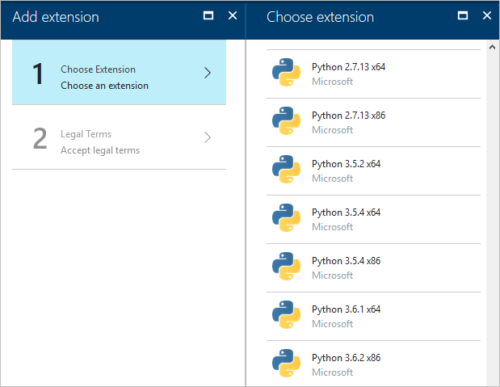
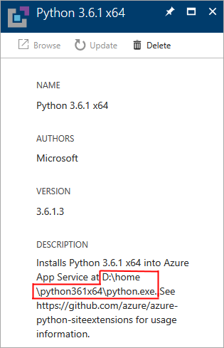
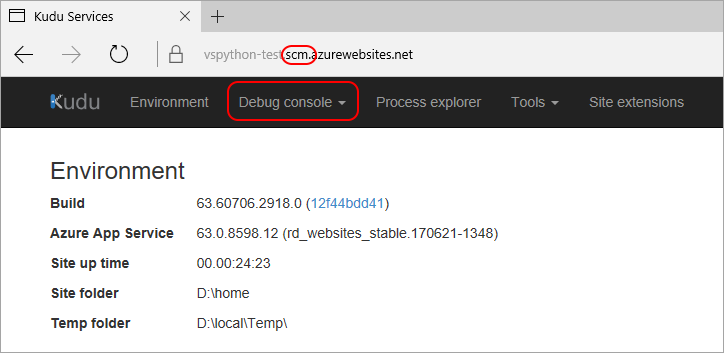

# Managing Python on Azure App Service

[Azure App Service](https://azure.microsoft.com/services/app-service/) is a platform-as-a-service offering for web apps, whether they are sites accessed through a browser, REST APIs used by your own clients, or event-triggered processing. App Service fully supports using Python to implement apps.

Customizable Python support on Azure App Service is provided as a set of App Service *site extensions* that each contain a specific version of the Python runtime. You can then install any desired packages directly into that environment, as described in this topic. By customizing the environment in the App Service itself, you don't need to maintain packages in your web app projects or upload them with the app code. 

> [!Tip]
> Although App Service by default has Python 2.7 and Python 3.4 installed in root folders on the server, you cannot customize or install packages in these environments, nor should you depend on their presence. You should instead rely on a site extension that you control, as described in this topic.

> [!Important]
> The processes described here are subject to change, and especially to improvement. Changes are announced on the [Python Engineering at Microsoft blog](https://blogs.msdn.microsoft.com/pythonengineering/).>

## Choosing a Python version through the Azure portal

1. Create an App Service for your web app on the Azure portal.
1. On the App Service's page, scroll to the **Development Tools** section, select **Extensions**, then select **+ Add**.
1. Scroll down in the list to the extension that contains the version of Python you want:

    

    > [!Tip]
    > The list of site extensions may hide site extensions for older versions of Python. If you need to install a version that's not shown in the list, you can do so through the Azure Resource Manager as described in the next section.

1. Select the extension, accept the legal terms, then select **OK**.
1. A notification appears in the portal when installation is complete.


## Choosing a Python version through the Azure Resource Manager

If you are deploying an App Service with an Azure Resource Manager template, add the site extension as a resource. The extension appears as a nested resource with the type `siteextensions` and the name from [siteextensions.net](https://www.siteextensions.net/packages?q=Tags%3A%22python%22).

For example, after adding a reference to `python361x64` (Python 3.6.1 x64), your template may look like the following:

```json
  "resources": [
    {
      "apiVersion": "2015-08-01",
      "name": "[parameters('siteName')]",
      "type": "Microsoft.Web/sites",
      //...
      "resources": [
        {
          "apiVersion": "2015-08-01",
          "name": "python361x64",
          "type": "siteextensions",
          "properties": { },
          "dependsOn": [
            "[resourceId('Microsoft.Web/sites', parameters('siteName'))]"
          ]
        },
      //...
```

## Setting web.config to point to the Python interpreter

After installing the site extension (through either the portal or an Azure Resource Manager template), you next point your app's `web.config` file to the Python interpreter. The `web.config` file instructs the IIS (7+) web server running on App Service about how it should handle Python requests through either FastCGI or HttpPlatform.

Begin by finding the full path to the site extension's `python.exe`, then create and modify the appropriate `web.config` file.

### Finding the path to python.exe

A Python site extension is installed on the server under `d:\home` in a folder appropriate to the Python version and architecture (except in the case of a few older versions). For example, Python 3.6.1 x64 is installed in `d:\home\python361x64`. The full path to the Python interpreter is then `d:\home\python361x64\python.exe`.

To see the specific path on your App Service, select **Extensions** on the App Service page, then select the extension in the list. 


This action opens the extension's description page containing the path:



If you have trouble seeing the path for the extension, you can find it manually using the console:

1. On your App Service page, select the **Development Tools > Console**.
2. Enter the command `ls ../home` or `dir ..\home` to see the top-level extensions folders, such as `Python361x64`.
3. Enter a command like `ls ../home/python361x64` or `dir ..\home\python361x64` to verify that it contains `python.exe` and other interpreter files.

### Configuring the FastCGI handler

FastCGI is an interface that works at the request level. IIS receives incoming connections and forwards each request to a WSGI app running in one or more persistent Python processes. The [wfastcgi package](https://pypi.io/project/wfastcgi) is pre-installed and configured with each Python site extension, so you can easily enable it by including the code in `web.config` like what's shown below for a web app based on the Bottle framework. Note that the full paths to `python.exe` and `wfastcgi.py` are placed in the `PythonHandler` key:

```xml
<?xml version="1.0" encoding="utf-8"?>
<configuration>
  <appSettings>
    <add key="PYTHONPATH" value="D:\home\site\wwwroot"/>
    <!-- The handler here is specific to Bottle; other frameworks vary. -->
    <add key="WSGI_HANDLER" value="app.wsgi_app()"/>
    <add key="WSGI_LOG" value="D:\home\LogFiles\wfastcgi.log"/>
  </appSettings>
  <system.webServer>
    <handlers>
      <add name="PythonHandler" path="*" verb="*" modules="FastCgiModule"
           scriptProcessor="D:\home\Python361x64\python.exe|D:\home\Python361x64\wfastcgi.py"
           resourceType="Unspecified" requireAccess="Script"/>
    </handlers>
  </system.webServer>
</configuration>
```

The `<appSettings>` defined here are available to your app as environment variables:
- The value for `PYTHONPATH` may be freely extended but must include the root of your app.
- `WSGI_HANDLER` must point to a WSGI app importable from your app.
- `WSGI_LOG` is optional but recommended for debugging your app. 

See [Publishing to Azure](publishing-to-azure.md) for additional details on `web.config` contents for Bottle, Flask, and Django web apps.

### Configuring the HttpPlatform handler

The HttpPlatform module passes socket connections directly to a standalone Python process. This pass-through allows you to run any web server you like, but requires a startup script that runs a local web server. You specify the script in the `<httpPlatform>` element of `web.config`, where the `processPath` attribute points to the site extension's Python interpreter and the `arguments` attribute points to your script and any arguments you want to provide:

```xml
<?xml version="1.0" encoding="utf-8"?>
<configuration>
  <system.webServer>
    <handlers>
      <add name="PythonHandler" path="*" verb="*" modules="httpPlatformHandler" resourceType="Unspecified"/>
    </handlers>
    <httpPlatform processPath="D:\home\Python361x64\python.exe"
                  arguments="D:\home\site\wwwroot\runserver.py --port %HTTP_PLATFORM_PORT%"
                  stdoutLogEnabled="true"
                  stdoutLogFile="D:\home\LogFiles\python.log"
                  startupTimeLimit="60"
                  processesPerApplication="16">
      <environmentVariables>
        <environmentVariable name="SERVER_PORT" value="%HTTP_PLATFORM_PORT%" />
      </environmentVariables>
    </httpPlatform>
  </system.webServer>
</configuration>
```

The `HTTP_PLATFORM_PORT` environment variable shown here contains the port that your local server should listen on for connections from localhost. This example also shows how to create another environment variable, if desired, in this case `SERVER_PORT`.

## Installing packages

The Python interpreter installed through a site extension is only one piece of your Python environment. You likely need to install different packages in that environment as well.

To install packages directly in the server environment, use one of the following methods:

| Methods | Usage | 
| --- | --- |
| [Azure App Service Kudu console](#azure-app-service-kudu-console) | Installs packages interactively. Packages must be pure Python or must publish wheels. |
| [Kudu REST API](#kudu-rest-api) | Can be used to automate package installation.  Packages must be pure Python or must publish wheels. |
| Bundle with app | Install packages directly into your project and then deploy them to App Service as if they were part of your app. Depending on how many dependencies you have and how frequently you update them, this method may be the easiest way to get a working deployment going. Be advised that libraries must match the version of Python on the server, otherwise you'll see obscure errors after deployment. That said, because the versions of Python in the App Service site extensions are exactly the same as those versions released on python.org, you can easily obtain a compatible version for local development. |
| Virtual environments | Not supported. Instead, use bundling and set the `PYTHONPATH` environment variable to point to the location of the packages. |


### Azure App Service Kudu console

The [Kudu console](https://github.com/projectkudu/kudu/wiki/Kudu-console) gives you direct, elevated command-line access to the App Service server and its file system. This is both a valuable debugging tool and allows for CLI operations such as installing packages.

1. Open Kudu from your App Service page on the Azure portal by selecting **Development Tools > Advanced Tools**, then selecting **Go**. This action navigates to a URL that's the same as your base App Service URL except with `.scm` inserted. For example, if your base URL is `https://vspython-test.azurewebsites.net/` then Kudu is on `https://vspython-test.scm.azurewebsites.net/` (which you can bookmark):

        

2. Select **Debug console > CMD** to open the console, in which you can navigate into your Python installation and see what libraries are already there.

3. To install a single package:

    a. Navigate to the folder of the Python installation where you want to install the package, such as `d:\home\python361x64`.
     
    b. Use `python.exe -m pip install <package_name>` to install a package.
    
    
    
4. If you've deployed a `requirements.txt` for your app to the server already, install all those requirements as follows:

    a. Navigate to the folder of the Python installation where you want to install the package, such as `d:\home\python361x64`.
    
    b. Run the command `python.exe -m pip install --upgrade -r d:\home\site\wwwroot\requirements.txt`.
    
    Using `requirements.txt` is recommended because it's easy to reproduce your exact package set both locally and on the server. Just remember to visit the console after deploying any changes to `requirements.txt` and run the command again.
    
> [!Note]
> There's no C compiler on App Service, so you need to install the wheel for any packages with native extension modules. Many popular packages provide their own wheels. For packages that don't, use `pip wheel <package_name>` on your local development computer and then upload the wheel to your site. For an example, see [Managing required packages](python-environments.md#managing-required-packages)

### Kudu REST API

Instead of using the Kudu console through the Azure portal, you can run commands remotely through the Kudu REST API by posting the command to `https://yoursite.scm.azurewebsites.net/api/command`. For example, to install the `bottle` package, post the following JSON to `/api/command`:

```json
{
    "command": 'python.exe -m pip install bottle',
    "dir": '\home\python361x64'
}
```

For information about commands and authentication, see the [Kudu documentation](https://github.com/projectkudu/kudu/wiki/REST-API). 

You can also see credentials using the `az webapp deployment list-publishing-profiles` command through the Azure CLI (see [az webapp deployment](https://docs.microsoft.com/cli/azure/webapp/deployment#list-publishing-profiles). A helper library for posting Kudu commands is available on GitHub](https://github.com/lmazuel/azure-webapp-publish/blob/master/azure_webapp_publish/kudu.py#L42).

