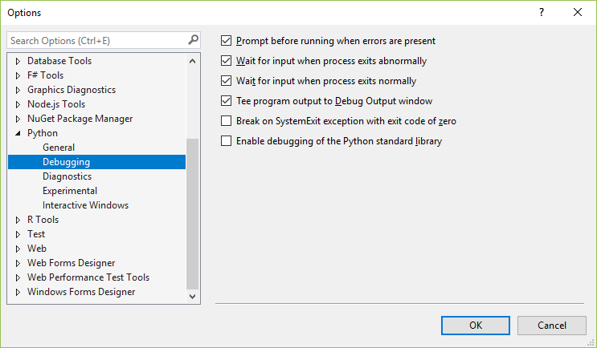
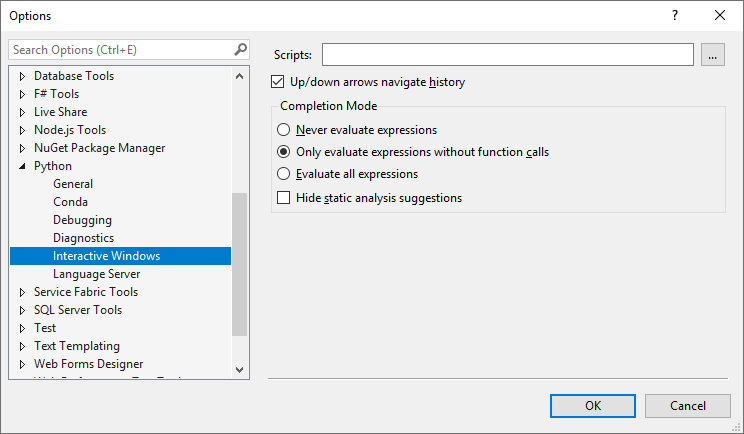
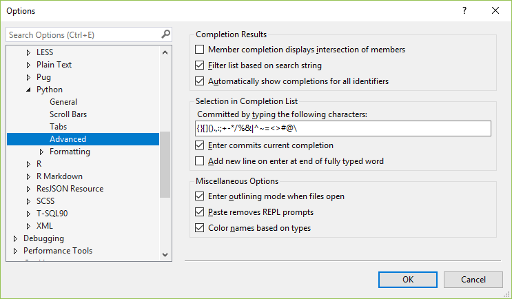

# Options for Python in Visual Studio

To view Python options, use the **Tools > Options** menu command, make sure **Show all settings** is selected, and then navigate to **Python Tools**:

There are also additional Python-specific options on the **Text Editor > Python > Advanced** tab.

The specific options are described in the following sections:

- [General options](#general-options)
- [Debugging options](#debugging-options)
- [Diagnostics options](#diagnostics-options)
- [Interactive Windows options](#interactive-windows-options)
- [Advanced Python editor options](#advanced-python-editor-options)

## General options

| Option | Default | Description |
| --- | --- | --- |
| Show the Output Window when creating virtual environments| On | Clear to prevent the output window from appearing. |
| Show the Output Window when installing or removing packages | On |  Clear to prevent the output window from appearing. |
| Always run pip as administrator | Off | Always elevates `pip install` operations for all environments. When installing packages, Visual Studio prompts for administrator privileges if the environment is located in a protected area of the file system such as `c:\Program Files`. In that prompt you can choose to always elevate `pip install` for just that one environment. See [Python environments - pip tab](python-environments.md#pip-tab). |
| Automatically generate completion DB on first use | On | For [IntelliSense completions](code-editing.md#intellisense) to work for a library, Visual Studio must generate a completion database for that library. Building the database is done in the background when a library is installed, but may not be complete when you start writing code. With this option selected, Visual Studio prioritizes completion of the database for a library when you write code that uses it. |
| Ignore system-wide PYTHONPATH variables | On | PYTHONPATH is ignored by default because Visual Studio provides a more direct means to specify search paths in environments and projects. See [Python Environments - search paths](python-environments.md#search-paths) for details. |
| Update search paths when adding linked files | On | When set, adding a [linked file](python-projects.md#linked-files) to a project updates [search paths](python-environments.md#search-paths) so that IntelliSense can include the contents of the linked file's folder in its completion database. Clear this option to exclude such content from the completion database. |
| Warn when imported module cannot be found | On | Clear this option to suppress warnings when you know an imported module isn't presently available but doesn't otherwise affect code operation. |
| Report inconsistent indentation as | Warnings | Because the Python interpreter depends heavily on proper indentation to determine scope, Visual Studio by default issues warnings when it detects inconsistent indentations that might indicate coding errors. Set to *Errors* to be even more strict, which causes the program to exit in such cases. To disable this behavior altogether, select *Don't*. |
| Check for survey/news | Once a week | Sets the frequency at which you allow Visual Studio can open a window containing a web page with Python-related surveys and news items, if available. Options are *Never*, *Once a day*, *Once a week*, and *Once a month*. |
| Reset all permanently hidden dialogs (button) | n/a | Different dialog boxes provide options such as **Don't show me this again**. Use this button to clear those options and cause the dialogs to reappear. |

## Debugging options

| Option | Default | Description |
| --- | --- | --- |
| Prompt before running when errors are present | On | When set, prompts you to confirm that you want to run code that contains errors. Clear this option to disable the warning. |
| Wait for input when process exits abnormally  Wait for input when process exits normally | On (for both) | A Python program started from Visual Studio runs in its own console window. By default, the window waits for you to press a key before closing it regardless of how the program exits. To remove that prompt and close the window automatically, clear either or both of these options. |
| Tee program output to Debug Output window | On | Displays program output in both a separate console window and the Visual Studio Output window. Clear this option to show output only in the separate console window. |
| Break on SystemExit exception with exit code of zero | Off | If set, stops the debugger on this exception. When clear, the debugger exits without breaking. |
| Enable debugging of the Python standard library | Off | Makes it possible to step into the standard library source code while debugging, but increases the time it takes for the debugger to start.|

## Diagnostics options

| Option | Default | Description |
| --- | --- | --- |
| Include analysis logs | On | Includes detailed logs relating to analysis of installed Python environments when saving diagnostics to a file or copying them to the clipboard using the buttons. This option may significantly increase the size of the generated file, but is often required to diagnose IntelliSense issues. |
| Save diagnostics to file (button) | n/a | Prompts for a filename, then saves the log to a text file. |
| Copy diagnostics to clipboard (button) | n/a | Places the entirety of the log on the clipboard; this operation may take some time depending on the size of the log. |

## Interactive Windows options

| Option | Default | Description |
| --- | --- | --- |
| Scripts | n/a | Specifies a general folder for startup scripts to apply to interactive windows for all environments. See [Startup scripts](python-environments.md#startup-scripts). Note, however, that this feature does not currently work. |
| Up/down arrows navigate history | On | Uses the arrow keys to navigate through history in the interactive window. Clear this setting to use the arrow keys to navigate within the interactive window's output instead. |
| Completion mode | Only evaluate expressions without function calls | The process of determining the available members on an expression in the interactive window may require evaluating the current unfinished expression, which can result in side-effects or functions being called multiple times. The default setting, *Only evaluate expressions without function calls* excludes expressions that appear to call a function, but evaluates other expressions. For example, it evaluates `a.b` but not `a().b`.  *Never evaluate expressions* prevents all side-effects, using only the normal IntelliSense engine for suggestions. *Evaluate all expressions* evaluates the complete expression to obtain suggestions, regardless of side effects. |
| Hide static analysis suggestions | Off | When set, displays only suggestions that are obtained by evaluating the expression. If combined with the Completion mode *Never evaluate expressions*, no useful completions appear in the interactive window. |

## Advanced Python editor options

### Completion Results

| Option | Default | Description |
| --- | --- | --- |
| Member completion displays intersection of members | Off | When set, shows only completions that are supported by all possible types. |
| Filter list based on search string | On | Applies filtering of completion suggestions as you type (default is checked). |
| Automatically show completions for all identifiers | On | Clear this option to disable completions in both the editor and interactive windows. |

### Selection in Completion List

| Option | Default | Description |
| --- | --- | --- |
| Committed by typing the following characters | {}.,:;+-*/%&&#124;^~=<>#@\ | These characters typically follow an identifier that one might select from a completion list, so it's convenient to commit the completion simply by typing a character. You can remove or add specific characters to the list as desired.  |
| Enter commits current completion | On | When set, the Enter key chooses and applies the currently selected completion as with the characters above (but of course, there isn't a character for Enter so it couldn't go into that list directly!). |
| Add new line on enter at end of fully typed word | Off | By default, if you type the entire word that appears in the completion popup and press Enter, you commit that completion. By setting this option, you effectively commit completions when you finish typing the identifier, such that Enter inserts a new line. |

### Miscellaneous Options

| Option | Default | Description |
| --- | --- | --- |
| Enter outlining mode when files open | On | Automatically turn on Visual Studio's outlining feature in the editor when opening a Python code file. |
| Paste removed REPL prompts | On | Removes >>> and ... from pasted text, allowing easy transfer of code from the interactive window to the editor. Clear this option if you need to retain those characters when pasting from other sources. |
| Color names based on types | On | Enables syntax coloring in Python code. |

