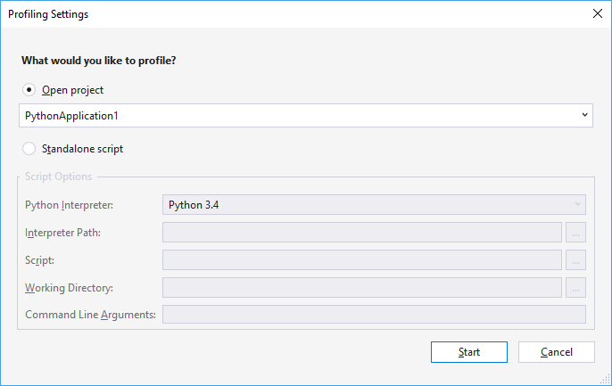

# Profile Python code

You can profile a Python application when using CPython-based interpreters. (See [Features matrix - profiling](overview-of-python-tools-for-visual-studio.md#matrix-profiling) for the availability of this feature for different versions of Visual Studio.)

## Profiling for CPython-based interpreters

Profiling is started through the **Analyze** > **Launch Python Profiling** menu command, which opens a configuration dialog:

When you select **OK**, the profiler runs and opens a performance report through which you can explore how time is spent in the application:

> [!Note]
> At present, Visual Studio supports only this level of full-application profiling, but we certainly want to hear your feedback on future capabilities. Use the [**Product feedback** button](#feedback) at the bottom of this page.

## Profiling for IronPython

Because IronPython is not a CPython-based interpreter, the profiling feature above does not work.

Instead, use the Visual Studio .NET profiler by launching *ipy.exe* directly as the target application, using the appropriate arguments to launch your startup script. Include `-X:Debug` on the command line to ensure that all of your Python code can be debugged and profiled. This argument generates a performance report including time spent both in the IronPython runtime and your code. Your code is identified using mangled names.

Alternately, IronPython has some of its own built-in profiling but there's currently no good visualizer for it. See [An IronPython Profiler](https://blogs.msdn.microsoft.com/curth/2009/03/30/an-ironpython-profiler/) (MSDN blogs) for what's available.
