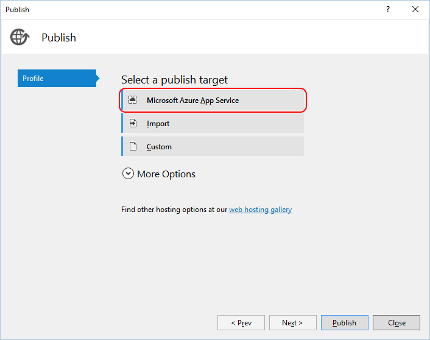

# Publishing to Azure App Service

You can get started quickly building a Python web site in Visual Studio and publish it to Azure App Service through the following steps:

- [Create an Azure subscription](#create-an-azure-subscription)
- [Create and test the initial project](#create-and-test-the-initial-project)
- [Publish to Azure App Service](#publish-to-azure-app-service)

 A short walkthrough of this process can be found on [Visual Studio Python Tutorial: Building a Website](https://www.youtube.com/watch?v=FJx5mutt1uk&list=PLReL099Y5nRdLgGAdrb_YeTdEnd23s6Ff&index=6) (youtube.com, 3m10s). 

> [!VIDEO https://www.youtube.com/embed/FJx5mutt1uk] 

## Create an Azure subscription

Publishing to Azure requires an Azure subscription, or you can use a temporary site.

For subscriptions, start with a [free full Azure account](https://azure.microsoft.com/en-us/free/), which includes generous credits for Azure services. Also consider signing up for [Visual Studio Dev Essentials](https://azure.microsoft.com/en-us/pricing/member-offers/vs-dev-essentials/) which gives you $25 credit every month for a full year.

To create a temporary site in Azure App Service without needing an Azure subscription:

1. Open your browser to [try.azurewebsites.net](https://try.azurewebsites.net).
1. Select **Web App** for the app type, then select **Next**.
1. Select **Empty Site** for the template, then select **Create >**.
1. Sign in with a social login of your choice, and after a short time your site will be ready at the displayed URL.
1. Select **Download publishing profile** and save the `.publishsettings` file, which you'll use later.

## Create and test the initial project

1. In Visual Studio, select **File > New > Project**, search for "Bottle", select the **Bottle Web Project**, and click **OK**.    

1. When prompted to install external packages, select **Install into a virtual environment**. Note the **Show required packages** control at the bottom of the dialog that will show which packages will be installed:

  

1. Select your preferred base interpreter for the virual environment (for example, **Python 2.7** or **Python 3.4**) and click **Create**:

  

1. Once the project is created, test it locally by selecting **Debug > Start Debugging** or pressing F5. By default, the application uses an in-memory repository which doesn't require any configuration. All data is lost when the web server is stopped.

1. Click around in the application to see its operation.

1. Stop the debugger when you're finished (**Debug > Stop Debugging** or Shift-F5).

## Publish to Azure App Service

1. In **Solution Explorer**, right-click the project select **Publish**. 

1. In the **Publish** dialog, select **Microsoft Azure App Service**:

  

1. Select a target:

    - If you have an Azure subscription, select **Microsoft Azure App Service** as the publishing target, then in the following dialog select an existing App Service or select **New** to create a new one.
    - If you're using a temporary site from try.azurewebsites.net, select **Import** as the publishing target, then browse for the `.publishsettings` file downloaded from the site and select **OK**.

1. The App Service details appear in the **Publish** dialog's **Connection** tab below.

  

1. Select **Next >** as needed to review additional settings. If you plan to [remotely debug your Python code on Azure](debugging-azure-remote.md), you must set **Configuration** to **Debug**
1. Select **Publish**. Once your application is deployed to Azure, your default browser will open on that site. 
 
## Additional resources

For a walkthrough of a richer web application, see [Deep Dive: Create a Python Django website using Visual Studio](https://www.youtube.com/watch?v=WG3pGmoo8nE&list=PLReL099Y5nRdLgGAdrb_YeTdEnd23s6Ff&index=10) (youtube.com, 8m58s). 

> [!VIDEO https://www.youtube.com/embed/WG3pGmoo8nE]