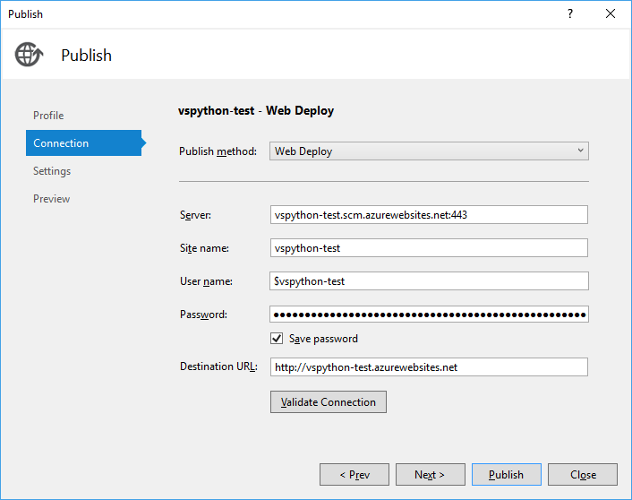

# Publishing to Azure App Service from Python Tools for Visual Studio

You can get started quickly building a Python web site in Visual Studio and publish it to Azure App Service. A short walkthrough of this process can be found on [Visual Studio Python Tutorial: Building a Website](https://www.youtube.com/watch?v=FJx5mutt1uk&list=PLReL099Y5nRdLgGAdrb_YeTdEnd23s6Ff&index=6) (youtube.com).  

## Create an Azure subscription

Publishing to Azure requires an Azure subscription, or you can use a temporary site.

For subscriptions, start with a [free full Azure account](https://azure.microsoft.com/en-us/free/), which includes generous credits for Azure services. Also consider signing up for [Visual Studio Dev Essentials](https://azure.microsoft.com/en-us/pricing/member-offers/vs-dev-essentials/) which gives you $25 credit every month for a full year.

To create a temporary site in Azure App Service without needing an Azure subscription:

1. Open your browser to [try.azurewebsites.net](https://try.azurewebsites.net).
1. Select **Web App** for the app type, then select **Next**.
1. Select **Empty Site** for the template, then select **Create >**.
1. Sign in with a social login of your choice, and after a short time your site will be ready at the displayed URL.
1. Select **Download publishing profile** and save the `.publishsettings` file, which you'll use later.

 ## Create and test the initial project

1. In Visual Studio, select **File > New > Project**, search for "Bottle", select the **Bottle Web Project**, and click **OK**.    

[!INCLUDE[include](includes/tutorial-environment-setup-test.md)]

## Publish to Azure App Service

1. In **Solution Explorer**, right-click the project select **Publish**. 

1. In the **Publish** dialog, select **Microsoft Azure App Service**:

  

1. Select a target:

    - If you have an Azure subscription, select **Microsoft Azure App Service** as the publishing target, then in the following dialog select an existing App Service or select **New** to create a new one.
    - If you're using a temporary site from try.azurewebsites.net, select **Import** as the publishing target, then browse for the `.publishsettings` file downloaded from the site and select **OK**.

1. The App Service details appear in the **Publish** dialog's **Connection** tab below.

  

1. Select **Next >** as needed to review additional settings, then select **Publish**. Once your application is deployed to Azure, your default browser will open on that site. 
 
## Additional resources

For a walkthrough of a richer web application, see [Visual Studio Python Tutorial Deep Dive: Create a Python Django website using Visual Studio](https://www.youtube.com/watch?v=WG3pGmoo8nE&list=PLReL099Y5nRdLgGAdrb_YeTdEnd23s6Ff&index=10) (youtube.com). 

The following tutorials also demonstrate setting up web applications with different types of storage:

- [Bottle and Azure Table Storage on Azure](tutorial-bottle-azure-table.md)
- [Bottle and MongoDB on Azure](tutorial-bottle-mongodb.md)
- [Flask and Azure Table Storage on Azure](tutorial-flask-azure-table.md)
- [Flask and MongoDB on Azure](tutorial-flask-mondodb.md)
- [Django and SQL Database on Azure](tutorial-django-sqldb.md)
- [Django and MySQL on Azure](tutorial-django-mysql.md)
