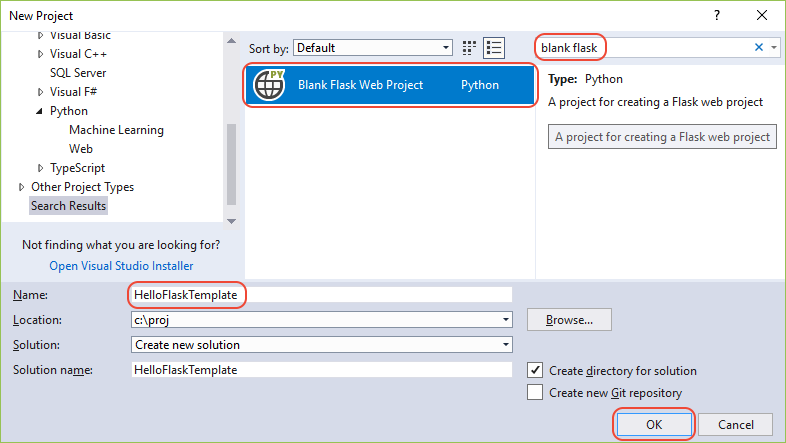
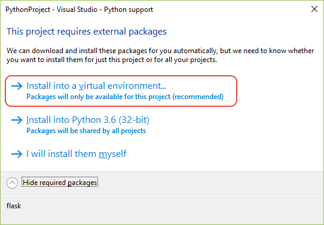

# Quickstart: create a Python project from a template in Visual Studio

Once you've [installed Python support in Visual Studio 2017](installing-python-support-in-visual-studio.md), it's easy to create a new Python project using a variety of templates. In this Quickstart, you create a simple Flask app using a template. The resulting project is similar to the project you create manually through [Quickstart - Create a web app with Flask](../ide/quickstart-python.md).

1. Start Visual Studio 2017.

1. From the top menu bar, choose **File > New > Project...**, then in the **New Project** dialog search for "blank flask", select the "Blank Flask Web Project" template in the middle list, give the project a name, and select **OK**:

    

1. Visual Studio prompts you with a dialog that says "This project requires external packages." This dialog appears because the template includes a `requirements.txt` file specifying a dependency on Flask. Visual Studio can install the packages automatically, and gives you the option to install them *virtual environment*. Using a virtual environment is recommended over installing into a global environment, so select **Install into a virtual environment** to continue.

    

1. Visual Studio displays the **Add Virtual Environment** dialog. Accept the default and select **Create**, then consent to any elevation requests.

    > [!Tip]
    > When you begin a project, it's highly recommended to create a virtual environment right away, as most Visual Studio templates invite you to do. Virtual environments maintain your project's exact requirements over time as you add and remove libraries. You can then easily generate a `requirements.txt` file, which you use to reinstall those dependencies on other development computers (as when using source control) and when deploying the project to a production server. For more information on virtual environments and their benefits, see [Using virtual environments](../python/selecting-a-python-environment-for-a-project.md#using-virtual-environments) and [Managing required packages with requirements.txt](../python/managing-required-packages-with-requirements-txt.md).

1. After Visual Studio creates that environment, look in **Solution Explorer** to see that you have an `app.py` file along with `requirements.txt`. Open `app.py` to see that the template has provided code like that in [Quickstart - Create a web app with Flask](../ide/quickstart-python.md), with two added sections.

    First is the line, `wsgi_app = app.wsgi_app` that can be helpful when deploying an app to a web host.

    Second is startup code that allows you to set the host and port through environment variables rather than hard-coding them. Such code allows you to easily control the configuration on both development and production machines without changing the code:

    ```python
    if __name__ == '__main__':
        import os
        HOST = os.environ.get('SERVER_HOST', 'localhost')
        try:
            PORT = int(os.environ.get('SERVER_PORT', '5555'))
        except ValueError:
            PORT = 5555
        app.run(HOST, PORT)
    ```

1. Select **Debug > Start Without Debugging** to run the app and open a browser to `localhost:5555`.

**Question: What other Python templates does Visual Studio offer?**

**Answer**: With the Python workload installed, Visual Studio provides a variety of project templates including ones for the [Flask, Bottle, and Django web frameworks](../python/python-web-application-project-templates.md), Azure cloud services, different machine learning scenarios, and even a template to create a project from an existing folder structure containing a Python app. You access these through the **File > New > Project...** dialog box by selecting the **Python** language node and its child nodes.

Visual Studio also provides a variety of file or *item templates* to quickly create a Python class, a Python package, a Python unit test, web.config files, and more. When you have a Python project open, you access item templates through the **Project > Add New Item...** menu command.

Using templates can save you significant time when starting a project or creating a file, and are also a great way to learn about different app types and code structures. It's helpful to take a few minutes to create projects and items from the various templates to familiarize yourself with what they offer.

**Question: Can I also use Cookiecutter templates?**

**Answer**: Yes! In fact, Visual Studio provides direct integration with Cookiecutter, which you can learn about through [Quickstart: create a project from a Cookiecutter template](../python/quickstart-04-python-in-visual-studio-project-from-cookiecutter.md).

## Next steps

> [!div class="nextstepaction"]
> [Tutorial: Working with Python in Visual Studio](tutorial-working-with-python-in-visual-studio-step-01-create-project.md)

## See also

- [Manually identifying an existing Python interpreter](managing-python-environments-in-visual-studio.md#manually-identifying-an-existing-environment).
- [Install Python support in Visual Studio 2015 and earlier](installing-python-support-in-visual-studio.md).
- [Install locations](installing-python-support-in-visual-studio.md#install-locations).
