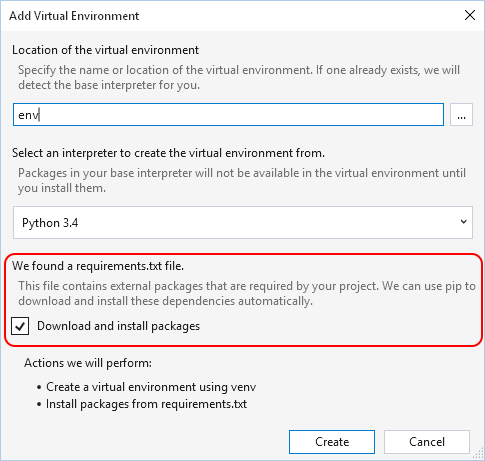
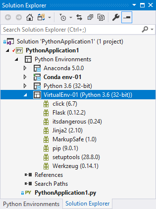

# Assigning which Python environment is used for a project

All code in a Python project runs within the context of a specific environment. Visual Studio also uses that environment for debugging, import and member completions, syntax checking, and any other tasks that require an environment.

All new Python projects in Visual Studio are initially configured to use the default global environment, which appears under the **Python Environments** node in Solution Explorer:

To change the environment for a project, right-click the **Python Environments** node and select **Add/Remove Python Environments...**. From the displayed list, which includes global, virtual, and conda environments, select all the ones you want to appear under the **Python Environments** node:

Once you select **OK**, all the selected environments appear **Python Environments** node. The currently activated environment appears in bold:

To quickly activate a different environment, right-click that environment name and select **Activate environment**. Your choice is saved with the project and that environment is activated whenever you open the project in the future. If you clear all the options in the **Add/Remove Python Environments** dialog, Visual Studio activates the global default environment.

The context menu on the **Python Environments** node also provides additional commands:

| Command | Description |
| --- | --- |
| Add Virtual Environment... | Begins the process of creating a new virtual environment in the project. See [Create a virtual environment](#create-a-virtual-environment). |
| Add Existing Virtual Environment... | Prompts you to select a folder containing a virtual environment and adds it to the list under **Python Environments**, but does not activate it. See [ActivateAdd an existing virtual environment](#activate-an-existing-virtual-environment). |
| Create Conda environment... | Switches to the **Python Environments** *window* in which you enter a name for the environment and specify its base interpreter. |

## Using virtual environments

A virtual environment is a unique combination of a specific Python interpreter and a specific set of libraries that is different from other global and conda environments. A virtual environment is specific to a project and is maintained in a project folder. That folder contains the environment's installed libraries along with a `pyvenv.cfg` file that specifies the path to the environment's *base interpreter* elsewhere on the file system. (That is, a virtual environment doesn't contain a copy of the interpreter, only a link to it.) 

A benefit to using a virtual environment is that as you develop project over time, the virtual environment always reflects the project's exact dependencies. (A shared global environment, on the other hand, contain any number of libraries whether you use them in your project or not.) You can then easily create a `requirements.txt` file from the virtual environment, which is then used to reinstall those dependencies on another development or production computer. For more information, see [Managing required packages with requirements.txt](managing-required-packages-with-requirements-txt.md).

When you open a project in Visual Studio that contains a `requirements.txt` file, Visual Studio automatically prompts gives you the option to recreate the virtual environment. On computers where Visual Studio isn't installed, such as Azure App Service, you can use `pip install -r requirements.txt` to restore the packages (this process is described on [Managing Python on Azure App Service](managing-python-on-azure-app-service.md)).

Because a virtual environment contains a hard-coded path to the base interpreter, and because you can recreate the environment using `requirements.txt`, you typically omit the entire virtual environment folder from source control.

The following sections explain how to activate an existing virtual environment in a project and how to create a new virtual environment.

In Visual Studio, a virtual environment can be activated for a project like any other through the **Python Environments** node in **Solution Explorer**.

Once a virtual environment is added to your project, it appears in the **Python Environments** window. You can then activate it like any other environment, and you can manage its packages.

### Create a virtual environment

You can create a new virtual environment directly from Visual Studio as follows:

1. Right-click **Python Environments** in Solution Explorer and select **Add Virtual Environment...**, which brings up the following dialog box:

    

1. In the **Location of the virtual environment** field, specify a path for the virtual environment. If you specify a name only, the virtual environment is created within the current project in a subfolder with that name.

1. Select an environment as the base interpreter and select **Create**. Visual Studio displays a progress bar while it configures the environment and downloads any necessary packages. At this point, the virtual environment appears in the **Python Environments** window for the containing project.

1. The virtual environment is not activated by default. To activate it for the project, right-click it and select **Activate Environment**.

> [!Note]
> If the location path identifies an existing virtual environment, Visual Studio detects the base interpreter automatically (using the `orig-prefix.txt` file in the environment's `lib` directory) and changes the create button to **Add**.
>
> If a `requirements.txt` file exists when adding a virtual environment, the **Add Virtual Environment** dialog displays an option to install the packages automatically, making it easy to recreate an environment on another computer:
>
> 
>
> Either way, the result is the same as if you'd used the **Add Existing Virtual Environment...** command.

### Activate an existing virtual environment

If you've already created a virtual environment elsewhere, you can activate it for a project as follows:

1. Right-click **Python Environments** in Solution Explorer and select **Add Existing Virtual Environment...**.

1. In the **Browse** dialog that appears, Navigate to and select the folder that contains the virtual environment, and select **OK**. If Visual Studio detects a `requirements.txt` file in that environment, it asks whether to install those packages.

1. After a few moments, the virtual environment appears under the **Python Environments** node in Solution Explorer. The virtual environment is not activated by default, so right-click it and select **Activate Environment**.

### Remove a virtual environment

1. In Solution Explorer, right-click the virtual environment and select **Remove**.

1. Visual Studio asks whether to remove or delete the virtual environment. Selecting **Remove** makes it unavailable to the project but leaves it on the file system. Selecting **Delete** both removes the environment from the project and deletes it from the file system. The base interpreter is unaffected.

## View installed packages

In Solution Explorer, expand any specific environment's node to quickly view the packages that are installed in that environment (meaning that you can import and use those packages in your code when the environment is active):

To install new packages, right-click the environment and select **Install Python Package...** to switch to the **Packages** tab in the **Python Environments** window. Enter a search term (usually the package name) and Visual Studio displays matching packages.

Within Visual Studio, packages (and dependencies) are downloaded from the [Python Package Index (PyPI)](https://pypi.python.org/pypi), where you can also search for available packages. Visual Studio's status bar and output window show information about the install. To uninstall a package, right-click it select **Remove**.

Be aware that the displayed entries may not always be accurate, and installation and uninstallation may not be reliable or available. Visual Studio uses the pip package manager if available, and downloads and installs it when required. Visual Studio can also use the easy_install package manager. Packages installed using `pip` or `easy_install` from the command line are also displayed.

Also note that Visual Studio does not presently support using `conda` to install packages into a conda environment. Use `conda` from the command line instead.

> [!Tip]
> A common situation where pip fails to install a package is when the package includes source code for native components in `*.pyd` files. Without the required version of Visual Studio installed, pip cannot compile these components. The error message displayed in this situation is `error: Unable to find vcvarsall.bat`. `easy_install` is often able to download pre-compiled binaries, and you can download a suitable compiler for older versions of Python from [http://aka.ms/VCPython27](http://aka.ms/VCPython27). For more details, see [How to deal with the pain of "unable to find vcvarsallbat"](https://blogs.msdn.microsoft.com/pythonengineering/2016/04/11/unable-to-find-vcvarsall-bat/) on the Python tools team blog.

## See also

- [Managing Python environments in Visual Studio](managing-python-environments-in-visual-studio.md)
- [Using requirements.txt for dependencies](managing-required-packages-with-requirements-txt.md)
- [Search paths](search-paths.md)
- [Python Environments window reference](python-environments-window-tab-reference.md)