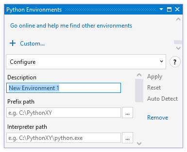
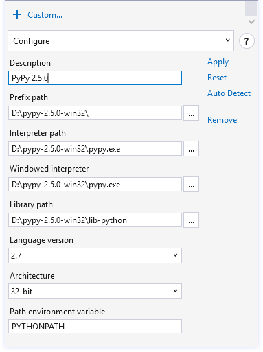

# Selecting and installing Python interpreters

The Python Tools for Visual Studio (PTVS) do not come with a Python interpreter, so you need to install one of the following to run your code. You can manage installed interpreters through the [Python Environments](python-environments.md) window in Visual Studio.

## CPython

CPython is the "native" and most commonly used interpreter, with the following attributes:

- Available in 32 and 64 bit versions. If you've already installed Visual Studio and PTVS, we recommend the [latest 32-bit CPython installer](http://go.microsoft.com/fwlink/?LinkID=299430) from python.org.
- Automatically detected by PTVS after installation
- Latest language features 
- Maximum Python package compatibility 
- Best debugging experience in PTVS (for example, debugging on Linux/Mac, mixed-mode Python/C++ debugging) 
- Works with [IPython](http://ipython.org/) 
- Versions: 2.7 (frozen) and 3.x (latest); see [Should I use Python 2 or Python 3?](http://wiki.python.org/moin/Python2orPython3) for a summary of differences

## IronPython

IronPython is a .NET implementation of Python with the following attributes:

- Best .NET (C#/F#/Visual Basic) interop
- Available in 32 and 64 bit versions. If you've already installed Visual Studio and PTVS, we recommend the [IronPython 2.7.5 installer](http://ironpython.codeplex.com/downloads/get/970325).
- Versions: 2.7.5 (3.x features underway) 
- Some non-.NET packages can be used via bridges, and others have been ported  
- Standard Python debugging (no mixed .NET/Native debugging) 
- No IPython support 
- Decent mixed IronPython <-> C# debugging 

## Ananconda

[Anaconda](https://www.continuum.io/downloads) is an open data science platform powered by Python, and includes the latest version of CPython and most of the difficult-to-install packages. We recommend it if you can't otherwise decide.

## Other options

- **[PyPy](http://www.pypy.org/)**: a high-performance tracing JIT implementation of Python
- **[Jython](http://www.jython.org/)**: An implementation of Python on the JVM
- **[Canopy](https://www.enthought.com/products/canopy/)**: a comprehensive Python analysis environment with many core scientific packages.

Note that PyPy and Jython work well with PTVS but with limited support for advanced debugging features.

## Pointing PTVS to an existing interpreter

PTVS normally locates an installed Python interpreter by checking the registry, but may not find it if the interpreter is installed in a non-standard fashion. In such cases, you can point PTVS directly to the interpreter as follows:

1. Open the Python Environments window with **View > Other Windows > Python Environments** and click **+ Custom...**, which brings up the following:

    

    Note that the **Remove** command will delete environments.

1. Enter the name and path to your interpreter manually or by clicking **...**

    

    Clicking "Auto-detect" will attempt to fill in the remaining information based off the executable at **path**, and will look for `python.exe` under **prefix path** if not specified yet. The fields are used as follows:

    | Field | Description |
    | --- | --- |
    | Path | The path to the interpreter executable, commonly the prefix path followed by `python.exe`, while **Windows Path** is the path to the non-console executable, often `pythonw.exe`. |   
    | Library path | Specifies the root of the standard library, but this value may be ignored if PTVS is able to request a more accurate path from the interpreter. |
    | Architecture | Normally detected and filled in automatically, otherwise specifies 32-bit or 64-bit. |
    | Language version | Selected from the drop down menu. |
    | Path environment variable | The environment variable that the interpreter is going to look at to find search paths. PTVS will change the value of the variable when starting Python so that it contains the project's search paths. Typically this property should be set to `PYTHONPATH`, but some interpreters use a different value. |
