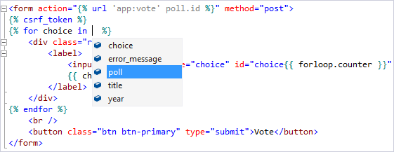
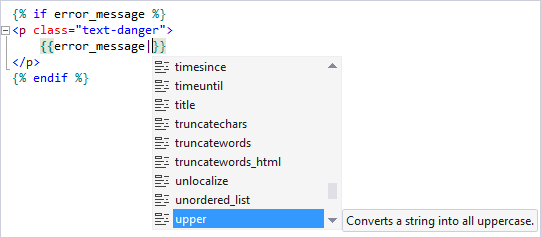
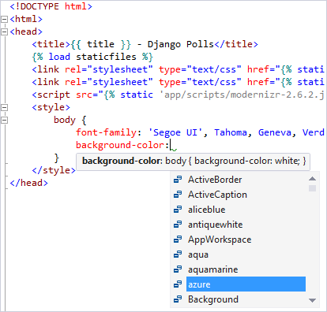
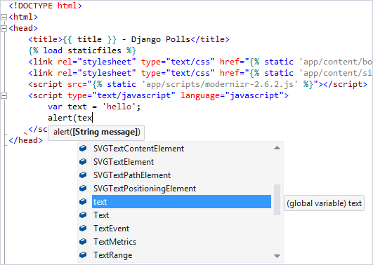
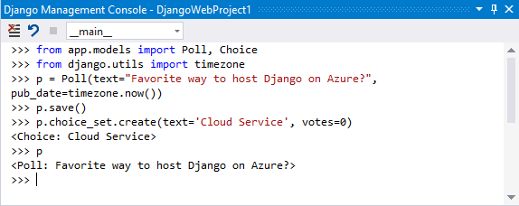
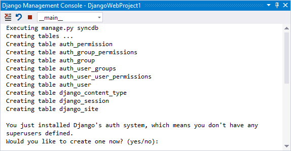

# Django Web Project Template

[Django](https://www.djangoproject.com/) is a high-level Python framework designed for rapid, secure, and scalable web development. Python support in Visual Studio provides a project template to set up the structure of a Django-based web application. To use the template in Visual Studio, select **File > New > Project**, search for "Django", and select the "Django Web Project" template. The resulting project includes boilerplate code as well as a default SQLite database. The "Blank Django Web Project" template is similar but does not include the database.

Visual Studio provides full IntelliSense for Django projects:

- Context variables passed into the template:

    

- Tagging and filtering for both built-ins and user-defined:

    

- Syntax coloring for embedded CSS and JavaScript:

    

    

Visual Studio also provides full [debugging support](debugging.md) for Django projects: 

It's typical for Django projects to be managed through their `manage.py` file, which is an assumption that Visual Studio follows. If you stop using that file as the entry point, you essentially break the project file. In that case you need to [recreate the project from existing files](python-projects.md#creating-a-project-from-existing-files) without marking it as a Django project.

## Django management console

The Django management console is accessed through various commands on the **Project** menu or by right-clicking the project in Solution Explorer.

- **Open Django Shell...**: opens a shell in your application context that enables you to manipulate your models"

    

- **Django Sync DB**: executes `manage.py syncdb` in an interactive window:

    

- **Collect Static**: executes `manage.py collectstatic --noinput` to copy all the static files to the path specified by `STATIC_ROOT` in your `settings.py`. Note that when [publishing to Microsoft Azure](template-web.md#publishing-to-azure-app-service), static files are automatically collected as part of the publish operation.

    

- **Validate**: executes `manage.py validate`, which reports any validation errors in the installed models specified by `INSTALLED_APPS` in your `settings.py`:

    