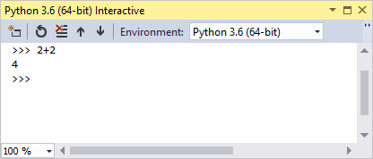

# Install Python support in Visual Studio

> [!Note]
> Python support is presently available only on Visual Studio for Windows; on Mac and Linux, Python support is available through Visual Studio Code. See [questions and answers](overview-of-python-tools-for-visual-studio.md#questions-and-answers).

1. Download and run the latest Visual Studio 2017 installer for Windows (Python support is present in release 15.2 and later). If you have Visual Studio installed already, run the Visual Studio installer and go to step 2.

    > [!div class="nextstepaction"]
    > <a target="frameTarget" href="https://www.visualstudio.com/thank-you-downloading-visual-studio/?sku=Community&rel=15&rid=34347&utm_source=docs&utm_medium=clickbutton&utm_campaign=python_gettingstarted">Install Visual Studio 2017 Community</a>

    >[!Tip]
    > The Community edition is for individual developers, classroom learning, academic research, and open source development. For other uses, install <a target="frameTarget" href="https://www.visualstudio.com/thank-you-downloading-visual-studio/?sku=Professional&rel=15&rid=34347&utm_source=docs&utm_medium=clickbutton&utm_campaign=python_gettingstarted">Visual Studio 2017 Professional</a> or <a target="frameTarget" href="https://www.visualstudio.com/thank-you-downloading-visual-studio/?sku=Enterprise&rel=15&rid=34347&utm_source=docs&utm_medium=clickbutton&utm_campaign=python_gettingstarted">Visual Studio 2017 Enterprise</a>.

1. The installer presents you with a list of workloads, which are groups of related options for specific development areas. For Python, select the **Python development** workload and select **Install**:

    

1. To quickly test Python support, launch Visual Studio, press Alt+I to open the Python Interactive window, and enter `2+2`. If you don't see the output of `4`, recheck your steps.

    

## Next steps

> [!div class="nextstepaction"]
> [Step 1: Create a Python project](tutorial-working-with-python-in-visual-studio-step-01-create-project.md)

## See also

- [Manually identifying an existing Python interpreter](managing-python-environments-in-visual-studio.md#manually-identifying-an-existing-environment).
- [Install Python support in Visual Studio 2015 and earlier](installing-python-support-in-visual-studio.md).
- [Install locations](installing-python-support-in-visual-studio.md#install-locations).

<iframe src="" height="0" width="0" frameborder="0" name="frameTarget" />
