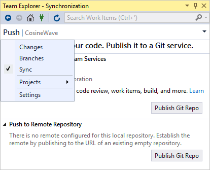
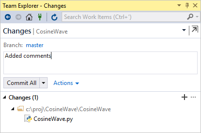
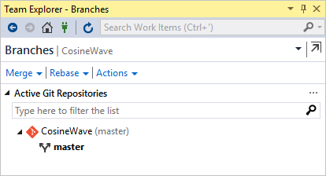

# Step 6: Working with Git

**Previous step: [Installing packages and managing your Python environment](tutorial-working-with-python-in-visual-studio-step-05-installing-packages.md)**

Visual Studio provides direct integration with local Git repositories and those that reside on services like GitHub and Visual Studio Team Services. The integration includes cloning a repository, committing changes, and managing branches.

This topic describes creating a local Git repository for an existing project. For a walkthrough of creating a project from a remote Git repository, see [Quickstart: clone a repository of Python code in Visual Studio](quickstart-03-python-in-visual-studio-project-from-repository.md).

1. With a project open in Visual Studio, such as the project from the [previous step](tutorial-working-with-python-in-visual-studio-step-05-installing-packages.md), right-click the solution and select **Add Solution to Source Control**. Visual Studio creates a local Git repository that contains your project code and displays Git-related controls also appear along the bottom of the Visual Studio window. The controls show pending commits, changes, the name of the repository, and the branch. Hover over the controls to see additional information.

  

1. The **Team Explorer** window also appears with various Git options available by selecting the repository header. The **Sync** pane, as shown, provides options for publishing to a remote repository.

  

1. Select **Changes** to review uncommitted changes and to commit them when desired.

  

1. Select **Branches** to examine branches and perform merge and rebase operations:

  

1. When using a local repository, committed changes go directly into the repository. If you're connected to a remote repository, select **Sync** to push your local commits.

## Going deeper

For a more extensive tutorial on working with Git, see [Share your code with Visual Studio 2017 and VSTS Git](/vsts/git/share-your-code-in-git-vs-2017)

## Tutorial review

Congratulations on completing this tutorial on Python in Visual Studio. In this tutorial you've learned how to:

- Create projects and view a project's contents.
- Use the code editor and run a project.
- Use the interactive window to develop new code and easily copy that code into the editor.
- Run a completed program in the Visual Studio debugger.
- Install packages and manage Python environments
- Work with code in a Git repository

From here, explore the Concepts and How-to Guides, including the following:

- [Creating a C++ extension for Python](working-with-c-cpp-python-in-visual-studio.md)
- [Publishing to Azure App Service](publishing-python-web-applications-to-azure-from-visual-studio.md)
- [Profiling](profiling-python-code-in-visual-studio.md)
- [Unit testing](unit-testing-python-in-visual-studio.md)
