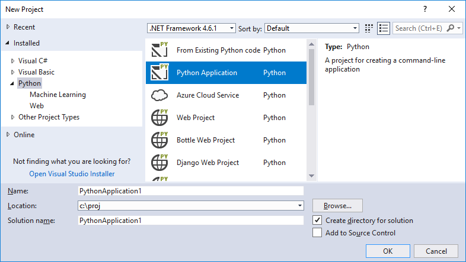
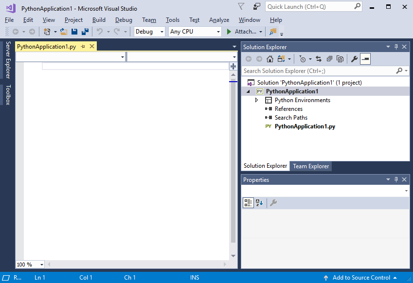
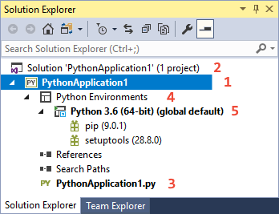

# Working with Python in Visual Studio

Python is a popular programming language that is reliable, flexible, easy to learn, free to use on all operating systems, and supported by both a strong developer community and many free libraries. The language supports all manners of development, including web applications, web services, desktop apps, scripting, and scientific computing and is used by many universities, scientists, casual developers, and professional developers alike.

Visual Studio provides first-class language support for Python. This tutorial guides you through the following steps:

- [Step 0: Installation](vs-tutorial-01-00.md)
- [Step 1: Creating a Python project (this topic)](#step-1-create-a-new-python-project)
- [Step 2: Writing and running code to see Visual Studio IntelliSense at work](vs-tutorial-01-02.md)
- [Step 3: Create more code in the interactive REPL window](vs-tutorial-01-03.md)
- [Step 4: Run the completed program in the Visual Studio debugger](vs-tutorial-01-04.md)
- [Step 5: Installing packages and managing Python environments](vs-tutorial-01-05.md)
- [Step 6: Working with Git](vs-tutorial-01-06.md)

## Prerequisites

- Visual Studio 2017 with the Python workload installed. See [Step 0](vs-tutorial-01-00.md) for instructions.

## Step 1: Create a new Python project

A *project* is how Visual Studio manages all the files that come together to produce a single application, including source code, resources, configurations, and so on. A project formalizes and maintains the relationship between all the project's files as well as external resources that are shared between multiple projects. As such, project allow your application to effortlessly expand and grow much easier than simply managing a project's relationships in ad hoc folders, scripts, text files, and even your own mind.

In this tutorial you begin with a simple project containing a single, empty code file.

1. In Visual Studio, select **File > New > Project** (Ctrl+Shift+N), which brings up the **New Project** dialog. Here you browse templates across different languages, then select one for your project and specify where Visual Studio places files.

1. To view Python templates, select **Installed > Python** on the left, or searching for "Python". Using search is a great way to find a template when you can't remember its location in the languages tree.

    

    Notice how Python support in Visual Studio includes a number of project templates, including web applications using the Bottle, Flask, and Django frameworks. For the purposes of this walkthrough, however, let's start with an empty project.

1. Select the **Python Application** template, specify a name for the project, and select **OK**.

1. After a few moments, Visual Studio shows the project structure in the **Solution Explorer** window (1). The default code file is open in the editor (2). The properties window (3) also appears to show additional information for any item selected in Solution Explorer, including its exact location on disk.

    

1. Take a few moments to familiarize yourself with Solution Explorer, which is where you browse files and folders in your project.

    

    (1) Highlighted in bold is your project, using the name you gave in the New Project dialog. On disk, this project is represented by a `.pyproj` file in your project folder.

    (2) At the top level is a *solution*, which by default has the same name as your project. A solution, represented by a `.sln` file on disk, is a container for one or more related projects. For example, if you write a C++ extension for your Python application, that C++ project could reside within the same solution. The solution might also contain a project for a web service, along with projects for dedicated test programs. 

    (3) Under your project you see source files, in this case only a single `.py` file. Selecting a file displays its properties in the Properties window. Double-clicking a file opens it in whatever way is appropriate for that file.

    (4) Also under the project is the **Python Environments** node. When expanded, you see the available Python interpreters that are available to you. Expand an interpreter node to see the libraries that are installed into that environment (5).

    Right-click any node or item in Solution Explorer to access a menu of applicable commands. For example, the **Rename** command allows you to change the name of any node or item, including the project and the solution.

## Next steps

> [!div class="nextstepaction"]
> [Writing and running code](vs-tutorial-01-02.md)

## Going deeper

- [Python projects in Visual Studio](python-projects.md).
- [Learn about the Python language on python.org](https://www.python.org)
- [Python for Beginners](https://www.python.org/about/gettingstarted/) (python.org)
- [Free Python courses on Microsoft Virtual Academy](https://mva.microsoft.com/search/SearchResults.aspx#!q=python)
- [Top Python Questions at Microsoft Virtual Academy](https://aka.ms/mva-top-python-questions)
