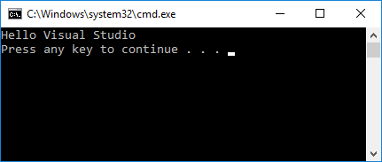
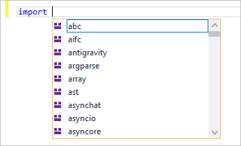
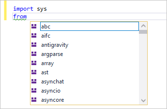
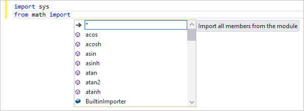
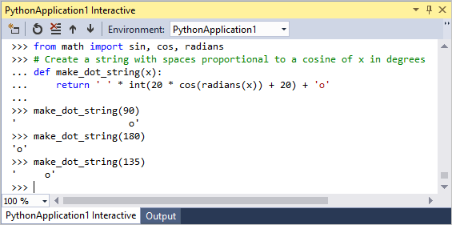
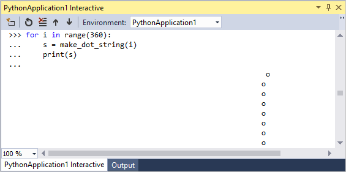
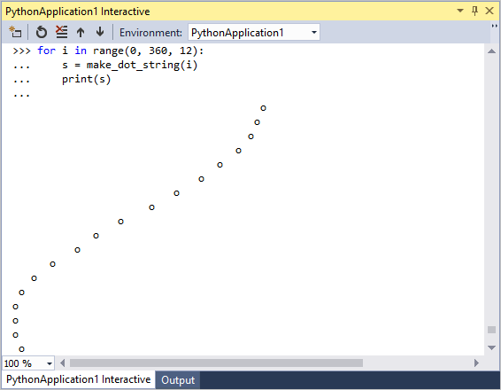
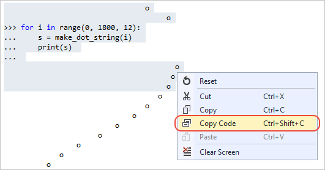
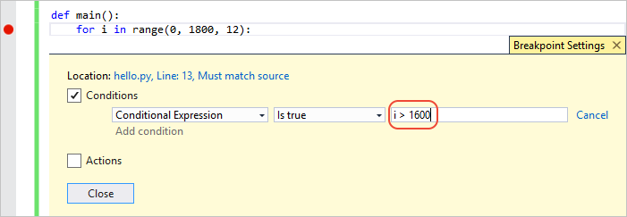

# Step 2: Writing and running code

**Previous step: [Creating a new Python project](vs-tutorial-01-01.md).**

While Solution Explorer is where you manage project files, the *editor* window is typically where you work with the *contents* of files, like source code. The editor is contextually aware of the type of file you're editing, including the programming language (based on the file extension), and offers features appropriate to that language such as syntax coloring and auto-completion using IntelliSense.

1. After creating a new "Python Application" project, a default empty file named `PythonApplication1.py` is open in the Visual Studio editor. To rename it, right-click the file in Solution Explorer, select **Rename**, and enter `hello.py`.

1. Start typing `print("Hello, Visual Studio")` and notice how Visual Studio IntelliSense displays auto-completion options along the way. The outlined option in the drop-down list is the default completion that's used when you press the Tab key. Completions are most helpful when longer statements or identifiers are involved.

    

1. IntelliSense shows different information depending on the statement you're using, the function you're calling, and so forth. With the `print` function, typing `(` after `print` to indicate a function call displays full usage information for that function. The IntelliSense pop up also shows the current argument in boldface (**value** as shown here):

    

1. Complete the statement so it matches the following:

    ```python
    print("Hello, Visual Studio")
    ```

1. Notice the syntax coloration that differentiates the statement `print` from the argument `"Hello Visual Studio"`. Also, temporarily delete the last `"` on the string and notice how Visual Studio will show a red underline for code that contains syntax errors. Then replace the `"` to correct the code.
 
    
 
    > [!Tip]
    > Because one's development environment is a very personal matter, Visual Studio gives you complete control over Visual Studio's appearance and behavior. Select the **Tools > Options** menu command and explore the settings under the **Environment** and **Text Editor** tabs. By default you'll see only a limited number of options; to see every option for every programming language, select **Show all settings** at the bottom of the dialog box. At any time, pressing F1 or selecting the **?** button on the dialog's title bar takes you to documentation for the current set of options.

1. Run the code you've written to this point by pressing Ctrl+F5 or selecting **Debug > Start Without Debugging** menu item. Visual Studio warns you if you still have errors in your code.
 
1. When you run the program, a console window appears displaying the results, just as if you'd run a Python interpreter with `hello.py` from the command line. Press a key to close the window and return to the Visual Studio editor.

    

1. In addition to completions for statements and functions, IntelliSense provide completions for Python `import` and `from` statements. These completions help you easily discover what modules are available in your environment and the members of those modules. In the editor, delete the `print` line and start typing `import `. A list of modules appears when you type the space:

    

1. Complete the line by typing or selecting `sys`.

1. On the next line, type `from` to again see a list of modules:

    

1. Select or type `math`, then continue typing with a space and `import`, which displays the module members:

    

1. Finish by importing the `sin`, `cos`, and `radians` members, noticing the auto-completions available for each. When you're done, your code should appear as follows:

    ```python
    import sys  
    from math import sin, cos, radians          
    ```

    > [!Tip]
    > Completions work with substrings as you type, matching parts of words, letters at the beginning of words, and even skipped characters. See [Editing Code - Completions](code-editing.md#completions) for details.

1. Add a little more code to print the cosine values for 360 degrees:

    ```python 
    for i in range(360):        
        print(cos(radians(i))
    ```

1. Run the program again with Ctrl+F5 or **Debug > Start Without Debugging**. Close the output window when you're done.

## Step 3: Using the interactive REPL window

The Visual Studio *interactive window* for Python provides a rich read-evaluate-print-loop (REPL) experience that greatly shortens the usual edit-build-debug cycle. The interactive window provides all the capabilities of the REPL experience of the Python command line. It also makes it very easy to exchange code with source files in the Visual Studio editor, which is otherwise cumbersome with the command line.

1. Open the interactive window by right-clicking the project's Python environment in Solution Explorer (such as "Python 3.6 (32-bit)" shown in an earlier graphic) and selecting **Open Interactive Window**. You can alternately select **View > Other Windows > Python Interactive Windows** from the main Visual Studio menu.

1. The interactive window opens below the editor with the usual `>>>` Python REPL prompt. Oftentimes you want to make the interactive window larger, which you can do by dragging the separator between the two windows:

    

    > [!Tip]
    > You can resize all of the windows in Visual Studio by dragging the bordering separators. You can also drag windows out independently of the Visual Studio frame, and rearrange them however you like within the frame. For complete details, see <a href="https://docs.microsoft.com/visualstudio/ide/customizing-window-layouts-in-visual-studio" target="_blank">Customizing window layouts</a>.

1. Enter a few statements like `print("Hello, Visual Studio")` and expressions like `123/456` to see immediate results:

    

1. When you start writing a multiline statement, like a function definition, the interactive window shows Python's `...` prompt for continuing lines, which, unlike the command-line REPL, provides automatic indentation:

    

1. The interactive window provides a full history of everything you've entered, and improves upon the command-line REPL with multiline history items. For example, you can easily recall the entire definition of the `f` function as a single unit and easily change the name to `make_double`, rather than re-creating the function line by line.

1. Visual Studio can send multiple lines of code from an editor window to the interactive window. This capability allows you to maintain code in a source file and easily send select parts of it to the interactive window. You can then work with such code fragments in the rapid REPL environment rather than having to run the whole program. To see this feature, first replace the `for` loop in your `hello.py` file with the following:

    ```python
    # Create a string with spaces proportional to a cosine of x in degrees
    def make_dot_string(x):  
        return ' ' * int(20 * cos(radians(x)) + 20) + 'o'
    ```

1. Select only the `import` and `from` statements in `hello.py`, right-click, and select **Send to Interactive** (or press Ctrl+Enter). The code fragment is immediately pasted into the interactive window and run. Now select the `make_dot_string` function and repeat the same command, which again runs that code fragment. Because the code defines a function, you can quickly test that function by calling it a few times:

    

    > [!Tip]
    > Using Ctrl+Enter in the editor *without* a selection runs the current line of code in the interactive window and automatically places the caret on the next line. With this feature, pressing Ctrl+Enter repeatedly provides a convenient way to step through your code that is not possible with only the Python command line. It also lets you step through your code without running the debugger and without necessarily starting your program from the beginning.

1. You can also copy and paste multiple lines of code into the interactive window from any source, such as the snippet below, which is difficult to do with the Python command-line REPL. When pasted, the interactive window runs that code as if you'd typed it in:

    ```python
    for i in range(360):
        s = make_dot_string(i)  
        print(s) 
    ```

    

1. As you can see, this code works fine but its output isn't very inspiring. A different step value in the `for` loop would show more of the cosine wave. Fortunately, because the entire `for` loop is in the REPL history as a single unit, it's easy to go back and make whatever changes you want and then test the function again. Press the up arrow to first recall the `for` loop. Then press the left or right arrows to start navigating in the code (until you do so, the up and down arrows continue to cycle through the history). Navigate to and change the `range` specification to `range(0, 360, 12)`. Then press Ctrl+Enter (anywhere in the code) to run the whole statement again:

    

1. Repeat the process to experiment with different step settings until you find a value you like best. You can also make the wave repeat by lengthening the range, for example, `range(0, 1800, 12)`.
 
1. When you're satisfied with code you're written in the interactive window, select it, right-click and select **Copy Code** (Ctrl+Shift+C), and then paste into the editor. Notice how this special feature of Visual Studio automatically omits any output as well as the `>>>` and `...` prompts. For example, the image below shows using the **Copy Code** command on a selection that includes prompts and output:

    

    When you paste into the editor, you get only the code:

    ```python
    for i in range(0, 1800, 12):
        s = make_dot_string(i)  
        print(s) 
    ```

    If you want to copy the exact contents of the interactive window, including prompts and output, just use the standard **Copy** command.

1. What you've just done is use the rapid REPL environment of the interactive window to work out the details for a small piece of code, then you conveniently added that code to your project's source file. When you now run the code again with Ctrl+F5 (or **Debug > Start Without Debugging**), you see the exact results you wanted.

## Step 4: Running code in the debugger

In addition to managing projects, providing a rich editing experience, and the interactive window, Visual Studio provides full-featured debugging for Python code. In the debugger, you can run your code step by step, including every iteration of a loop. You can also pause the program whenever certain conditions are true. At any point when the program is paused in the debugger, you can examine the entire program state and change the value of variables. Such actions are essential for tracking down program bugs, and also provide very helpful aids for carefully following the exact program flow.

1. Replace the code in your `hello.py` file with the following. This variation of the code expands `make_dot_string` so that you can examine its discrete steps in the debugger. It also places the `for` loop into a `main` function and runs it explicitly by calling that function:

    ```python  
    import sys  
    from math import sin, cos, radians    
    
    # Create a string with spaces proportional to a cosine of x in degrees
    def make_dot_string(x):
        rad = radians(x)                             # cos works with radians
        numspaces = int(20 * cos(radians(x)) + 20)   # scale to 0-40 spaces
        str = ' ' * numspaces + 'o'                  # place 'o' after the spaces
        return str
    
    def main():  
        for i in range(0, 1800, 12):
            s = make_dot_string(i)  
            print(s)  
            
    main()
    ```  

1. Check that the code works properly by pressing F5 or selecting the **Debug > Start Debugging** menu command. This command runs the code in the debugger, but because you haven't done anything to pause the program while it's running, it just prints a wave pattern for a few iterations. Pressing a key to the output window.

    > [!Tip]
    > To close the output window automatically when the program completes, replace the `main()` call with the following code:
    >
    > ```python    
    > if __name__ == "__main__":  
    >     sys.exit(int(main() or 0))      
    > ```    

1. Set a breakpoint on the `for` statement by clicking once in the gray margin by that line, or by placing the caret in that line and using the **Debug > Toggle Breakpoint** command (F9). A red dot appears in the gray margin to indicate the breakpoint (as noted by the arrow below):

    

1. Start the debugger again (F5) and see that running the code stops on the line with that breakpoint. Here you can inspect the call stack and examine variables. Variables that are in-scope appear in the **Autos** window when they're defined; you can also switch to the **Locals** view at the bottom of that window to show all variables that Visual Studio finds in the current scope (including functions), even before they're defined:

    

1. Observe the debugging toolbar (shown below) along the top of the Visual Studio Window. This toolbar provides quick access to the most common debugging commands (which can also be found on the **Debug** menu):

    

    The buttons from left to right as follows:
    - **Continue** (F5) runs the program until the next breakpoint or until program completion.
    - **Break All** (Ctrl+Alt+Break) pauses a long-running program.
    - **Stop Debugging** (Shift+F5) stops the program wherever it is, and exits the debugger.
    - **Restart** (Ctrl+Shift+F5) stops the program wherever it is, and restarts it from the beginning in the debugger.
    - **Show Next Statement** (Alt + Num *) switches to the next line of code to run. This is most helpful when you navigate around within your code during a debugging session and want to quickly return to the point where the debugger is paused.
    - **Step Into** (F11) runs the next line of code, entering into called functions.
    - **Step Over** (F10) runs the next line of code without entering into called functions.
    - **Step Out** (Shift+F11) runs the remainder of the current function and pauses in the calling code.

1. Step over the `for` statement using **Step Over**. *Stepping* means that the debugger runs the current line of code, including any function calls, and then immediately pauses again. Notice how the variable `i` is now defined in the **Locals** and **Autos** windows.
 
1. Step over the next line of code, which calls `make_dot_string` and pauses. Step Over here specifically means that the debugger runs the whole of `make_dot_string` and pauses when it returns. The debugger does not stop inside that function unless a separate breakpoint exists there.

1. Continue stepping over the code a few more times and observe how the values in the **Locals** or **Autos** window change.

1. In the **Locals** or **Autos** window, double-click in the **Value** column for either the `i` or `s` variables to edit the value. Press Enter or click outside that value to apply any changes.

1. Continue stepping through the code using **Step Into**. Step Into means that the debugger enters inside any function call for which it has debugging information, such as `make_dot_string`. Once inside `make_dot_string` you can examine its local variables and step through its code specifically.
 
1. Continue stepping with Step Into and notice that when you reach the end of the `make_dot_string`, the next step returns to the `for` loop with the new return value in the `s` variable. As you step again to the `print` statement, notice that Step Into on `print` does not enter into that function. This is because `print` is not written in Python but is rather native code inside the Python runtime.

1. Continue using Step Into until you're again partway into `make_dot_string`. Then use **Step Out** and notice that you return to the `for` loop. With Step Out, the debugger runs the remainder of the function and then automatically pauses in the calling code. This is very helpful when you've stepped through some portion of a lengthy function that you wish to debug, but don't need to step through the rest and don't want to set an explicit breakpoint in the calling code.

1. To continue running the program until the next breakpoint is reached, use **Continue** (F5). Because you have a breakpoint in the `for` loop, you'll break on the next iteration.

1. Stepping through hundreds of iterations of a loop can be tedious, so Visual Studio lets you add a *condition* to a breakpoint. The debugger then pauses the program at the breakpoint only when the condition is met. For example, you can use a condition with the breakpoint on the `for` statement so that it pauses only when the value of `i` exceeds 1600. To set this condition, right-click the red breakpoint dot and select **Conditions...** (Alt+F9,C). In the **Breakpoint Settings** popup that appears, enter `i > 1600` as the expression and select **Close**. Press F5 to continue and observe that the program runs many iterations before the next break. 

    

1. To run the program to completion, disable the breakpoint by right-clicking and selecting **Disable breakpoint** (Ctrl+F9). Then select **Continue** (or press F5) to run the program. When the program ends, Visual Studio stops its debugging session and returns to its editing mode. Note that you can also delete the breakpoint by clicking its dot, but this also deletes any condition you've set.

> [!Tip]    
> In some situations, such as a failure to launch the Python interpreter itself, the output window may appear only briefly and then close automatically without giving you a chance to see any errors messages. If this happens, right-click the project in Solution Explorer, select **Properties**, select the **Debug** tab, then add `-i` to the **Interpreter Arguments** field. This argument causes the interpreter to go into interactive mode after a program completes, thereby keeping the window open until you enter Ctrl+Z,Enter to exit.

## Next Steps

> [!div class="nextstepaction"]
> [Using the interactive REPL window](vs-tutorial-01-03.md)


## Going deeper

- [Editing Code](code-editing.md)
- [Formatting Code](code-formatting.md)
- [Refactoring Code](code-refactoring.md)
- [Using PyLint](code-pylint.md)
