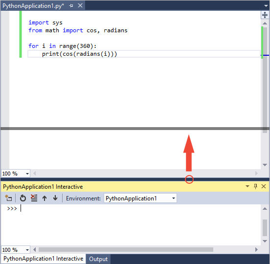
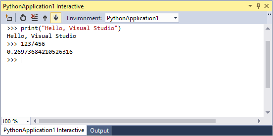
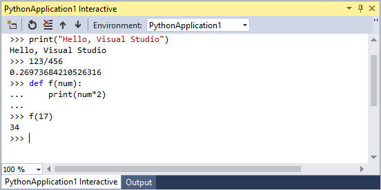

# Step 3: Using the interactive REPL window

**Previous step: [Writing and running code](vs-tutorial-01-02.md)**

The Visual Studio *interactive window* for Python provides a rich read-evaluate-print-loop (REPL) experience that greatly shortens the usual edit-build-debug cycle. The interactive window provides all the capabilities of the REPL experience of the Python command line. It also makes it very easy to exchange code with source files in the Visual Studio editor, which is otherwise cumbersome with the command line.

1. Open the interactive window by right-clicking the project's Python environment in Solution Explorer (such as "Python 3.6 (32-bit)" shown in an earlier graphic) and selecting **Open Interactive Window**. You can alternately select **View > Other Windows > Python Interactive Windows** from the main Visual Studio menu.

1. The interactive window opens below the editor with the usual `>>>` Python REPL prompt. Oftentimes you want to make the interactive window larger, which you can do by dragging the separator between the two windows:

    

    > [!Tip]
    > You can resize all of the windows in Visual Studio by dragging the bordering separators. You can also drag windows out independently of the Visual Studio frame, and rearrange them however you like within the frame. For complete details, see [Customizing window layouts](../ide/customizing-window-layouts-in-visual-studio.md).

1. Enter a few statements like `print("Hello, Visual Studio")` and expressions like `123/456` to see immediate results:

    

1. When you start writing a multiline statement, like a function definition, the interactive window shows Python's `...` prompt for continuing lines, which, unlike the command-line REPL, provides automatic indentation:

    

1. The interactive window provides a full history of everything you've entered, and improves upon the command-line REPL with multiline history items. For example, you can easily recall the entire definition of the `f` function as a single unit and easily change the name to `make_double`, rather than re-creating the function line by line.

1. Visual Studio can send multiple lines of code from an editor window to the interactive window. This capability allows you to maintain code in a source file and easily send select parts of it to the interactive window. You can then work with such code fragments in the rapid REPL environment rather than having to run the whole program. To see this feature, first replace the `for` loop in the `PythonApplication1.py` file with the following:

    ```python
    # Create a string with spaces proportional to a cosine of x in degrees
    def make_dot_string(x):
        return ' ' * int(20 * cos(radians(x)) + 20) + 'o'
    ```

1. Select only the `import` and `from` statements in the `.py` file, right-click, and select **Send to Interactive** (or press Ctrl+Enter). The code fragment is immediately pasted into the interactive window and run. Now select the `make_dot_string` function and repeat the same command, which again runs that code fragment. Because the code defines a function, you can quickly test that function by calling it a few times:

    

    > [!Tip]
    > Using Ctrl+Enter in the editor *without* a selection runs the current line of code in the interactive window and automatically places the caret on the next line. With this feature, pressing Ctrl+Enter repeatedly provides a convenient way to step through your code that is not possible with only the Python command line. It also lets you step through your code without running the debugger and without necessarily starting your program from the beginning.

1. You can also copy and paste multiple lines of code into the interactive window from any source, such as the snippet below, which is difficult to do with the Python command-line REPL. When pasted, the interactive window runs that code as if you'd typed it in:

    ```python
    for i in range(360):
        s = make_dot_string(i)
        print(s)
    ```

    

1. As you can see, this code works fine but its output isn't very inspiring. A different step value in the `for` loop would show more of the cosine wave. Fortunately, because the entire `for` loop is in the REPL history as a single unit, it's easy to go back and make whatever changes you want and then test the function again. Press the up arrow to first recall the `for` loop. Then press the left or right arrows to start navigating in the code (until you do so, the up and down arrows continue to cycle through the history). Navigate to and change the `range` specification to `range(0, 360, 12)`. Then press Ctrl+Enter (anywhere in the code) to run the whole statement again:

    

1. Repeat the process to experiment with different step settings until you find a value you like best. You can also make the wave repeat by lengthening the range, for example, `range(0, 1800, 12)`.
 
1. When you're satisfied with code you're written in the interactive window, select it, right-click and select **Copy Code** (Ctrl+Shift+C), and then paste into the editor. Notice how this special feature of Visual Studio automatically omits any output as well as the `>>>` and `...` prompts. For example, the image below shows using the **Copy Code** command on a selection that includes prompts and output:

    

    When you paste into the editor, you get only the code:

    ```python
    for i in range(0, 1800, 12):
        s = make_dot_string(i)
        print(s)
    ```

    If you want to copy the exact contents of the interactive window, including prompts and output, just use the standard **Copy** command.

1. What you've just done is use the rapid REPL environment of the interactive window to work out the details for a small piece of code, then you conveniently added that code to your project's source file. When you now run the code again with Ctrl+F5 (or **Debug > Start Without Debugging**), you see the exact results you wanted.

## Next steps

> [!div class="nextstepaction"]
> [Running code in the debugger](vs-tutorial-01-04.md)

### Going deeper

- [Using the Interactive Window](interactive-repl.md)
- [Using IPython REPL](interactive-repl-ipython.md)
