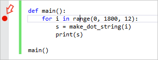
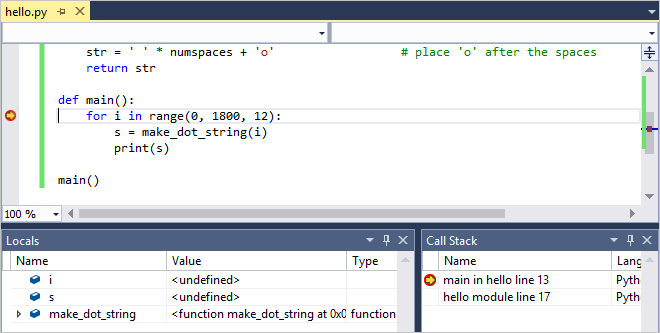

## Step 4: Running code in the debugger

**Previous step: [Using the interactive REPL window](vs-tutorial-01-03.md).**

In addition to managing projects, providing a rich editing experience, and the interactive window, Visual Studio provides full-featured debugging for Python code. In the debugger, you can run your code step by step, including every iteration of a loop. You can also pause the program whenever certain conditions are true. At any point when the program is paused in the debugger, you can examine the entire program state and change the value of variables. Such actions are essential for tracking down program bugs, and also provide very helpful aids for carefully following the exact program flow.

1. Replace the code in your `hello.py` file with the following. This variation of the code expands `make_dot_string` so that you can examine its discrete steps in the debugger. It also places the `for` loop into a `main` function and runs it explicitly by calling that function:

    ```python  
    import sys  
    from math import sin, cos, radians    
    
    # Create a string with spaces proportional to a cosine of x in degrees
    def make_dot_string(x):
        rad = radians(x)                             # cos works with radians
        numspaces = int(20 * cos(radians(x)) + 20)   # scale to 0-40 spaces
        str = ' ' * numspaces + 'o'                  # place 'o' after the spaces
        return str
    
    def main():  
        for i in range(0, 1800, 12):
            s = make_dot_string(i)  
            print(s)  
            
    main()
    ```  

1. Check that the code works properly by pressing F5 or selecting the **Debug > Start Debugging** menu command. This command runs the code in the debugger, but because you haven't done anything to pause the program while it's running, it just prints a wave pattern for a few iterations. Pressing a key to the output window.

    > [!Tip]
    > To close the output window automatically when the program completes, replace the `main()` call with the following code:
    >
    > ```python    
    > if __name__ == "__main__":  
    >     sys.exit(int(main() or 0))      
    > ```    

1. Set a breakpoint on the `for` statement by clicking once in the gray margin by that line, or by placing the caret in that line and using the **Debug > Toggle Breakpoint** command (F9). A red dot appears in the gray margin to indicate the breakpoint (as noted by the arrow below):

    

1. Start the debugger again (F5) and see that running the code stops on the line with that breakpoint. Here you can inspect the call stack and examine variables. Variables that are in-scope appear in the **Autos** window when they're defined; you can also switch to the **Locals** view at the bottom of that window to show all variables that Visual Studio finds in the current scope (including functions), even before they're defined:

    

1. Observe the debugging toolbar (shown below) along the top of the Visual Studio Window. This toolbar provides quick access to the most common debugging commands (which can also be found on the **Debug** menu):

    

    The buttons from left to right as follows:
    - **Continue** (F5) runs the program until the next breakpoint or until program completion.
    - **Break All** (Ctrl+Alt+Break) pauses a long-running program.
    - **Stop Debugging** (Shift+F5) stops the program wherever it is, and exits the debugger.
    - **Restart** (Ctrl+Shift+F5) stops the program wherever it is, and restarts it from the beginning in the debugger.
    - **Show Next Statement** (Alt + Num *) switches to the next line of code to run. This is most helpful when you navigate around within your code during a debugging session and want to quickly return to the point where the debugger is paused.
    - **Step Into** (F11) runs the next line of code, entering into called functions.
    - **Step Over** (F10) runs the next line of code without entering into called functions.
    - **Step Out** (Shift+F11) runs the remainder of the current function and pauses in the calling code.

1. Step over the `for` statement using **Step Over**. *Stepping* means that the debugger runs the current line of code, including any function calls, and then immediately pauses again. Notice how the variable `i` is now defined in the **Locals** and **Autos** windows.
 
1. Step over the next line of code, which calls `make_dot_string` and pauses. Step Over here specifically means that the debugger runs the whole of `make_dot_string` and pauses when it returns. The debugger does not stop inside that function unless a separate breakpoint exists there.

1. Continue stepping over the code a few more times and observe how the values in the **Locals** or **Autos** window change.

1. In the **Locals** or **Autos** window, double-click in the **Value** column for either the `i` or `s` variables to edit the value. Press Enter or click outside that value to apply any changes.

1. Continue stepping through the code using **Step Into**. Step Into means that the debugger enters inside any function call for which it has debugging information, such as `make_dot_string`. Once inside `make_dot_string` you can examine its local variables and step through its code specifically.
 
1. Continue stepping with Step Into and notice that when you reach the end of the `make_dot_string`, the next step returns to the `for` loop with the new return value in the `s` variable. As you step again to the `print` statement, notice that Step Into on `print` does not enter into that function. This is because `print` is not written in Python but is rather native code inside the Python runtime.

1. Continue using Step Into until you're again partway into `make_dot_string`. Then use **Step Out** and notice that you return to the `for` loop. With Step Out, the debugger runs the remainder of the function and then automatically pauses in the calling code. This is very helpful when you've stepped through some portion of a lengthy function that you wish to debug, but don't need to step through the rest and don't want to set an explicit breakpoint in the calling code.

1. To continue running the program until the next breakpoint is reached, use **Continue** (F5). Because you have a breakpoint in the `for` loop, you'll break on the next iteration.

1. Stepping through hundreds of iterations of a loop can be tedious, so Visual Studio lets you add a *condition* to a breakpoint. The debugger then pauses the program at the breakpoint only when the condition is met. For example, you can use a condition with the breakpoint on the `for` statement so that it pauses only when the value of `i` exceeds 1600. To set this condition, right-click the red breakpoint dot and select **Conditions...** (Alt+F9,C). In the **Breakpoint Settings** popup that appears, enter `i > 1600` as the expression and select **Close**. Press F5 to continue and observe that the program runs many iterations before the next break. 

    

1. To run the program to completion, disable the breakpoint by right-clicking and selecting **Disable breakpoint** (Ctrl+F9). Then select **Continue** (or press F5) to run the program. When the program ends, Visual Studio stops its debugging session and returns to its editing mode. Note that you can also delete the breakpoint by clicking its dot, but this also deletes any condition you've set.

> [!Tip]    
> In some situations, such as a failure to launch the Python interpreter itself, the output window may appear only briefly and then close automatically without giving you a chance to see any errors messages. If this happens, right-click the project in Solution Explorer, select **Properties**, select the **Debug** tab, then add `-i` to the **Interpreter Arguments** field. This argument causes the interpreter to go into interactive mode after a program completes, thereby keeping the window open until you enter Ctrl+Z,Enter to exit.

## Next Steps

> [!div class="nextstepaction"]
> TODO

### Going deeper
- [Debugging](debugging.md).
- Also see [Debugging in Visual Studio](../debugger/debugging-in-visual-studio.md) for full documentation of Visual Studio's debugging features.
