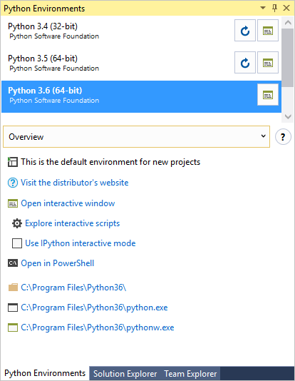
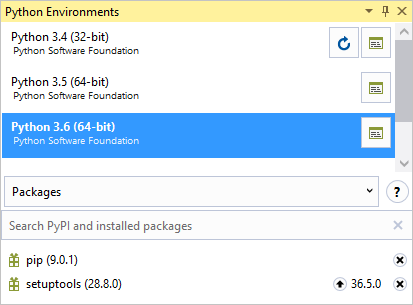
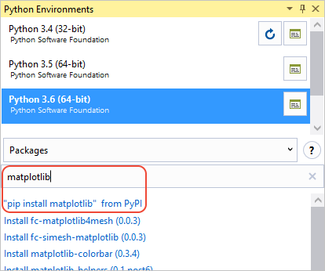
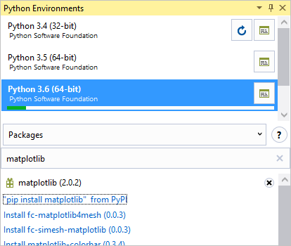
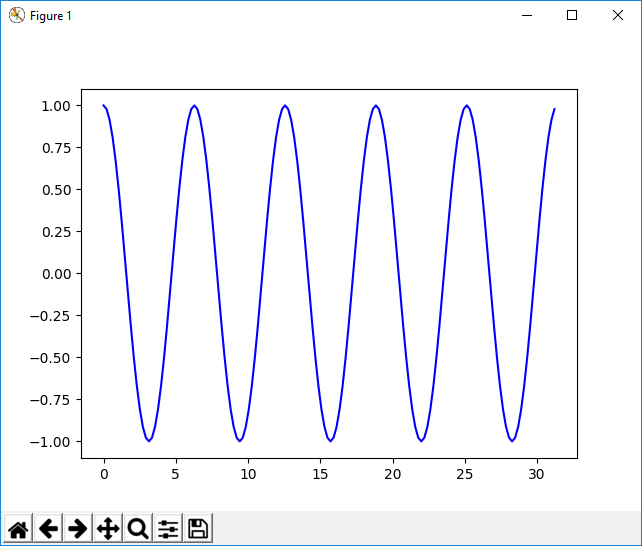

# Step 5: Installing packages in your Python environment

**Previous step: [Running code in the debugger](vs-tutorial-01-04.md)**

The Python developer community has produced thousands of useful packages that you can incorporate into your own projects. Visual Studio provides a UI to manage packages in your Python environments.

1. Select the **View > Other Windows > Python Environments** menu command. The **Python Environments** window opens as a peer to Solution Explorer and shows the different environments available to you. The list includes both environments that you installed using the Visual Studio installer and those you installed separately. The environment in bold is the default environment that's used for new projects.

  

1. The environment's **Overview** tab provides quick access to an interactive window for that environment along with the environment's installation folder and interpreters. For example, select **Open interactive window** and an interactive window for that specific environment appears in Visual Studio.

1. Select the **Packages** tab and you see a list of packages that are currently installed in the environment.

  

1. Install `matplotlib` by entering its name into the search field, then select the `pip install`

  

1. Consent to elevation if prompted to do so.
 
1. After the package is installed, it appears in the Python Environments window. The **X** to the right of the package uninstalls it. 

  

  The small progress bar underneath the environment indicates that Visual Studio is building its IntelliSense database for the newly-installed package. The **IntelliSense** tab also shows more detailed information. Note that until that database is complete, IntelliSense features like auto-completion and syntax checking won't be active in the editor for that package.

1. Create a new project with **File > New > Project**, selecting the "Python Application" template. In the code file that appears, paste the following code, which creates a cosine wave like the previous tutorial steps, only this time plotted graphically:

    ```python
    import numpy as np     # installed with matplotlib
    import matplotlib.pyplot as plt
    from math import radians

    def main():
        x = np.arange(0, radians(1800), radians(12))
        plt.plot(x, np.cos(x), 'b')
        plt.show()

    main()
    ```

1. Run the program with (F5) or without the debugger (Ctrl+F5) to see the output:

  

## Next steps

> [!div class="nextstepaction"]
> [Working with Git](vs-tutorial-01-06.md)

### Going deeper

- [Python environments](python-environments.md)
