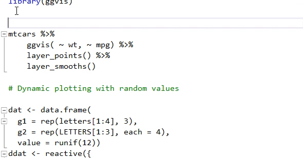

# Editing R code in Visual Studio
 
R Tools for Visual Studio (RTVS) tailors the Visual Studio editing experience specifically for R, while retaining all the features and the ability to use extensions. (For example, if you prefer VIM key bindings, you can install the free [VsVim extension](https://visualstudiogallery.msdn.microsoft.com/59ca71b3-a4a3-46ca-8fe1-0e90e3f79329) from the Visual Studio gallery.)

In this topic:

Also see the topics on [IntelliSense](code-intellisense.md), [code navigation](code-navigation.md), and [code snippets](code-snippets.md).

## Syntax highlighting 

In addition to coloring different parts of your code, such as strings, comments, and keywords, RTVS also highlights and enables links in comments:

Visual Studio also supports *themes* that let you switch between a set of predefined themes (e.g., Blue, Dark, and Light) as well as making it easy for you to define custom colors for R syntax elements through Visual Studio's extensive customization features.

## Typing and organizing your code

As you type your code, we do a number of things to improve your productivity. For example, we will auto-complete braces and parenthesis as you type: 

When typing calls to functions that have many parameters, oftentimes you want to line up the parameters to make the code easier to read. We now support remembering the indentation position for your parameters once you've told us what it is. From that point onwards we'll automatically indent to that indentation position when you press Enter at the end of a line:

Collapsible code regions are really useful when you want to temporarily hide chunks of code in the editor. You just need to surround the code that you want to create a region around using specially formatted comments. The start of a region is defined by a comment with a trailing set of `---`; the comment text will be displayed as the name of the region when the region is collapsed. The
end of a region is defined by a comment that contains `----`. See an example of this below:

 
## Editor and interactive window

A very common style of programming involves write code in the editor, and then selecting and sending lines to the R Interactive window (also known as a Read-Eval-Print-Loop or REPL). You can select code within the editor and send to the REPL using Ctrl+Enter:
 

 
If you press Ctrl+Enter in the editor without selecting any text, it will send the current line that the cursor is on to the REPL, and then advance to the next non-whitespace line. This makes it convenient to execute a sequence of code from the editor simply by pressing Ctrl+Enter without the need to advance the cursor to the next line. In the example below, the cursor was originally on the line in the editor window with the "1", and Ctrl+Enter was pressed twice. 
 
 
 
## Code Formatting

**Automatic formatting** saves you time when documenting code or formatting it the way you want it to be - even if you copy and pasted that code from a different implementation. Here's an example of generating an [Roxygen](http://roxygen.org/) comment using the parameter names of a function simply by typing `###` on a blank line above the function definition:

The editor supports automatically formatting R code based on your preferences. For example, if you had a function definition all on a single line:
 

You can reformat the code by selecting it, right clicking on the selection, and running the Format Selection command. Or you can also just type the shortcut key chord Ctrl K,F.
 
 
 
The editor also supports formatting an entire document. So if you loaded a large document of R code that you wanted to format to your coding conventions, you can open the file in the RTVS editor, and select Format Document from the Edit menu, or by pressing the shortcut key chord Ctrl+K,D.
 
 
 
You can define your own R coding conventions by invoking the **Tools > Options** menu:
 
 

This brings up the Options dialog box. Once that is open, you can scroll down until you reach the Text Editor node. Click the chevron to open it and scroll down until you reach the R section. Here, you will find all of the editor configuration settings for R. 
 
 
 
Another way to quickly get to the R editor options is to use the **R Tools** top level menu:
 
 
 
Within the dialog box, if you select the **Advanced** options, you can define how you want your code formatted:
 
  

This includes whether you want RTVS to automatically format code based on your preferences when you type it, or whether you want it to reformat code that you paste into RTVS from the clipboard. This is helpful when you are pasting in code that you copy from a web browser, for example.
 
You can also undo formatting. If you have **Format** on paste enabled in the RTVS options, and you want to preserve the formatting in the pasted code without permanently turning off the **Format** on paste option in RTVS, all you need to do is paste it into RTVS and press Ctrl+Z to undo the formatting changes.
 