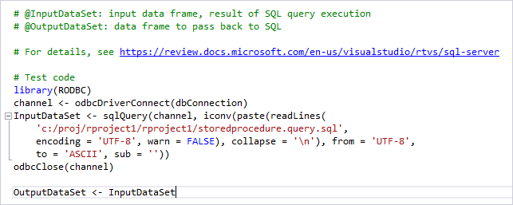
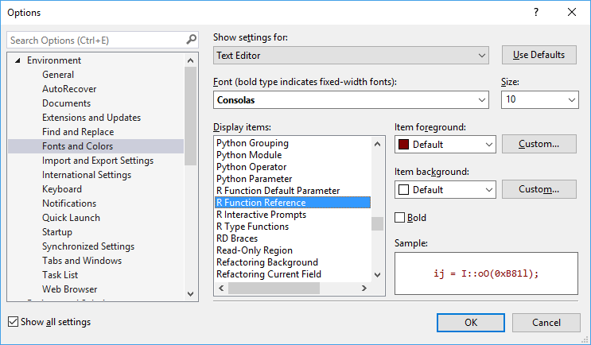
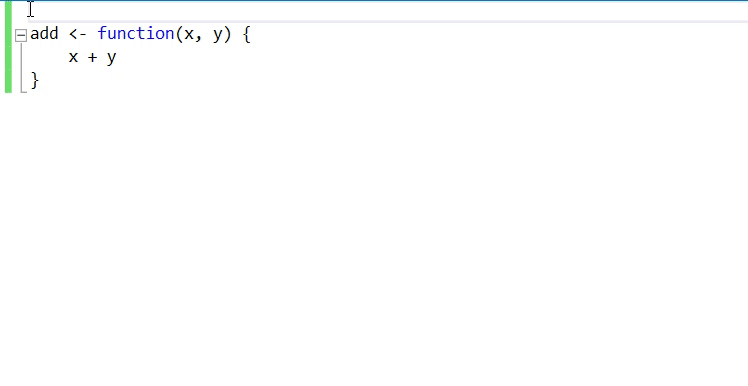

# Edit R code in Visual Studio

R Tools for Visual Studio (RTVS) tailors the Visual Studio editing experience specifically for R while retaining all the features and the ability to use extensions. (For example, if you prefer VIM key bindings, you can install the free [VsVim extension](https://visualstudiogallery.msdn.microsoft.com/59ca71b3-a4a3-46ca-8fe1-0e90e3f79329) from the Visual Studio gallery.)

In addition to the features in this article, also see [IntelliSense](r-intellisense.md), [linting](linting-r-code.md), [code snippets](code-snippets-for-r.md), and [R Markdown](rmarkdown-with-r-in-visual-studio.md).

## Syntax highlighting

In addition to coloring different parts of your code, such as strings, comments, and keywords, RTVS also highlights and enables links in comments:



To customize fonts and certain highlight colors, select the **Tools** > **Options** command, navigate to **Environment** > **Fonts and Colors**, then change settings for R-related items in the **Display items** box:



Visual Studio also underlines syntax errors in the editor:


To change this behavior, see the **Advanced** > **Syntax check** setting under [editor options](#editor-options).

## Edit and organize code

As you type code, RTVS provides auto-completion as described on the [IntelliSense](r-intellisense.md) page. It also does automatic formatting such as completion of braces and parenthesis: 


When typing calls to functions that have many parameters, oftentimes you want to line up the parameters to make the code easier to read. RTVS remembers the indentation your set for parameters and automatically applies that indentation for subsequent lines:


To change this behavior, see [editor options](#editor-options) for the **Tabs** group.

Collapsible code regions let you temporarily hide part of code in the editor. Visual Studio creates various regions for you automatically, as for multi-line statements, unless the **Advanced** > **Outlining** > **Code outlining** option is set to Off.

To create a region of your own, surround the desired code with comments that end with `---`. The small +/- controls to the left of the code lets you then expand and collapse regions:


By default, Visual Studio inserts spaces when you press the Tab key. You can again change this behavior as described on [Options, Text Editor, Tabs](../ide/reference/options-text-editor-all-languages.md).

## Code navigation

Code navigation gives you quick access to the source code of your R program and its libraries. These features keep you in the flow of your work rather than having to manually search your code.

**Go To Definition** quickly jumps to a function definition or pops up an inline mini-editor to read the source code of a library function. Just **right-click** the function of interest and select **Go To Definition**, or place the cursor in the function and press **F12**.

This command opens a new editor window containing the source code for the function. The cursor is conveniently positioned at the start of the function definition.

**Peek Definition**, invoked from the right-click menu or **Alt**+**F12**, inserts a read-only, scrollable region containing the source code of the function below the function call:


## Send code to the interactive window

Many developers like to write some code in the editor and then send that code to the [interactive window](interactive-repl-for-r-in-visual-studio.md) for immediate testing (also known as a Read-Evaluate-Print-Loop or REPL). Pressing **Ctrl**+**Enter** in the R editor sends the current line of code to the interactive window, then places the cursor on the next line. With **Ctrl**+**Enter**, then, you can effectively step through your code from the editor.

You can also select code and press **Ctrl**+**Enter** to apply that entire selection. Alternately, **right-click** the selection and select **Execute in Interactive**.

## Format code

Visual Studio's automatic formatting keeps the code you write, as well as code you paste into the editor, formatted as set by your preferences. You can also make a selection, **right-click**, and select **Format Selection** (**Ctrl**+**K**,**F**) to apply those preferences. For example, if you had a function definition all on a single line:

```R
f<-function  (a){  return(a + 1) }
```

Applying formatting cleans it up to be:

```R
f <- function(a) { return(a + 1) }
```

To reformat the entire code file, select **Edit** > **Advanced** > **Format Document** (**Ctrl**+**E**,**D**).

Automatic formatting is a separate operation that can be undone. For example, if you paste code into the editor and formatting it applies, selecting **Edit** > **Undo** or pressing **Ctrl**+**Z** once reverses the formatting; a second **Undo** reverses the paste itself.

Formatting options (including turning off formatting) are set through **Tools** > **Options** on the **Text Editor** > **R** > **Advanced** tab. You can go directly to this page using either the **R Tools** > **Editor options** command or by right-clicking in the editor and selecting **Formatting options**. See the [editor options](#editor-options) section for details.

## Inserting Roxygen comments

RTVS provides a shortcut for generating [Roxygen](http://roxygen.org/) comments using the parameter names of a function. Just type `###` on a blank line above the function definition:



## Editor options

Editor-specific options are set through the **Tools** > **Options** command, navigating to **Text Editor** > **R**, or use the shortcut command **R Tools** > **Editor Options**.

Options on the **General**, **Scroll bars**, and **Tabs** tabs are not specific to R, but are rather general Visual Studio settings available for all languages but applied on a per-language basis. For details, see the following articles:

- [Options, Text Editor, All Languages](../ide/reference/options-text-editor-all-languages.md)
- [Track you code by customizing the scroll bar](../ide/how-to-track-your-code-by-customizing-the-scrollbar.md)
- [Options, Text Editor, Tabs](../ide/reference/options-text-editor-all-languages-tabs.md)

Options on the **R** > **Advanced** tab are specific to RTVS:

| Group | Option | Default | Description |
| --- | --- | --- | --- |
| Formatting | Automatic formatting | On | Reformats code as you type. Does not affect the **Format Selection** or **Format Document** commands. |
| | Expanded braces | Off | Places an open { on a new line. |
| | Format on paste | On | Applies formatting on paste. |
| | Format scope on } | On | Formats scope after typing a closing }. |
| | Space after comma | On | Places a space after commas. |
| | Space after keyword | On | Places a space after keywords like `if`, `while`, and `repeat`. |
| | Space before { | On | Places a space before and opening {. |
| | Spaces around = | On | Places spaces around an equal sign. |
| IntelliSense | Commit on Enter key | Off | Commits auto-completion selection when **Enter** is pressed. |
| | Commit on Space key | Off | Commits auto-completion selection when **Space** is pressed.|
| | Completion list on first character | On | Shows completion list on the first character types. When Off, a completion list is displayed with **Edit** > **IntelliSense** > **List Members** (**Ctrl**+**J**). |
| | Completion list on **Tab** key | Off | Invokes completion list by typing one or more characters and pressing **Tab**. |
| | Match partially types argument names | Off | WHen typing argument names in a function call, signature help shows a description for the argument that is the best match. |
| Interactive Window | Syntax check in R Console | Off | Applies syntax checking in the Interactive window. Syntax checking may not work correctly with multi-line statements. | 
| Outlining | Code outlining | On | Automatically creates collapsible regions for areas like multi-line statements. |
| Syntax check | Show syntax errors | On | Enables automatic syntax checking of code. |
