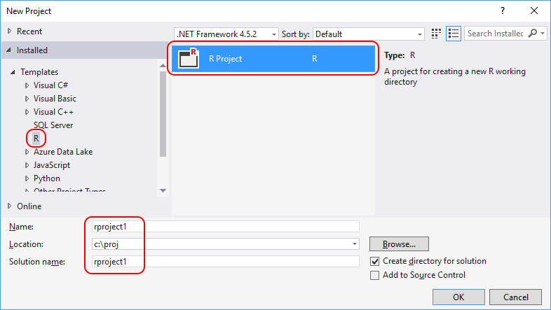
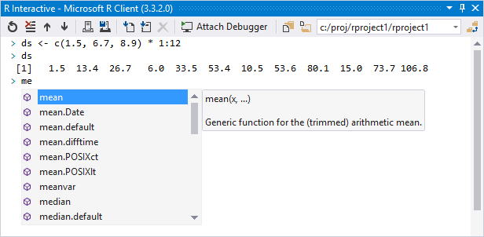
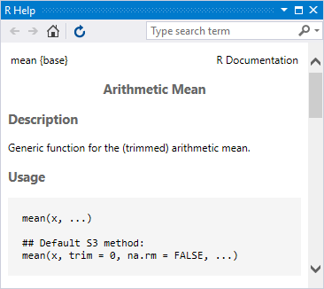
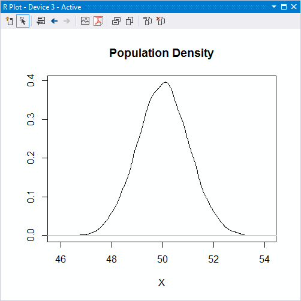
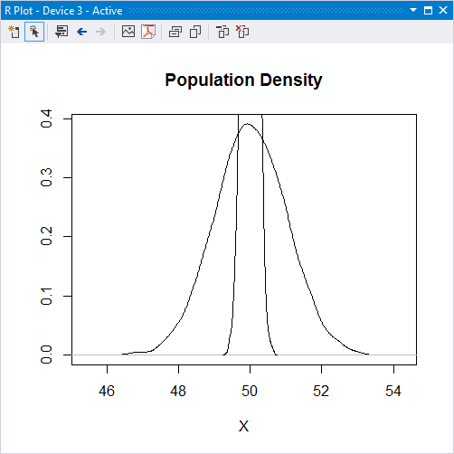
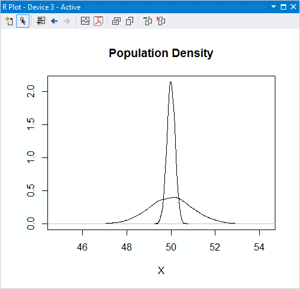
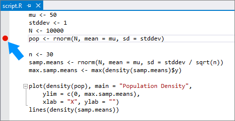
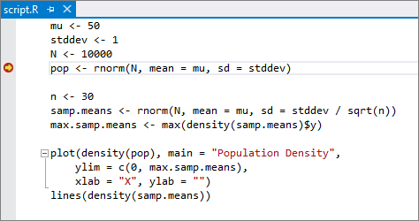

# Getting started with R Tools for Visual Studio

Once you have R Tools for Visual Studio (RTVS) installed (see [Installation](installation.md)), you can quickly get a taste of the experience that those tools provide. The following sections will guide you through a short tour:

- [Create an R project](#create-an-r-project)
- [Explore the Interactive window and IntelliSense](#explore-the-interactive-window-and-intellisense)
- [Experience code editing features]()

## Create an R project

1. Start Visual Studio.
1. Choose **File > New > Project...**.
1. Select "R Project" from under **Templates > R**, give the project a name and location, and select **OK**:

   

1. Once the project is created, you'll see the following:

    - On the right is Visual Studio Solution Explorer, where you'll see your project inside a containing *solution*. (Solutions can contain any number of projects of different types; see [Projects](projects.md) for details.
    - On the top left is a new R file (`script.R`) where you can edit source code with all of Visual Studio's editing features.
    - On the bottom left is the **R Interactive** window in which you can interactively develop and test code.

## Explore the Interactive window and IntelliSense

1. Test that the interactive window is working by typing in `3 + 4` and then Enter to see the result:

    

1. Enter something a little more complicated, `ds <- c(1.5, 6.7, 8.9) * 1:12`, and then enter `ds` to see the result:

    

1. Type in `mean(ds)` but notice that as soon as you type `m` or `me`, Visual Studio IntelliSense will provide auto-completion options as shown below. When the completion you want is selected in the list, press Tab to insert it; you can change the selection with the arrow keys or the mouse.

    

1. After completing `mean`, type the opening parenthesis `(` and note how IntelliSense gives you inline help for the function:

    

1. Complete the line `mean(ds)` and press Enter to see the result (`[1] 39.51667`).

1. The Interactive window is integrated with help, so enter `?datasets`, for example, and you'll see help for the built-in datasets appearing in the **R Help** window in Visual Studio. For additional details on this feature, see [Help in R Tools for Visual Studio](getting-started-help.md).

    

1. Enter `data()` to display a list of available datasets, which opens in a new window in Visual Studio:

    

The interactive window also lets you review your history, load and save workspaces, attach to a debugger, and interact with source code files to shortcut copy-paste operations. See [Working with the R Interactive Window](interactive-repl.md) for details.

## Experience code editing features

Working briefly with the interactive window above demonstrated basic editing features like IntelliSense that also work in the code editor. If you enter the same code as before, you'll see the same auto-completion and IntelliSense prompts, but not the output, of course.

Writing code in a `.R` file lets you see all your code at once, and makes it easier to make small changes to different parts of the code and then see the result by quickly running the code in the interactive window. You can also have as many files as you want in a project. When code is in a file you can also run it step-by-step in the debugger (as we'll see later). All of this is very helpful when you're developing computational algorithms and writing code to manipulate one or more datasets, especially when you want to examine all intermediate results.

As an example, the following steps create a little code to explore the [Central Limit Theorem](https://en.wikipedia.org/wiki/Central_limit_theorem) (Wikipedia). (This example is adapted from the *R Cookbook* by Paul Teetor.)

1. In the `script.R` editor, enter the following code:

    ```r
    mu <- 50
    stddev <- 1
    N <- 10000
    pop <- rnorm(N, mean = mu, sd = stddev)
    plot(density(pop), main = "Population Density", xlab = "X", ylab = "")
    ```

1. To quickly see the results, select all the code (Ctrl-A), then press Ctrl-Enter or right-click and select **Execute In Interactive**. This enters all the selected code in the interactive window as if you typed it directly, showing the result in a plot window:

    

> [!Tip]
> Learn the patter of making editing, selecting everything with Ctrl-A, and then pressing Ctrl-Enter to quickly run the code. This is much more efficient than using the mouse for the same operations.
> 
> In addition, you can drag and drop the plot window out of the Visual Studio frame and place it whenever else you want on your display. This allows you to easily resize the plot window to the dimensions you want and then save it to an image or PDF file.

1. Add a few more lines of code to include a second plot:

    ```r
    n <- 30
    samp.means <- rnorm(N, mean = mu, sd = stddev / sqrt(n))    
    lines(density(samp.means))
    ```

1. Press Ctrl-A and Ctrl-Enter again to re-run the code to produce the following:

    

1. The problem is that the first plot determines the vertical scale, so the second plot (with `lines`) doesn't fit. To correct this, we need to set the `ylim` parameter on the `plot` call, but do so that properly we need to add code to calculate the maximum vertical value. Doing this line-by-line in the interactive window is somewhat inconvenient because we need to rearrange the code to use `samp.means` before calling `plot`. In a code file, though, we can easily make the appropriate edits:

    ```r
    mu <- 50
    stddev <- 1
    N <- 10000
    pop <- rnorm(N, mean = mu, sd = stddev)

    n <- 30
    samp.means <- rnorm(N, mean = mu, sd = stddev / sqrt(n))
    max.samp.means <- max(density(samp.means)$y)

    plot(density(pop), main = "Population Density",
        ylim = c(0, max.samp.means),
        xlab = "X", ylab = "")
    lines(density(samp.means))
    ```

1. Ctrl-A and Ctrl-Enter again to see the result:

    

There's more you can do in the editor. For details, see [editing code](code-editing), [IntelliSense](code-intellisense.md), [code navigation](code-navigation.md), and [code snippets](code-snippets.md).

## Debugging your code

One of the key strengths of Visual Studio is its debugging UI. RTVS builds on top of this strong foundation and adds innovative UI such as the [Variable Explorer](variable-explorer.md) and the [Data Table Viewer](data-table-viewer.md). Here, let's just take a first look at debugging.

1. To begin, reset the current workspace to clear everything you've done so far by using the **R Tools > Session > Reset** menu command. By default, everything you do in the interactive window accrues to the current session, which is then also used by the debugger. By resetting the session, you make sure that you start a debugging session with no pre-existing data (if that's what you want!). Note that this doesn't affect your `script.R` source file, because that's managed and saved outside of the workspace.

1. With the `script.R` file created in the previous section, set a breakpoint on the line that begins with `pop <-` by placing the caret on that line and then pressing F9, or selecting the **Debug > Toggle Breakpoint** menu command. You can do this in one step by clicking in the left-hand margin (or gutter) for that line where the red breakpoint dot appears:

    

1. Launch the debugger with the code in `script.R` by either selecting the **Source startup file** button on the toolbar, selecting the **Debug > Source startup file** menu items, or pressing F5. This puts Visual Studio into its debugging mode and starts running the code. It stops, however, on the line where you set the breakpoint:

    

1. During debugging, Visual Studio provides the ability to step through your code line by line, including the ability to step into functions, step over them, or step out of them to the calling context. These capabilities, along with others, can be found on the **Debug** menu, the right-click context menu in the editor, and the Debug toolbar:

    

1. When stopped at a breakpoint, you can examine the values of variables. Locate the **Autos** window in Visual Studio and select the tab along the bottom named **Locals**. The **Locals** window shows local variables at the current point in the program. If you're stopped on the breakpoint set earlier, you'll see that the `pop` variable isn't yet defined. Now use the **Debug > Step Over** command (F10), and you'll see the value for pop appear:

    

1. You can continue stepping through the program line by line, or select **Continue** (F5) to run it to completion (or the next breakpoint).

To go deeper, see [Debugging](debugging.md).

## Next steps

In this walkthrough you've learned the basics of R projects, using the interactive window, code editing, and debugging in Visual Studio. To continue exploring more capabilities, see the following topics as well as those shown in the table of contents:

- [Sample projects](getting-started-samples.md)
- [Editing code](code-editing.md)
- [Debugging](debugging.md)
- [Workspaces](workspaces.md)
- [Visualizing data](visualizing-data.md)
