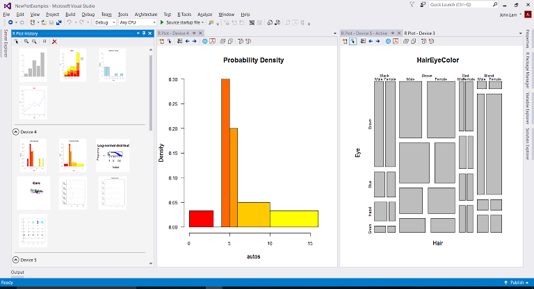
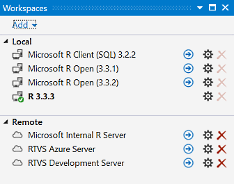
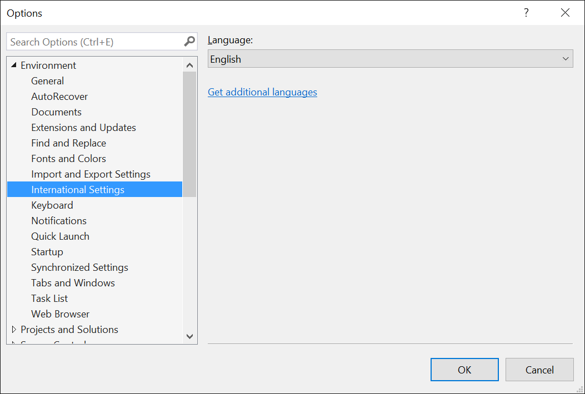

# Working with R in Visual Studio

R is a highly-extensible language and environment for statistical computing and graphics. It's distributed for free under the GNU General Public License, enjoys strong community support, and is known for its ability to produce publication-quality plots including mathematical symbols and formulae. You can learn more about R at [r-project.org](https://www.r-project.org/about.html) and [An Introduction to R](https://cran.r-project.org/doc/manuals/r-release/R-intro.html).

R Tools for Visual Studio is a free, [open-source](https://github.com/microsoft/RTVS) extension for Visual Studio 2017 and Visual Studio 2015 Update 3 (or higher), released under the MIT license. (A second open-source component called [RHost](https://github.com/microsoft/R-Host), which links to the R interpreter binaries, is released under the GNU Public License V2.)

To experience R in Visual Studio:

- [Install the R Tools](installation.md).
- Follow the [Getting Started](getting-started-with-r.md) guide.

The following video also provides a brief (5m 48s) review of the R Tools capabilities:

> [!VIDEO https://www.youtube.com/embed/RcSDEfMgUvU]

## A brief feature tour

- **Highly productive inner loop**: An inner loop is composed of those features that you use repeatedly during your development process, such as syntax highlighting, IntelliSense, interactive code execution, code navigation, and automatic formatting. 

### Extensive debugging features

One of the key strengths of Visual Studio is its debugging UI. RTVS builds on top of this strong foundation, and adds innovative new UI such as the [Variable Explorer](variable-explorer.md) and the [Data Table Viewer](data-table-viewer.md). 

* Breakpoints
* Watch windows
* Data Tips
* Variable explorer
* Interactive window

Finally, the [Interactive Window](interactive-repl.md) is a powerful tool that lets you interactively call functions in your code. You can also have the debugger bound to your Interactive Window session, which lets you step through the code that you're calling. This makes it easy to call functions with different parameter values to verify that the behavior of your function is correct.

### Better with SQL Server

(Content moved)

### Powerful data visualizers

While writing your R programs, you will frequently need to visualize your data. Either through inspecting the values of your data or through plots, RTVS provides you with the tools that you need to be highly productive in your day to day work. Let's look at some of the powerful data visualization features in RTVS:

* Variable explorer
* Table viewer
* Excel integration
* Plot windows
* Window docking
* Multiple plot windows
* Plot history

The [Variable Explorer](variable-explorer.md) gives you a convenient way to see all of the variables that you have defined in your program, including data frames:

It provides convenient links to other tools like the **Table viewer** for visualizing your data frames, and a one-click experience for exporting your data frame to **Excel**:

## Visualizing data

[Plots](visualize-data.md) are a key part of your workflow as an R developer. There are fantastic plotting libraries available for R, and we make it easy for you to interact with the plots that they create. We give you tools to arrange your plots where you want them to be, we give you with an interactive history of all of the plots that you've created, and we make it easy to export your plots to other tools so that you can generate reports from your data.

### Easily share your results with others

Sharing your results with others, easily, is a key design goal of RTVS. Your colleagues prefer to consume their documents using a variety of different media: ranging from web pages to PDFs to Word documents. Your results often include formatted text, plots and equations. 

**RMarkdown** gives you a way to easily [create documents](http://rmarkdown.rstudio.com/) to share your results with your colleagues. We take advantage of Visual Studio's high-performance editor to deliver a lag-free typing experience in your RMarkdown documents. Our editor has
syntax coloring and IntelliSense, for both your Markdown markup **and the R code within Markdown code blocks**:

We make it easy for you to generate HTML, PDF, or Word markdown documents. For more details, see the [RMarkdown documentation](rmarkdown.md).

### Scalable compute resources

R developers and data scientists often prefer to use laptops in their day-to-day work. They develop their models against down-sampled datasets until they are satisfied with the results that they can get from those datasets. When they want to validate their models against larger datasets, they often have to move their code or their development environments to a more powerful machine.

The [workspaces](workspaces.md) feature of RTVS makes it easy to bind RTVS to different workspaces. Local workspaces are simply other versions of the R interpreter that you have on your local computer. **Remote workspaces** are R interpreters that are installed on remote computers. By [installing RTVS Remote Services](workspaces-remote.md) on a machine with lots of CPU cores, lots of RAM, lots of storage, or lots of GPU, you can tailor the execution environment to the needs of your code and the data that you want to analyze. A remote workspace can
be shared by several team members, making it easier to collaborate on large or sensitive datasets that must reside on an IT-managed computer.

You can even setup your remote workspaces on [Azure virtual machines](https://azure.microsoft.com/services/virtual-machines/?b=17.08),
eliminating the need for capital expenditures to get the computing resources that you need to get your work done. 

When you are using a remote workspace, all editing and visualization are done using RTVS on your local computer. All code execution occurs on the remote computer. This ensures that the computing resources on your remote computer are totally dedicated to running your R code, without the overhead of running an IDE. 

For more details, see the [workspaces documentation](workspaces-remote.md).

## Popular R Extensions

Extensions for Visual Studio are provided by a rich ecosystem of third-party developers, including those that improve your productivity with R:

* [VsVim for vim key bindings](https://marketplace.visualstudio.com/items?itemName=JaredParMSFT.VsVim)
* [Github](https://marketplace.visualstudio.com/items?itemName=GitHub.GitHubExtensionforVisualStudio)
* [Markdown editor with live preview](https://marketplace.visualstudio.com/items?itemName=MadsKristensen.MarkdownEditor)

See the [Visual Studio Marketplace](https://marketplace.visualstudio.com/) to find more.

## Send us your feedback!

1. **Github issues**: The best way to reach the RTVS team is by [filing an issue on GitHub](https://github.com/Microsoft/RTVS/issues), or by using the **R Tools > Feedback** menu.

1. **Send a Smile / Frown**: This is a quick way to send feedback *and* attach RTVS log files to assist in the diagnosis of your issue. You can find this command under the **R Tools > Feedback** menu. This command will collect logs, start your mail client and attach the log file. You have the opportunity to examine the contents of those files before you click Send. The logs are written into `%TEMP%/RTVSlogs.zip` in case you want to send it yourself.

    Note that the above logging functionality will not be available if you have explicitly opted out of Visual Studio telemetry through the **Help > Feedback > Settings** menu command, or during installation.

1. **Email**: You can send direct feedback to the team at [rtvsuserfeedback@microsoft.com](mailto:rtvsuserfeedback@microsoft.com).

## Frequently Asked Questions

**Q. Does RTVS work with Visual Studio Express editions?**

A. No.

**Q. What R interpreters does RTVS work with?**

A. [CRAN R](https://cran.r-project.org/), [Microsoft R Client and Microsoft R Server](https://msdn.microsoft.com/microsoft-r/)

**Q. Where can I download these interpreters?**

A. See [Installation](installation.md).

**Q. Because RTVS is in VS, does it mean that R can be easily used with C#, C++ and other Microsoft languages?**

A. No. RTVS is a tool for developing R code, and uses the standard native R interpreters. There currently isn't support for interop between R and other languages.

**Q. Feature X is missing, but RStudio has it!**

A. RStudio is a fantastic and mature IDE for R that's been under development for many years. RTVS seeks to have all the critical features that you need to be successful. Help prioritize future work by taking the [RTVS survey](https://www.surveymonkey.com/r/RTVS1).

**Q. Will RTVS work on MacOS / Linux?**

A. No, RTVS is built on top of Visual Studio, which is a Windows-only implementation. That said, Microsoft is investigating building a new set of tools based on [Visual Studio Code](https://code.visualstudio.com/), the wildly popular cross-platform editor from Microsoft.

**Q. Can I contribute to RTVS?**

A. Absolutely! The source code lives on [Github](https://github.com/microsoft/RTVS). Please the issue tracker to submit bugs and comment on those already files.

You're also welcome to contribute to this documentation--just select the **Edit** command on the upper right of any page. Comments on the docs are also welcome, which you can add at the bottom of any page.

**Q. Does RTVS work with my source control system?**

A. Yes, you can use any source control system that is integrated into Visual Studio.

**Q. I don't use a US English locale in Windows or in Visual Studio. Will RTVS work?**

A. The 1.0 release of RTVS will be English-only. The 1.1 release will be localized to the same set of languages that Visual Studio itself is. In the meantime, use the [English language pack for Visual Studio 2015](https://www.microsoft.com/download/details.aspx?id=48157), or in Visual Studio 2017, run the installer and select English in the **Language Packs** tab.

**Q. Will RTVS work with 32-bit editions of R?**

A. No, RTVS only supports 64-bit editions of R running on 64-bit editions of Windows.

**Q. I really like my current Visual Studio settings, but I want to try out the new Data Science settings. What should I do?**

A. Save your current Visual Studio settings using **Tools > Import and Export Settings...**, then switch to the Data Science settings. To restore the saved settings, use the **Import and Export Settings...** command again.

**Q. What are the recommended `.gitignore` settings for an RTVS project?**

A. Github maintains a master repository of recommended `.gitignore` files. You can see it here: [R .gitignore](https://github.com/github/gitignore/blob/master/R.gitignore)

**Q. Can I store my Visual Studio project on a network share?**

A. No, this isn't supported by Visual Studio.
