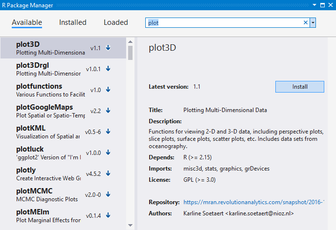

# Package Manager

The Package Manager is a UI for working with packages. You can activate the Package Manager using the menu command **R Tools > Windows > Packages**, or pressing Ctrl-8 if you are using the Data Science Settings. It has three tabs, which let you browse, install, and visualize the list of loaded packages in your R session.

### Installed Packages 

The default tab is the Installed Packages tab, which provides a list of all installed and loaded packages. If there is a green dot next to a package, it indicates that the package is also loaded into your R session.

Installed packages can also be uninstalled by clicking on the red "x" to the right of each listed package. The presence of a blue up arrow to the right of each installed package indicates that there is a newer version of your currently installed package. You can click on that arrow to download that package.

### Available Packages

The Available Packages tab lets you browse and search for packages. You can use the search box in the top-right corner to filter the list of available packages by name. When you select a package, the right hand pane provides you with some summary information about the package, along with hyperlinks to let you read more about the package before installing it.

### Loaded Packages

The Loaded Packages tab lets you examine all of the packages loaded into your R session. All of the packages on this tab should have a green dot next to them which indicates that they are loaded. You can also see details about the package along with the path to where the package is installed on your machine.
