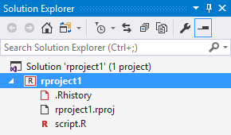
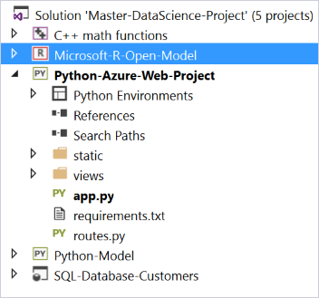

# Creating R projects in Visual Studio

An R project (an `.rxproj` file) identifies all the source and content files associated with your project, contains build information for each file, maintains the information to integrate with source-control systems, and helps you organize your application into logical components. Note that workspace-related information such as the list of installed packages is maintained separately in the workspace itself.

Projects are always managed within a Visual Studio *solution*, which can contain any number of projects that might reference one another. See [Use multiple project types in Visual Studio](#use-multiple-project-types-in-visual-studio) below.

## Creating a new R project

1. Start Visual Studio.
1. Choose **File > New > Project...** (Ctrl+Shift+N)
1. Select "R Project" from under **Templates > R**, give the project a name and location, and select **OK**:

    

This will create a project with an empty `script.R` file open in the editor. Notice also in **Solution Explorer** there are two other files in the project:

The `.Rhistory` records whatever commands you enter into the [R Interactive](interactive-repl.md) window. You can open a dedicated history window with the **R Tools > Windows > History** command, and that window has a toolbar button and context menu items to clear history contents.

The `rproject.rproj` file maintains certain R-specific project settings that aren't otherwise managed by Visual Studio:

| Property | Default | Description |
| --- | --- | --- |
| Version | 1.0 | The version of R Tools for Visual Studio used to create the project. |
| RestoreWorkspace | Default | |
| SaveWorkspace | Default | |
| AlwaysSaveHistory | Default | |
| EnableCodeIndexing | Yes | Determines whether to run a background indexing task to speed code searches. |
| UseSpacesForTab | Yes | Determines whether to insert spaces (Yes) or a Tab character (No) when the Tab key is pressed in the editor. |
| NumSpacesForTab | 2 | The number of spaces to insert if UseSpacesForTab is Yes. |
| Encoding | UTF-8 | The default encoding for `.R` files. |
| RnwWeave | Sweave | |
| LaTeX | pdfLaTeX | |

### Converting a folder of files to an R project

If you have an existing folder of `.R` files that you want to manage in a project, do the following:

1. Create a new project in Visual Studio as in the previous section.
1. Copy your files into the project folder.
1. In the Visual Studio Solution Explorer, right-click the project, select **Add > Exiting Item**, and browse to the files you want to add. When you select **OK** they'll appear in the project tree.
1. To organize code into subfolders, right-click the project, select **Add > New Folder** first, then copy your files into that folder and all those existing items as above.

## Project properties

To open the project property pages, right click the project in **Solution Explorer** and select **Properties**, or select the **Project > (project name) properties...* menu item. This opens a window with the following properties:

| Tab | Property | Description |
| --- | --- | --- |
| Run | Startup file | The name of the file that is run with **Source startup file** command, F5, **Debug > Start debugging**, or **Debug > Start without debugging**. You can also set this by right-clicking the file in the project and selecting **Set as startup R script**. |
| | Reset R Interactive on Run | Clears all variables from the interactive window's workspace when running the project. Doing so guarantees that there's no residual workspace contents from pervious runs. |
| | Remote Project Path | Path to a remote workspace. |
| | Transfer files on run | Indicates whether the project files, subject to the filter in **Files to transfer**, are to be copied to a remote workspace with each run. |
| | Files to transfer | Filenames and wildcards indicating the specific files to copy to a remote workspace if **Transfer files on run** is selected. |
| Settings | (Settings.R file) | R project settings come from `Settings.R` or `*.Settings.R` files that are located inside the project. If there is no settings file, you can add variables and save the page, and a default `Settings.R` file will be created for you. You can also add settings file to the project through the **File > Add New Item...* menu command.   Settings are stored as R code and the file can be sourced before running other modules thus pre-populating environment with the predefined settings. |

## R-specific project commands

Visual Studio projects support a number of general commands through both the right-click menu and the **Project** menu. For details on these general capabilities, see [Solutions and Projects in Visual Studio](../ide/solutions-and-projects-in-visual-studio.md). Keep in mind, however, that 

R Tools for Visual Studio adds a number of its own commands to the right-click menu for an R project and also files and folders within the project.

| Command | Description |
| --- | --- |
| Set Working Directory Here | Sets the R Interactive window's working directory to the project folder. This can also be used on any subfolder within a project. |
| Open Containing Folder | Opens Windows Explorer at the location of the selected file. | 
| Add R Script | Creates and opens a new `.R` file with a default name. You can also use the **Add > New Item...** command to create `.R` files as well as a number of other file types. See below under [R-specific item templates](#r-specific-item-templates). |
| Add R Markdown | Creates and opens new `.rmd` document with a default name. You can also use the **Add > New Item...** command to create `.rmd` files as well as a number of other file types. See below under [R-specific item templates](#r-specific-item-templates).  | 
| Publish Stored Procedures | Starts a process to publish any stored procedures contained in R scripts. See [Adding a SQL stored procedure file to your project](sql-server.md#adding-a-sql-stored-procedure-file-to-your-project). | 

## R-specific item templates

R Tools for Visual Studio includes a number of templates for specific file types. You access these by right-clicking an R project and selecting **Add > New Item...**, through **Project > Add New Item...**, or through **File > New > File...** and selecting the **R** tab. The best way to explore these is to simply create a new project and insert files of each type.

> [!Note]
> The **Add > New Item...** commands also display general file types that aren't listed below; with **File > New > File...** those types are contained instead on the **General** tab.

| File Type | Description |
| --- | --- |
| R Script | A text file containing the same commands that can be entered on the R command line. |
| R Markdown | A file containing an [R Markdown](rmarkdown.md) document. |
| R Settings | A file that holds R application settings. | 
| R Documentation | A generic R documentation file containing only name, alias, and title fields. |
| R Documentation (Function) | An R documentation file containing many fields with comments for describing a function. |
| R Documentation (Dataset) | An R documentation file containing many fields with comments for describing a dataset. |
| SQL Query | And empty `.sql` file. See [SQL Server integration](sql-server.md). |
| Stored Procedure with R | An R file with child SQL Query and child stored procedure template file. See [SQL Server integration](sql-server.md). |

## Use multiple project types in Visual Studio

Visual Studio Solutions provide a convenient place to gather and manage related projects in one logical place. This helps keep your code organized and facilitates collaboration within teams.

In the example below, the solution contains an R project with a model built using R and Azure Machine Learning, a Python/scikit-learn project, a C++ project containing modules for intensive computational work, a SQL project for data management, and a Python/Bottle project for the web site that publishes the result:

The project highlighted with boldface is the "startup" project for the solution; to change it, right-click a different project and select **Set as startup project**.

> [!Note]
> At present, there isn't any explicit R to C#/C++ language integration in place (as there is for Python, see [Creating a C++ extension for Python](../python/cpp-and-python.mdd)).  However there are libraries available that provide C# and C++ bridges for R.

For more details on managing projects and solutions in general, see [Solutions and Projects in Visual Studio](../ide/solutions-and-projects-in-visual-studio.md).