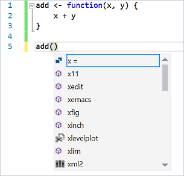
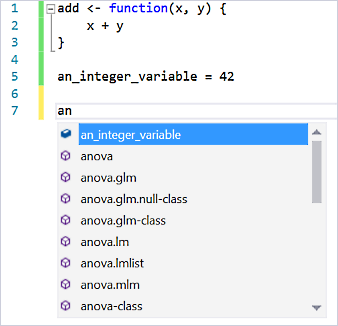

# IntelliSense

Visual Studio IntelliSense displays information about functions you can call, members of objects, function arguments, and [code snippets](code-snippets-for-r.md) directly in your view as you write code. It also displays possible completions as you type, and completes when you press the Tab or Enter keys (see [editor options](editing-r-code-in-visual-studio.md#editor-options) for the **Advanced** tab). IntelliSense is available in both the editor and the [interactive window](interactive-repl-for-r-in-visual-studio.md).

When typing a function or other statement, IntelliSense provides an auto-completion menu filtered (case-sensitively) by what you've already entered:

Pressing Tab (or Enter, or Space, depending on how options are set), inserts the item selected in the dropdown. You can change the selection with the arrow keys.

IntelliSense also provides suggestions for members of R objects:

Pressing ESC dismisses the menu altogether. You can bring it back up with Ctrl+Space.

Typing the opening `(` for a function call inserts the closing `)` and brings up signature help as shown earlier:

Again, ESC dismisses the popup; for function signatures, you can bring it up again with Ctrl+Shift+Space.

> [!Tip]
> If parameter help obscures text underneath it, press and hold the Ctrl key to make the parameter help text translucent.

## IntelliSense for user-defined functions and variables

IntelliSense applies for user-defined functions in the same file, including name-parameter completion:

IntelliSense also applies for variables in the same file and the current session:

> [!Note]
> In the interactive window, IntelliSense considers only names in the current R session and ignores files in your project.

## Code suggestions

When a light bulb (called smart tag) appears in the margin, Visual Studio is suggesting that there is a shortcut available for a commonly used action. For example, hover over a line that contains a `library` statement in the editor to see a light bulb. Selecting the light bulb displays available options:

