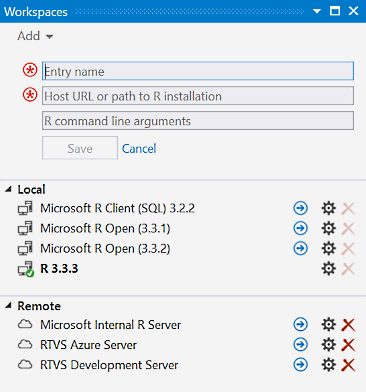
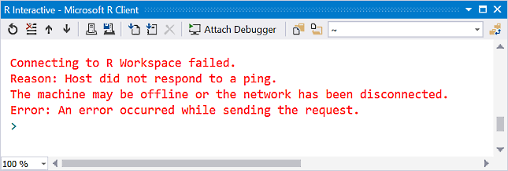
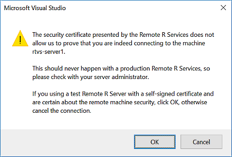
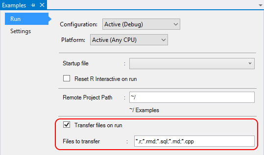

# Controlling where R code runs with workspaces

A workspace in R Tools for Visual Studio (RTVS) lets you configure where an R session runs, which can happen on both local and remote computers. The goal is to allow you to work on either with a comparable user experience, which gives you the ability to take advantage of potentially more powerful cloud-based computers.

To open the **Workspaces** window, use the **R Tools > Windows > Workspaces** command or press Ctrl+9.

In this window, the green checkmark indicates the active workspace to which RTVS is bound. Selecting a blue arrow sets the active workspace. The settings (gear) icon to the right of each workspace allows you to change its name, location, and command-line arguments. The red X removes a manually added workspace.

In this topic:

- [Saving and resetting a workspace](#saving-and-resetting-a-workspace)
- [Local workspaces](#local-workspaces)
- [Remote workspaces](#remote-workspaces)
- [Remote workspace logon](#remote-workspace-logon)
- [Switching between workspaces](#switching-between-workspaces)
- [Directories on local and remote computers](#directories-on-local-and-remote-computers)
- [Copying project files to remote workspaces](#copying-project-files-to-remote-workspaces)
- [Copying files from a remote workspace](#copying-files-from-a-remote-workspace)

## Saving and resetting a workspace

By default, RTVS doesn't save workspace state when you close and reopen a project. You can change this behavior, however, through the [Workspace options](options-for-r-tools-in-visual-studio.md#workspace).

The **R Tools > Session > Reset** command and the reset toolbar button in the interactive window also reset workspace state at any time. With remote workspaces, reset deletes the user profile created when first connecting to the remote server, which effectively deletes any files that have accumulated there.

## Local workspaces

The Local workspaces list displays all the R interpreters that you have installed on your computer. 

When Visual Studio starts, it attempts to automatically detect all of the versions of R that you have installed by looking through the `HKEY_LOCAL_MACHINE\Software\R-Core\` registry key. Because this check is done only at startup, you need to restart Visual Studio if you install a new R interpreter.

RTVS might not detect an R interpreter that's installed in a non-standard way (for example, when simply copying files to a folder instead of running an installer). In this case, manually create a new local R Workspace as follows:

1. Select the **Add** button in the Workspaces window.
1. Enter a name for the new Workspace.
1. Enter the path to the R root folder, which is the one that contains the `bin` folder with the interpreter, along with any optional command-line arguments to pass to the interpreter when RTVS starts it up.
1. Select **Save** when you're done.

## Remote workspaces

Remote workspaces let you connect to an R session on a remote computer. (See [Setting up remote workspaces](setting-up-remote-r-workspaces.md) for how to configure a computer for this purpose.)

Visual Studio doesn't automatically detect remote workspaces, so you must add them manually using the **Add** button in the Workspaces window as described in the previous section. In this case, enter the remote computer's URI rather than a local path.

> [!Important]
> Remote workspaces are identified by a URI that *must use the HTTPS protocol* to ensure the privacy and the integrity of communication with the remote computer. Visual Studio cannot connect to a remote computer that does not support HTTPS.

> [!Note]
> Remote workspaces are effectively in preview. We are working on a better implementation of the file sync problem for a future release and welcome your ideas and feedback.

## Remote Workspace Logon

You must use a username and password to logon to the remote workspace.

### Logon to Windows workspace

If your remote machine is setup to use your domain account, you can use the domain logon to access a remote workspace. If it is not, then you have to use `machine-name\username` format to logon using a machine account on the remote machine.

### Logon to Linux workspace

To logon to a linux account use `<<unix>>\username` format. For example, if you have an account by the name `ruser`, then you should type in the username as `<<unix>>\ruser`.

## Switching between workspaces

RTVS is bound to only a single workspace at a time. The bound workspace is indicated by a small green checkmark in the Workspaces window. By default, RTVS binds to the last open local workspace in a previous session.

To change the active workspace, select the blue arrow next to the desired workspace. Doing so prompts you to save your session, terminates the current workspace, then switches to the new one.

> [!Tip]
> To disable the save prompt, select the **R Tools > Options** command and set the **Show confirmation dialog before switching workspaces** option to `No`. See [Workspace options](options-for-r-tools-in-visual-studio.md#workspace).

If you attempt to switch to a local workspace that's been uninstalled, or to a remote workspace that it unavailable, RTVS might not be bound to any workspace. As a result, you might see an error when you enter code in the interactive window or try to run code otherwise:

To correct this, switch to another workspace in the Workspaces window. If no workspaces are available, you need to install an R interpreter. You can also try restarting Visual Studio if you've installed an interpreter while Visual Studio running.

### Switching to a remote workspace

RTVS prompts you for credentials when you first connect to a remote workspace, then caches those credentials (using the secure Windows Credential Locker) for later sessions. Communication with the remote server is then done securely over HTTPS (which is required).

Depending on the server's configuration, you may see a certificate warning when connecting that reads, "The security certificate presented by the Remote R Services does not allow us to prove that you are indeed connecting to the machine (name)."

The certificate is a document presented to RTVS by the computer that you're trying to connect to. The certificate contains a field that identifies the URI of that computer. The warning appears when RTVS detects a mismatch between the URI in the certificate and the URI used to connect to the computer, indicating that the server's security may have been compromised.

However, this warning also appears if a *self-signed certificate* was used to enable HTTPS on the remote computer instead of using one from a trusted provider. For more information, see [Setting up remote workspaces](setting-up-remote-r-workspaces.md).

## Directories on local and remote computers

By default, when you start a new R interpreter in a local workspace, your current working directory is `%userprofile%\Documents`. You can change directory at any time using the **R Tools > Working Directory** commands, or by right-clicking a project in Visual Studio Solution Explorer and selecting commands like **Set Working Directory Here**.

When you first connect to a remote computer, RTVS automatically creates a user profile based on your credentials, which sets the working directory to the  `Documents` folder under that profile. This folder is used for all subsequent remote sessions that use the same credentials. 

As a result, the exact location where your code runs can differ between local and remote workspaces. In your code, then, always use relative paths to data files and such so that your code is portable across workspaces.

Note also that with remote workspaces, all files in the working directory remain in place across sessions for the same user profile. As noted earlier, you can delete these files by using the  **R Tools > Session > Reset** command (or the reset button in the interactive window) when using a remote workspace. This command again deletes the user profile from the server, which is recreated when you reconnect.

## Copying project files to remote workspaces

When working with R projects in Visual Studio, the local computer always has the latest project files even when you're using a remote workspace. That is, when you open a project in Visual Studio (which typically means opening a solution containing that project), RTVS assumes that the project's contents reside wholly on the local computer. The remote workspace is, in effect, just a temporary host for the project's files and any output from the code. This means, for example, that when loading a file using `source` in the interactive window, that file must already be on the remote computer in the path you provide, or it must be in the current working directory of the remote R interpreter (set with the `setwd()` function).

Files are copied to the remote server as follows:

- To work with files remotely through the interactive window, you must first copy them manually by right-clicking those files (or the project) in Solution Explorer and selecting **Source Selected **. For individual files, they're copied to the working directory on the server; when copying a project, RTVS creates a folder for the project.

- You can also copy files by selecting then in Solution Explorer and then selecting **Source Selected Files(s)**. This action loads them into the interactive window and runs them there. If the session is connected to a remote computer, the files are copied there first.

- When RTVS is bound to a remote workspace and you press F5, select **Debug > Start Debugging**, or otherwise start running your code, RTVS by default copies the project's file to the remote workspace automatically (see below for how to control this behavior).

- Any files that already exist on the server are overwritten.

> [!Note]
> Because RTVS cannot reliably intercept all R function calls, calling functions such as `source()` or `runApp()` (for Shiny applications) within the interactive window does *not* copy files to the remote workspace.

[Project properties](r-projects-in-visual-studio.md#project-properties) control whether RTVS copies files when a project is run, and exactly which files are copied. To open this page, select the **Project > (name) Properties...** menu command, or right-click the project in Solution Explorer and select **Properties...**.

Here, the **Transfer files on run** property determines whether RTVS copies project files automatically. The **Files to transfer** value then filters exactly which files are transferred. The default is to copy only `.R`, `.Rmd`, `.sql`, `.md`, and `.cpp` files. This behavior avoids inadvertently copying large data files to the server with every run. 

## Copying files from a remote workspace

If your R script generates files on the server, you can copy those files back to the client using the `rtvs::fetch_file` function. This function accepts, at a minimum, the remote path to the file that you want to copy to your computer, and optionally the target path on your computer. If you don't specify a path, the file is copied into your `%userprofile%\Downloads` folder.
