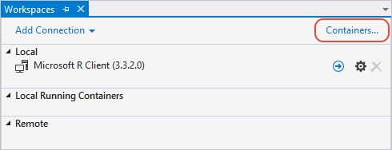
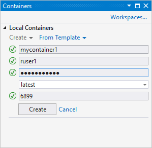
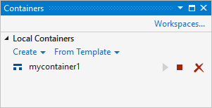
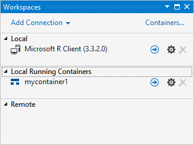

# Using Docker containers with R Tools for Visual Studio

The R Tools for Visual Studio (RTVS) version 1.3+, alongside an installation of [Docker for Windows](https://www.docker.com/docker-windows), supports working with Docker containers.

- [Creating a container](#creating-a-container)
- [Connecting to a container](#connecting-to-a-container)
- [Using custom-built images](#using-custom-built-images)

## Creating a container

1. Select the **Containers...** button on the right-hand corner of the **Workspaces** window. (The window informs you if you don't have Docker for Windows installed.)

    

1. In the **Containers** window, select **Create** and enter a name for the container, a username, and a password. These credentials are used to create an account on Linux, with which you'll sign in later.

    

1. Select the **Create** button, and RTVS builds the image and starts the container. You can Stop, Remove, or Restart the container from the **Containers** window.

    

## Connecting to a container

1. The **Local Running Containers** section of the **Workspaces** window displays containers running the RTVS daemon on port 5444. (See [Remote R Server for Linux](remote-r-service-for-linux.md) for details on how the daemon is configured.)

    

1. To connect to a container, double-click a listed container, or select it and then select the connect (forward arrow) button.

    

## Using custom-built images

RTVS detects and allows management of containers created using custom-built images, such as the microsoft/rtvs image described in the docker file below. The base image used here has rtvs-daemon, R 3.4.2, and common R packages pre-installed. **Note**: change the username and password shown here as needed.

```docker
FROM microsoft/rtvs:1.3-ub1604-r3.4.2
RUN useradd --create-home ruser1
RUN echo "ruser1:foobar" | chpasswd
```

Use the following command to build the image, changing the container name (the `--name` argument) as desired:

```bash
docker build -t my-rtvs-image:latest .
docker run -p 6056:5444 --name my-rtvs-container my-rtvs-image:latest rtvsd
```

The `-p 6056:5444` argument maps port 6056 to internal port 5444, which RTVS uses to detect rtvs-daemon. Any container that exposes container port 5444 is listed in the **Workspaces** window. You can then use the **Workspaces** window to connect to a container using `<<unix>>\ruser1` as the username and "foobar" as the password, unless you specified different credentials in the docker file.
