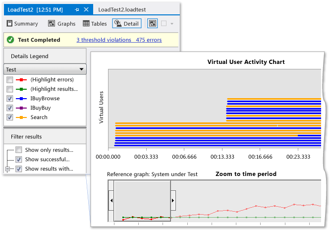
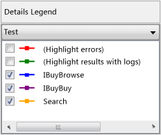
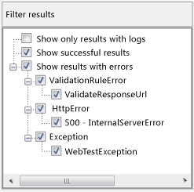

# Analyzing load test virtual user activity in the Details view of the Load Test Analyzer

**Virtual User Activity Chart**

 

 The **Details** view displays the **Virtual User Activity Chart**, which is used to visually analyze what the individual virtual users did during the load test. **Virtual User Activity Chart** lets you see patterns of user activity, load patterns, correlate failed or slow tests, and see requests with other virtual user activity. The **Virtual User Activity Chart** can also help you determine spikes in CPU usage, drops in requests per second, and what tests or pages were running during the spikes and drops.

> [!NOTE]
> Before you run the load test for which you want to use the **Virtual User Activity Details Chart**, you must verify that the **Timing Details Storage** property is set to the **AllIndividualDetails** option by using the Load Performance Test Editor.

 **Details Legend Panel**

 

 The details legend panel is visible in the **Virtual User Activity Chart**. The details legend pane lets you filter out tests, pages and transactions based on several different criteria. For example, you can remove certain tests from the view, or remove all successful tests, or remove tests which failed with certain failures. You can also remove all tests that do not have logs.

 You can highlight tests which failed, which displays all failed tests colored in red. You can also highlight tests that have test logs. Tests with logs will be colored in green.

 **Filter results Panel**

 

 The Filter results panel is visible in the **Virtual User Activity Chart**. The Filter results panel can filter on the following:

-   **Show only results with logs** Displays only test results that have test logs associated with them.

-   **Show successful results** Displays successful results.

-   **Show results with errors** Displays results with errors that can help in debugging.

## Tasks

|Tasks|Associated topics|
|-|-|
|**Run your load test:** After you have created a load test and configured it to enable virtual user activity data collecting, you must run the test until it is complete in order to view the **Virtual User Activity Chart**.||
|**View the load test results that contain the virtual user activity data:** After your load test has been created, configured, and has completed running, you can view the virtual user activity data by using the **Virtual User Activity Chart**.|-   [Analyze load test results](../test/analyze-load-test-results-using-the-load-test-analyzer.md) -   [How to: Analyze what virtual users are doing during a load test](../test/how-to-analyze-virtual-user-activity-during-a-load-test.md)|
|**Isolate performance issues in load tests:** You can use the **Virtual User Activity Chart** to help isolate performance issues in your load test.|-   [Walkthrough: Using the virtual user activity chart to isolate issues](../test/walkthrough-use-the-virtual-user-activity-chart-to-isolate-issues.md)|

## See also

- [Analyze load test results](../test/analyze-load-test-results-using-the-load-test-analyzer.md)
- [Analyze load test results and errors in the Tables view](../test/analyze-load-test-results-and-errors-in-the-tables-view.md)