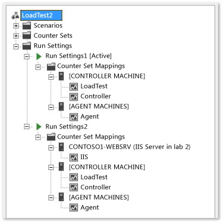

# Configure load test run settings

*Run settings* are a set of properties that influence the way a load test runs. Run settings are organized by categories in the **Properties** window.

You can have more than one run setting in a load test, however only one of the run settings may be active per run. The other run settings provide a quick way to select an alternative setting to use for subsequent test runs.

The initial run setting is created when you create a load test by using the **New Load Test Wizard**.

## Tasks

|Tasks|Associated Topics|
|-----------|-----------------------|
|**Add more run settings to your load test:** In addition to the run setting that is created when you run the **New Load Test Wizard**, you can add more run settings to your load test so that you can run the test under different conditions.|-   [How to: Add additional run settings to a load test](../test/how-to-add-additional-run-settings-to-a-load-test.md)|
|**Specify the active run setting to use with the load test:** You can select the run setting that you want to use with your load test using the Load Test Editor. The active run setting is identified by the "[Active]" suffix.|-   [How to: Select the active run setting for a load test](../test/how-to-select-the-active-run-setting-for-a-load-test.md)|
|**Edit run setting properties:** You can edit your run setting properties for such things as logging options (see more below), determining the length of the test, warm-up duration, maximum number of error details reported, sampling rate, connection model (Web performance tests only), results storage type, validation level and SQL tracing. The run settings should reflect the goals of your load test.|-   [Load test run settings properties](../test/load-test-run-settings-properties.md) -   [Changing run setting properties](../test/load-test-run-settings-properties.md#LoadTestRunSettingsHowToChange)|
|**Specify test iteration count in load test run settings:** You can specify the number of times to run all of the Web performance and unit tests in all of the scenarios of your load tests by configuring the **Test Iterations** property.|-   [How to: Specify the number of test iterations in a run setting](../test/how-to-specify-the-number-of-test-iterations-in-a-load-test.md)|
|**Specify the sampling rate for a load test run setting:** You can specify how frequently to have the load test collect performance counter data by configuring the **Sample Rate** property.|-   [How to: Specify the sample rate](../test/how-to-specify-the-sample-rate-for-a-load-test.md)|
|**Specify the timing details storage option:** You can specify how you want the details of the load test saved by configuring the **Timing Details Storage** property.|-   [How to: Specify the timing details storage property](../test/how-to-specify-the-timing-details-storage-property-for-a-load-test.md)|
|**Specify the test resource retention period:** Speed up the test > fix > retest cycle by retaining the test resources for a specified period by setting the **Resources Retention Time** property.|-   [Retain the resources to speed up load testing](https://www.visualstudio.com/docs/test/performance-testing/getting-started/getting-started-with-performance-testing#retain-resources)|
|**Use context parameters:** You can use context parameters to parameterize a string. For example, if your load test contains a Web performance test that uses a parameterized Web server, you can add a context parameter to the run settings that maps to a different server.|-   [How to: Add context parameters to a run setting](../test/how-to-add-context-parameters-to-a-load-test-run-setting.md)|
|**Configuring test logging properties:** You can configure how frequently data is written to the log that is associated with your load test run settings. This can be important when you are running a large or complex load test because the log could become several gigabytes.   You can also configure the log file to be automatically saved when your load test fails to help in debugging and analyzing your application.|-   [Modifying load test logging settings](../test/modify-load-test-logging-settings.md)|