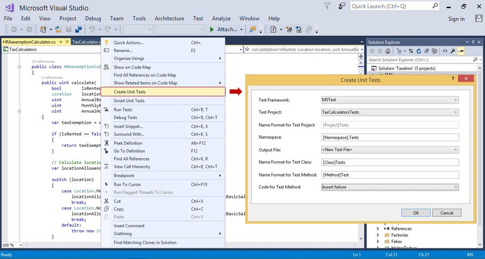
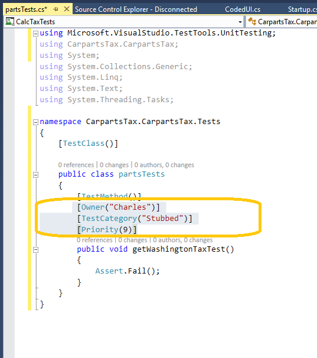
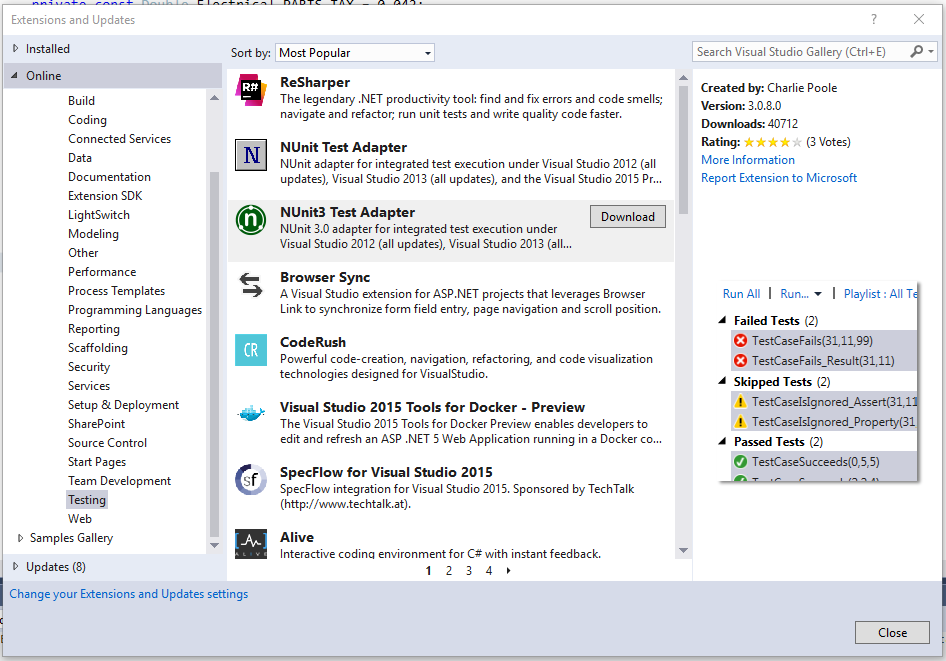

# Create unit test method stubs with the Create Unit Tests command

The Visual Studio **Create Unit Tests**
command provides the ability to create unit 
test method stubs. This feature allows easy 
configuration of a test project, the test class, 
and the test method stub within it. 

## Availability and extensions

The **Create Unit Tests** menu command:

* Is available in the Community, Professional, and Enterprise
  Editions of Visual Studio 2015 and later.

* Supports only C# code that targets the .NET Framework.

* Is [extensible](#extend-framework), and supports emitting tests in MSTest,
  MSTest V2, NUnit, xUnit format.

## Get started

To get started, select a method, a type, or a namespace in the code
editor in the project you want to test, open the shortcut menu, and choose
**Create Unit Tests**. This opens the **Create Unit Tests**
dialog where the create options for the new unit tests can be selected.

## Setting unit test traits

If you plan to run these tests is part of the test automation process,
you might consider having the test created in another test project
(the second option in the dialog above) and setting unit test traits
for the unit test. This will enable you to more easily include or
exclude these specific tests as part of a continuous integration or
continuous deployment pipeline. The traits are set by adding metadata
to the unit test directly, as shown below. 

## Using third-party unit test frameworks

With Visual Studio, you can easily have unit tests created for you using
any test framework. To install add other test frameworks, choose **Tools | Extensions and Updates**.
Expand **Online**, **Visual Studio Gallery**, **Tools**, and choose **Testing**. 

Test framework extensions are available in Visual Studio Marketplace:

* [NUnit Extension for the Test Generators](https://marketplace.visualstudio.com/items?itemName=NUnitDevelopers.TestGeneratorNUnitextension)
* [xUnit.net Extension for the Test Generators](https://marketplace.visualstudio.com/items?itemName=BradWilson.xUnitnetTestExtensions)

## When should I use this feature?

Use this feature whenever you need to create unit tests,
but specifically when you are testing existing code 
that has very little or no test coverage, and no 
documentation. In other words,  where there is 
limited or non-existent code specification. It 
effectively implements an approach similar to
[Smart Unit Tests](http://blogs.msdn.com/b/visualstudioalm/archive/2014/11/19/introducing-smart-unit-tests.aspx)
that characterize the observed behavior of the code.

However, this feature is equally applicable to
the situation where the developer starts by writing 
some code, and uses that to bootstrap the unit testing 
discipline. Within the flow of coding, the developer might 
want to quickly create a unit test method stub 
(with a suitable test class, and a suitable test project) 
for a particular piece of code. 

## More information

See the blog post [Creating unit test method stubs with "Create Unit Tests"](https://blogs.msdn.microsoft.com/visualstudioalm/2015/03/06/creating-unit-test-method-stubs-with-create-unit-tests/).

More unit testing blog posts can be found [here](https://blogs.msdn.microsoft.com/visualstudioalm/tag/unit-testing/).
