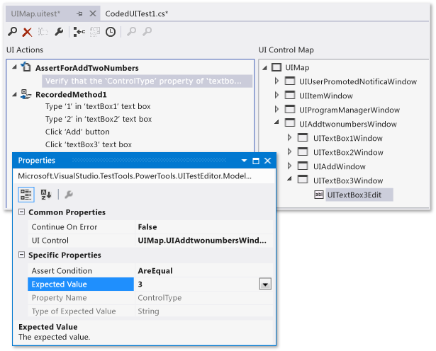

# Developer testing tools, scenarios, and capabilities

Maintain code health with unit testing. Visual Studio provides a wide range of powerful tools and techniques for developers to use when testing applications.

## Avoid regressions and achieve code coverage with IntelliTest

In traditional unit test suites, each test case represents an exemplary usage scenario, and the assertions embody the relationship between the input and output.  Verifying a few such scenarios
might well be enough, but experienced developers know that bugs lurk even in well-tested code, when correct but untested inputs provoke wrong responses.

Improve coverage, and avoid regressions with IntelliTest. IntelliTest dramatically reduces the effort to create and maintain unit tests for new or existing code.

* [Introduction to IntelliTest with Visual Studio](http://download.microsoft.com/download/6/2/B/62B60ECE-B9DC-4E8A-A97C-EA261BFB935E/Docs/Introduction%20to%20IntelliTest%20with%20Visual%20Studio%20Enterprise%202015.docx)
* [IntelliTest – One test to rule them all](http://blogs.msdn.com/b/visualstudioalm/archive/2015/07/05/intellitest-one-test-to-rule-them-all.aspx)
* [IntelliTest videos](https://channel9.msdn.com/Series/Test-Tools-in-Visual-Studio)
* [Get started with IntelliTest](generate-unit-tests-for-your-code-with-intellitest.md)
* [IntelliTest reference manual](intellitest-manual/index.md)

## User interface testing with Coded UI and Selenium

Test your user interface (UI) with best of breed or community approved UI Testing. Coded UI tests provide a way to create fully automated tests to validate the functionality and behavior of your application’s user interface. They can automate UI testing across a variety of technologies, including XAML-based UWP apps, browser apps, and SharePoint apps.

Whether you choose best of breed Coded UI Tests or generic browser-based UI testing with Selenium, Visual Studio provides all the tools you need.

* [Use UI automation to test your code](use-ui-automation-to-test-your-code.md)
* [Get started creating, editing, and maintaining a coded UI test](walkthrough-creating-editing-and-maintaining-a-coded-ui-test.md)
* [Test UWP apps with coded UI tests](test-uwp-app-with-coded-ui-test.md)
* [Test SharePoint applications with coded UI tests](testing-sharepoint-2010-applications-with-coded-ui-tests.md)
* [Introduction to coded UI tests with Visual Studio Enterprise (Lab)](http://download.microsoft.com/download/6/2/B/62B60ECE-B9DC-4E8A-A97C-EA261BFB935E/Docs/Introduction%20to%20Coded%20UI%20Tests%20with%20Visual%20Studio%20Enterprise%202015.docx)

## Effective unit testing with Visual Studio code coverage

To determine what proportion of your project’s code is actually being tested by coded tests such as unit tests, you can use the code coverage feature of Visual Studio. To guard effectively against bugs, your tests should exercise or ‘cover’ a large proportion of your code.

Code coverage analysis can be applied to both managed and unmanaged (native) code.

Code coverage is an option when you run test methods using Test Explorer. The results table shows the percentage of the code that was run in each assembly, class, and method. In addition, the source editor shows you which code has been tested.

* [Use code coverage to determine how much code is being tested](using-code-coverage-to-determine-how-much-code-is-being-tested.md)
* [Unit testing, code coverage and code clone analysis with Visual Studio (Lab)](http://download.microsoft.com/download/6/2/B/62B60ECE-B9DC-4E8A-A97C-EA261BFB935E/Docs/Unit%20Testing,%20Code%20Coverage%20and%20Code%20Clone%20Analysis%20with%20Visual%20Studio%202015.docx)
* [Customize code coverage analysis](customizing-code-coverage-analysis.md)

## Test Explorer

**Test Explorer** helps developers create, manage, and run unit tests.

* [Get started with unit testing](unit-test-your-code.md)
* [Run unit tests with Test Explorer](run-unit-tests-with-test-explorer.md)
* [Test Explorer FAQ](test-explorer-faq.md)
* [Install third-party unit test frameworks](install-third-party-unit-test-frameworks.md)

Visual Studio is also extensible and opens the door for third-party unit testing adapters such as NUnit and xUnit.net. In addition, the code clone capability goes hand-in-hand with delivering high-quality software by helping you identify blocks of semantically similar code that may be candidates for common bug fixes or refactoring.

## See also

* [Get started with unit testing](getting-started-with-unit-testing.md)
* [Speed up unit test execution in Team Foundation Server](http://blogs.msdn.com/b/visualstudioalm/archive/2015/07/30/speeding-up-test-execution-in-tfs.aspx)
* [Parallel and context sensitive unit test execution](https://blogs.msdn.microsoft.com/visualstudioalm/2016/02/08/parallel-and-context-sensitive-test-execution-with-visual-studio-2015-update-1/)
* [Unit testing, code coverage and code clone analysis with Visual Studio (Lab)](http://download.microsoft.com/download/6/2/B/62B60ECE-B9DC-4E8A-A97C-EA261BFB935E/Docs/Unit%20Testing,%20Code%20Coverage%20and%20Code%20Clone%20Analysis%20with%20Visual%20Studio%202015.docx)
* [Writing unit tests for C/C++](writing-unit-tests-for-c-cpp.md)
