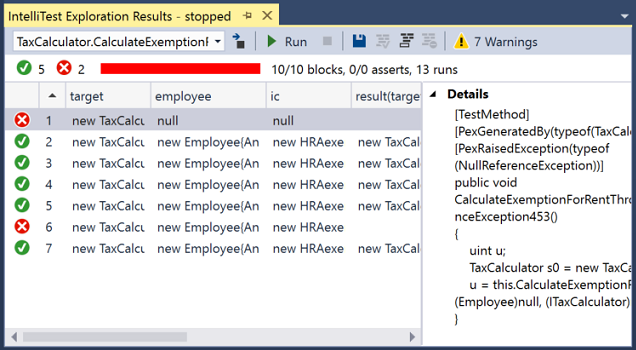
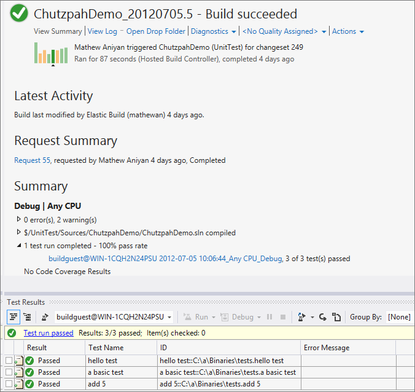

# Developer testing tools, scenarios, and capabilities

Maintain code health with unit testing. Visual Studio provides a wide range
of powerful tools and techniques for developers to use when testing applications:

**Scenarios and capabilities:**

* [Avoid regressions and achieve code coverage with IntelliTest](#intellitest)
* [User interface testing with Coded UI and Selenium](#ui-testing)
* [Effective unit testing with Visual Studio Code Coverage](#unit-testing)
* [Unit testing with any framework using the high performance Test Explorer](#test-explorer)
* [Get started with unit testing](getting-started-with-unit-testing.md)

## Avoid regressions and achieve code coverage with IntelliTest

In traditional unit test suites, each test case 
represents an exemplary usage scenario, and the 
assertions embody the relationship between the 
input and output.  Verifying a few such scenarios 
might well be enough, but experienced developers 
know that bugs lurk even in well-tested code, when 
correct but untested inputs provoke wrong responses.

Improve coverage, and avoid regressions with IntelliTest.
IntelliTest dramatically reduces the effort to 
create and maintain unit tests for new or existing 
code. 

* [Introduction to IntelliTest with Visual Studio](http://download.microsoft.com/download/6/2/B/62B60ECE-B9DC-4E8A-A97C-EA261BFB935E/Docs/Introduction%20to%20IntelliTest%20with%20Visual%20Studio%20Enterprise%202015.docx)
* [IntelliTest – One Test to rule them all](http://blogs.msdn.com/b/visualstudioalm/archive/2015/07/05/intellitest-one-test-to-rule-them-all.aspx)
* [IntelliTest Videos](https://channel9.msdn.com/Series/Test-Tools-in-Visual-Studio)
* [Get Started with IntelliTest](generate-unit-tests-for-your-code-with-intellitest.md)
* [IntelliTest reference manual](intellitest-manual/index.md)

## User interface testing with Coded UI and Selenium

Test your user interface (UI) with best 
of breed or community approved UI Testing.
Coded UI tests provide a way to create fully 
automated tests to validate the functionality and 
behavior of your application’s user interface.
They can automate UI testing across a variety 
of technologies, including XAML-based Windows Store 
apps, browser apps, and SharePoint apps.

Whether you choose best of breed Coded 
UI Tests or generic browser based UI testing with 
Selenium, Visual Studio provides all the tools you 
need. 

* [Use UI Automation To Test Your Code](use-ui-automation-to-test-your-code.md)
* [Get started creating, editing and maintaining a coded UI test](walkthrough-creating-editing-and-maintaining-a-coded-ui-test.md)
* [Test Windows Store Apps with Coded UI Tests](test-windows-store-8-1-apps-with-coded-ui-tests.md)
* [Test Windows Phone Apps with Coded UI Tests](test-windows-phone-8-1-apps-with-coded-ui-tests.md)
* [Test SharePoint Applications with Coded UI Tests](testing-sharepoint-2010-applications-with-coded-ui-tests.md)
* [Introduction to Coded UI Tests with Visual Studio Enterprise (Lab)](http://download.microsoft.com/download/6/2/B/62B60ECE-B9DC-4E8A-A97C-EA261BFB935E/Docs/Introduction%20to%20Coded%20UI%20Tests%20with%20Visual%20Studio%20Enterprise%202015.docx)

## Effective unit testing with Visual Studio Code Coverage

To determine what proportion of your project’s code 
is actually being tested by coded tests such as unit
tests, you can use the code coverage feature of 
Visual Studio. To guard effectively against bugs, 
your tests should exercise or ‘cover’ a large 
proportion of your code.

Code coverage analysis can be applied to both 
managed (CLI) and unmanaged (native) code.

Code coverage is an option when you run test 
methods using Test Explorer. The results table 
shows the percentage of the code that was run in 
each assembly, class, and method. In addition, the 
source editor shows you which code has been tested.

* [Using Code Coverage to Determine How Much Code is being Tested](using-code-coverage-to-determine-how-much-code-is-being-tested.md)
* [Unit Testing, Code Coverage and Code Clone Analysis with Visual Studio (Lab)](http://download.microsoft.com/download/6/2/B/62B60ECE-B9DC-4E8A-A97C-EA261BFB935E/Docs/Unit%20Testing,%20Code%20Coverage%20and%20Code%20Clone%20Analysis%20with%20Visual%20Studio%202015.docx)
* [Customizing Code Coverage Analysis](customizing-code-coverage-analysis.md)

## Unit testing with any framework using the high performance Test Explorer

Test Explorer help developers create, manage, and get maximum 
benefit from unit testing.

* [Get started with Unit Testing](unit-test-your-code.md)
* [Run unit tests with Test Explorer](run-unit-tests-with-test-explorer.md)
* [Writing Unit Tests for C/C++](writing-unit-tests-for-c-cpp.md)
* [Install third-party unit test frameworks](install-third-party-unit-test-frameworks.md)

Visual Studio is also extensible and opens the door for 
third-party unit testing adapters such as NUnit 
and xUnit.net. In addition, the code clone 
capability goes hand-in-hand with delivering high quality 
software by helping you identify blocks of 
semantically similar code which may be candidates 
for common bug fixes or refactoring.

## Also see

* [Get started with unit testing](getting-started-with-unit-testing.md)
* [Speeding up Unit Test Execution in Team Foundation Server](http://blogs.msdn.com/b/visualstudioalm/archive/2015/07/30/speeding-up-test-execution-in-tfs.aspx)
* [Parallel and Context Sensitive Unit Test Execution](https://blogs.msdn.microsoft.com/visualstudioalm/2016/02/08/parallel-and-context-sensitive-test-execution-with-visual-studio-2015-update-1/)
* [Unit Testing, Code Coverage and Code Clone Analysis with Visual Studio (Lab)](http://download.microsoft.com/download/6/2/B/62B60ECE-B9DC-4E8A-A97C-EA261BFB935E/Docs/Unit%20Testing,%20Code%20Coverage%20and%20Code%20Clone%20Analysis%20with%20Visual%20Studio%202015.docx)
