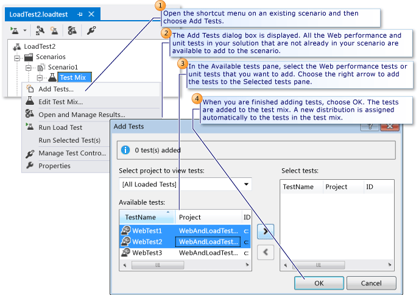
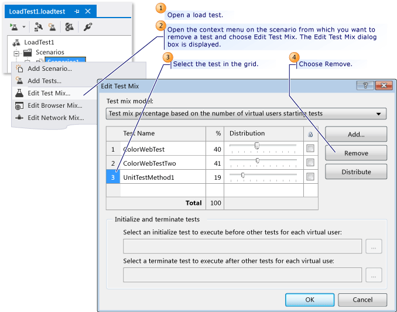

# Edit the test mix to specify which web performance, unit and coded UI tests to include in a load test scenario

The *test mix* of a scenario is a combination of the selection of Web performance and unit tests that are contained in the scenario and the distribution of those tests in the scenario. The distribution is a setting that you can specify for the probability that a particular test will be selected by a virtual user during a load test run.

 After you add a set of tests to a load test, the *test mix* works like other mix options. A virtual user randomly selects a test, based on the probability that you specified in the mix. For example, if you have two tests, each 50 percent in the mix, a new virtual user chooses to run the first test approximately half the time. In a 50/50 mix, if one test is long and another is short, more load comes from the long test.

 After you have added tests to the mix, you can remove them. You can also change the distribution of the test mix by using the mix control. The mix control lets you easily adjust the distribution of tests in a scenario.

> [!NOTE]
> Distribution is a measure of the probability that a particular test will be selected by a virtual user during a load test run. Distribution is expressed as a percentage. Therefore, the sum of the distribution numbers for all tests that are contained in a scenario is 100. For example, if a scenario contains only one test, the distribution for that test is 100 percent.

## Add new tests to a test mix in an existing scenario

When you create a new scenario by using the **New Load Test Wizard**, you can specify the Web performance and unit tests to add to the test mix of the new scenario.

You can add more Web performance and unit tests to the text mix of the scenario by using the **Load Test Editor**.

### To add more tests to an existing scenario

1.  Open a load test.

2.  In the **Load Test Editor**, right-click an existing scenario and then choose **Add Tests**.

     The **Add Tests** dialog box is displayed. All Web performance, unit, and coded UI tests in your solution that are not already in your scenario are available to add to the scenario.

3.  In the **Available tests** pane, select the Web performance, unit, and coded UI tests that you want to add. Choose the right arrow to add the tests to the **Selected tests** pane.

4.  When you finish adding tests, choose **OK**.

     The tests are added to the test mix. A new distribution is assigned automatically to the tests in the test mix.

5.  (Optional) Adjust the mix control to specify the test distribution. For more information, see [About the mix control](../test/edit-the-test-mix-to-specify-which-web-browsers-types-in-a-load-test-scenario.md).

##  Remove tests from a scenario
 

### To remove tests from a scenario

1.  Open a load test.

2.  In the **Load Test Editor**, in the load test tree, right-click the scenario from which you want to remove a test and select **Edit Test Mix**. The **Edit Test Mix** dialog box is displayed.

3.  Select the Web performance, unit, or coded UI test in the grid and then choose **Remove**.

    > [!NOTE]
    > After you remove the test, adjust the test mix to your preferred distribution.

4.  When you finish removing tests, choose **OK**.

##   About the Mix Control
 The mix control allows you to adjust the percentage of load that is distributed among tests, browser types, or network types in a load test scenario. You adjust the percentage values by moving sliders. Adjusting the mix for tests specifies the probability of a virtual user running a specific test in a load test scenario.

 When you move a slider, the percentage values of all available items change. If you have more than two items, the amount you add or remove is distributed evenly among the other items. It is possible to override this behavior. If you select the check box in the lock column for a particular item, you lock the specified percentage value for that item. Then, when you move a slider, the amount you add or remove is only applied to any remaining unlocked items.

 The **Distribute** button is used to allocate the percentages equally among all items. For example, if you have three items, choosing **Distribute** sets the percentage values to 34, 33, and 33.

> [!WARNING]
> The **Distribute** button overrides any items that are locked.

 It is also possible to type the percentage values directly into the **%** column instead of using the sliders. If you enter a percentage value directly, the other items will not adjust automatically.

> [!NOTE]
> The sliders are disabled when the total does not add up to 100%, or when the percentage values entered into the **%** column are decimals.

 When you enter percentage values manually, you should make sure that the sum of all items is 100%. When you save a mix, if the sum is not 100%, you will be prompted to accept the percentage values as they are, or to go back and adjust them. If you choose to accept them as they are, they will be prorated to 100%.  For example, if you have two items and you manually set them to 80% and 40%, the first item will be set to 66.67% (80 divided by 120) and the second item will be set to 33.33% (40 divided by 120).

## See also

- [Editing load test scenarios](../test/edit-load-test-scenarios.md)