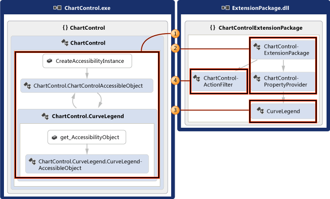
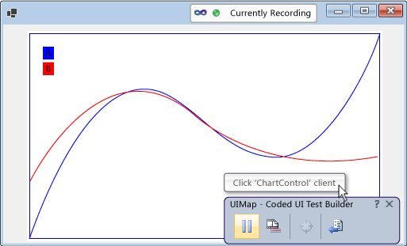
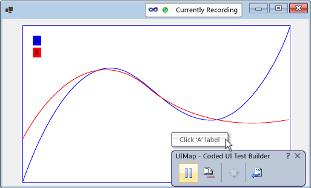
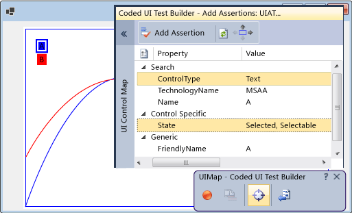
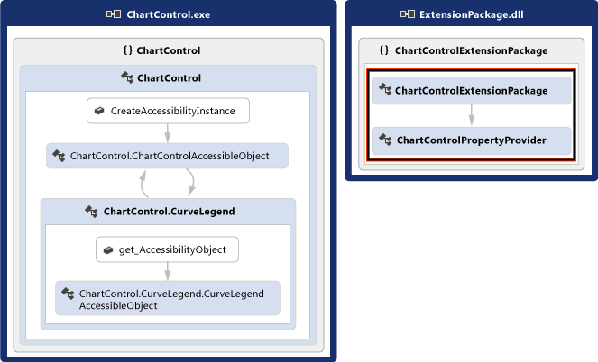
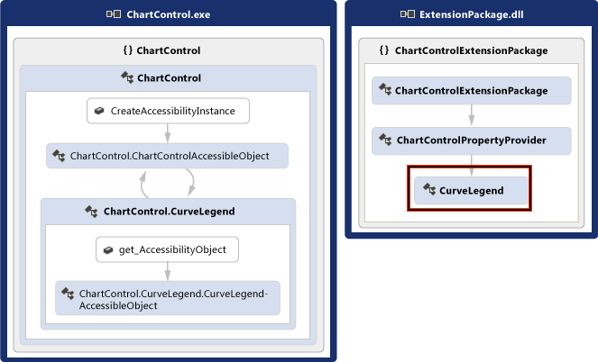
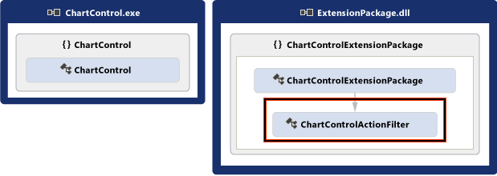

# Enable Coded UI testing of your controls

Implement support for the coded UI testing framework to make your control more testable. You can add increasing levels of support incrementally. Start by supporting record and playback and property validation. Then, build on that to enable the coded UI test builder to recognize your control's custom properties. Provide custom classes to access those properties from generated code. You can also help the coded UI test builder capture actions in a way that is closer to the intent of the action being recorded.



## Support record and playback and property validation by implementing accessibility

The coded UI test builder captures information about the controls that it encounters during a recording and then generates code to replay that session. If your control doesn't support accessibility, then the coded UI test builder captures actions (like mouse clicks) using screen coordinates. When the test is played back, the generated code issues the actions in the same screen coordinates. If your control appears in a different place on the screen when the test is played back, the generated code will fail to perform the action. By not implementing accessibility for your control, you might see test failures if the test is played back on different screen configurations, in different environments, or when the UI layout changes.

 

 If you implement accessibility, the coded UI test builder uses that to capture information about your control when it records a test. Then, when you run the test, the generated code will replay those events against your control, even if it's somewhere else in the user interface. Test authors can also create asserts using the basic properties of your control.

 

### To support record and playback, property validation, and navigation for a Windows Forms control
 Implement accessibility for your control as outlined in the following procedure, and explained in detail in <xref:System.Windows.Forms.AccessibleObject>.

 

1.  Implement a class that derives from <xref:System.Windows.Forms.Control.ControlAccessibleObject>, and override the <xref:System.Windows.Forms.Control.AccessibilityObject%2A> property to return an object of your class.

    ```csharp
    public partial class ChartControl : UserControl
    {
        // Overridden to return the custom AccessibleObject for the control.
        protected override AccessibleObject CreateAccessibilityInstance()
        {
            return new ChartControlAccessibleObject(this);
        }

        // Inner class ChartControlAccessibleObject represents accessible information
        // associated with the ChartControl and is used when recording tests.
        public class ChartControlAccessibleObject : ControlAccessibleObject
        {
            ChartControl myControl;
            public ChartControlAccessibleObject(ChartControl ctrl)
                : base(ctrl)
            {
                myControl = ctrl;
            }
        }
    }
    ```

2.  Override the accessible object's <xref:System.Windows.Forms.AccessibleObject.Role%2A>, <xref:System.Windows.Forms.AccessibleObject.State%2A>, <xref:System.Windows.Forms.AccessibleObject.GetChild%2A> and <xref:System.Windows.Forms.AccessibleObject.GetChildCount%2A> properties and methods.

3.  Implement another accessibility object for the child control and override the child control's <xref:System.Windows.Forms.Control.AccessibilityObject%2A> property to return the accessibility object.

4.  Override the <xref:System.Windows.Forms.AccessibleObject.Bounds%2A>, <xref:System.Windows.Forms.AccessibleObject.Name%2A>, <xref:System.Windows.Forms.AccessibleObject.Parent%2A>, <xref:System.Windows.Forms.AccessibleObject.Role%2A>, <xref:System.Windows.Forms.AccessibleObject.State%2A>, <xref:System.Windows.Forms.AccessibleObject.Navigate%2A>, and <xref:System.Windows.Forms.AccessibleObject.Select%2A> properties and methods for the child control's accessibility object.

> [!NOTE]
> This topic starts with the accessibility sample in <xref:System.Windows.Forms.AccessibleObject>, and then builds on that sample in the remaining procedures. If you want to create a working version of the accessibility sample, create a console application and then replace the code in Program.cs with the sample code. Add references to Accessibility, System.Drawing, and System.Windows.Forms. Change the **Embed Interop Types** for Accessibility to **False** to eliminate a build warning. You can change the project's output type from **Console Application** to **Windows Application** so that a console window doesn't appear when you run the application.

## Support custom property validation by implementing a property provider

After you implement basic support for record and playback and property validation, you can make your control's custom properties available to coded UI tests by implementing a <xref:Microsoft.VisualStudio.TestTools.UITesting.UITestPropertyProvider> plug-in. For example, the following procedure creates a property provider that allows coded UI tests to access the State property of the chart control's CurveLegend child controls:

 

### To support custom property validation



1. Override the curve legend accessible object's <xref:System.Windows.Forms.AccessibleObject.Description%2A> property to pass rich property values in the description string. Separate multiple values with semicolons (;).

    ```csharp
    public class CurveLegendAccessibleObject : AccessibleObject
    {
        // add the state property value to the description
        public override string Description
        {
            get
            {
                // Add ";" and the state value to the end
                // of the curve legend's description
                return "CurveLegend; " + State.ToString();
            }
        }
    }
    ```

1. Create a UI test extension package for your control by creating a class library project. Add references to Accessibility, Microsoft.VisualStudio.TestTools.UITesting, Microsoft.VisualStudio.TestTools.UITest.Common, and Microsoft.VisualStudio.TestTools.Extension. Change the **Embed Interop Types** for Accessibility to **False**.

1. Add a property provider class that's derived from <xref:Microsoft.VisualStudio.TestTools.UITesting.UITestPropertyProvider>:

    ```csharp
    using System;
    using System.Collections.Generic;
    using Accessibility;
    using Microsoft.VisualStudio.TestTools.UITesting;
    using Microsoft.VisualStudio.TestTools.UITest.Extension;
    using Microsoft.VisualStudio.TestTools.UITesting.WinControls;
    using Microsoft.VisualStudio.TestTools.UITest.Common;

    namespace ChartControlExtensionPackage
    {
        public class ChartControlPropertyProvider : UITestPropertyProvider
        {
        }
    }
    ```

1. Implement the property provider by placing property names and property descriptors in a <xref:System.Collections.Generic.Dictionary%602>.

1. Override <xref:Microsoft.VisualStudio.TestTools.UITesting.UITestPropertyProvider.GetControlSupportLevel%2A?displayProperty=fullName> to indicate that your assembly provides control-specific support for your control and its children.

1. Override the remaining abstract methods of <xref:Microsoft.VisualStudio.TestTools.UITesting.UITestPropertyProvider?displayProperty=fullName>

1. Add an extension package class that's derived from <xref:Microsoft.VisualStudio.TestTools.UITest.Extension.UITestExtensionPackage>.

1. Define the `UITestExtensionPackage` attribute for the assembly.

1. In the extension package class, override <xref:Microsoft.VisualStudio.TestTools.UITest.Extension.UITestExtensionPackage.GetService%2A?displayProperty=fullName> to return the property provider class when a property provider is requested.

1. Override the remaining abstract methods and properties of <xref:Microsoft.VisualStudio.TestTools.UITest.Extension.UITestExtensionPackage>.

1. Build your binaries and copy them to **%ProgramFiles%\Common\Microsoft Shared\VSTT\10.0\UITestExtensionPackages**.

> [!NOTE]
> This extension package is applied to any control that is of type "Text". If you're testing multiple controls of the same type, test them separately so you can manage which extension packages are deployed when you record the tests.

## Support code generation by implementing a class to access custom properties

When the coded UI test builder generates code from a session recording, it uses the <xref:Microsoft.VisualStudio.TestTools.UITesting.UITestControl> class to access your controls.

If you've implemented a property provider to provide access to your control's custom properties, you can add a specialized class that is used to access those properties. Adding a specialized class simplifies the generated code.

### To add a specialized class to access your control



1. Implement a class that's derived from <xref:Microsoft.VisualStudio.TestTools.UITesting.WinControls.WinControl> and add the control's type to the search properties collection in the constructor.

1. Implement your control's custom properties as properties of the class.

1. Override your property provider's <xref:Microsoft.VisualStudio.TestTools.UITesting.UITestPropertyProvider.GetSpecializedClass%2A?displayProperty=fullName> method to return the type of the new class for the curve legend child controls.

1. Override your property provider's <xref:Microsoft.VisualStudio.TestTools.UITesting.UITestPropertyProvider.GetPropertyNamesClassType%2A> method to return the type of the new class' PropertyNames method.

## Support intent-aware actions by implementing an action filter

 When Visual Studio records a test, it captures each mouse and keyboard event. However, in some cases, the intent of the action can be lost in the series of mouse and keyboard events. For example, if your control supports autocomplete, the same set of mouse and keyboard events may result in a different value when the test is played back in a different environment. You can add an action filter plug-in that replaces the series of keyboard and mouse events with a single action. This way, you can replace the series of mouse and keyboard events that select a value with a single action that sets the value. Doing that protects coded UI tests from the differences in autocomplete from one environment to another.

### To support intent-aware actions



1. Implement an action filter class that's derived from <xref:Microsoft.VisualStudio.TestTools.UITest.Common.UITestActionFilter>, overriding the properties <xref:Microsoft.VisualStudio.TestTools.UITest.Common.UITestActionFilter.ApplyTimeout%2A>, <xref:Microsoft.VisualStudio.TestTools.UITest.Common.UITestActionFilter.Category%2A>, <xref:Microsoft.VisualStudio.TestTools.UITest.Common.UITestActionFilter.Enabled%2A>, <xref:Microsoft.VisualStudio.TestTools.UITest.Common.UITestActionFilter.FilterType%2A>, <xref:Microsoft.VisualStudio.TestTools.UITest.Common.UITestActionFilter.Group%2A> and <xref:Microsoft.VisualStudio.TestTools.UITest.Common.UITestActionFilter.Name%2A>.

1. Override <xref:Microsoft.VisualStudio.TestTools.UITest.Common.UITestActionFilter.ProcessRule%2A>. The example here replaces a double-click action with a single click action.

1. Add the action filter to the <xref:Microsoft.VisualStudio.TestTools.UITest.Extension.UITestExtensionPackage.GetService%2A> method of your extension package.

1. Build your binaries and copy them to %ProgramFiles%\Common Files\Microsoft Shared\VSTT\10.0\UITestExtensionPackages.

> [!NOTE]
> The action filter does not depend on the accessibility implementation or on the property provider.

## Debug your property provider or action filter

Your property provider and action filter are implemented in an extension package. The test builder runs the extension package in a separate process from your application.

### To debug your property provider or action filter

1.  Build the debug version of your extension package copy the .dll and .pdb files to %ProgramFiles%\Common Files\Microsoft Shared\VSTT\10.0\UITestExtensionPackages.

2.  Run your application (not in the debugger).

3.  Run the coded UI test builder.

     `codedUITestBuilder.exe  /standalone`

4.  Attach the debugger to the codedUITestBuilder process.

5.  Set breakpoints in your code.

6.  In the coded UI test builder, create asserts to exercise your property provider, and record actions to exercise your action filters.

## See also

- <xref:System.Windows.Forms.AccessibleObject>
- [Use UI Automation To Test Your Code](../test/use-ui-automation-to-test-your-code.md)