# Get started with unit testing

Use Visual Studio to define and run your unit tests
to maintain code health, ensure code coverage, and
to find errors and faults before your customers do.

## Create unit tests

Create unit tests and run them frequently to make sure your code is working properly.

1. Create a unit test project.
        
   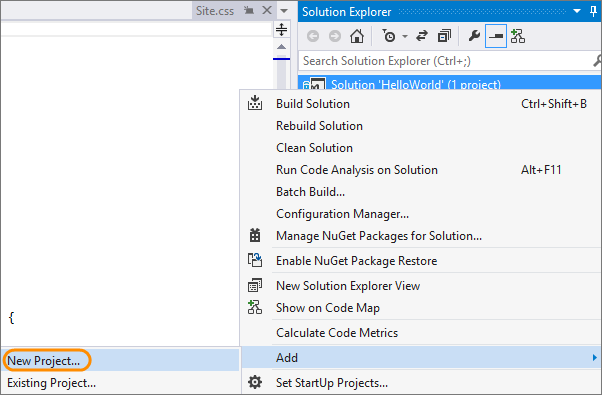
    
1. Name your project.
        
   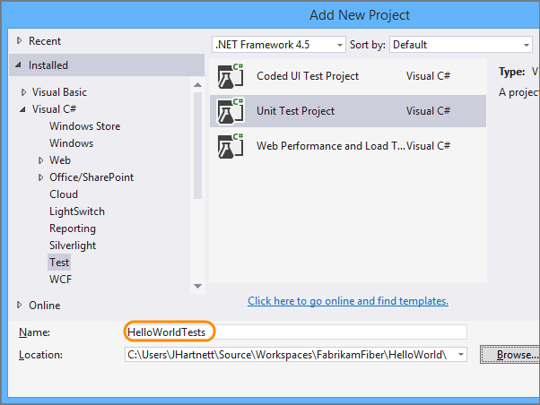
  
   The project is added to your solution.
    
   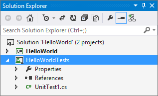
    
1. In the unit test project, add a reference to the project you want to test.
        
   
    
1. Select the project that contains the code you'll test.
        
   
    
1. Code your unit test.

   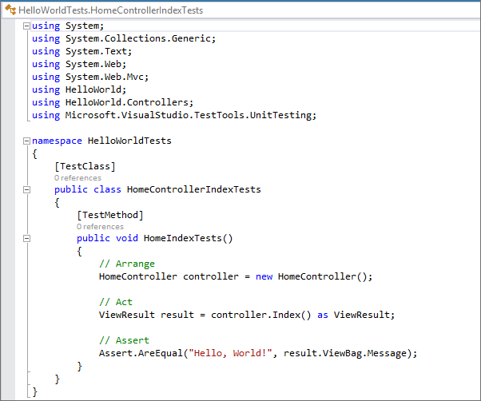 

You can also create unit test method stubs with the [**Create Unit Tests** command](create-unit-tests-menu.md).
Or you can use a [different unit test framework](#frameworks) to create tests for different code languages.

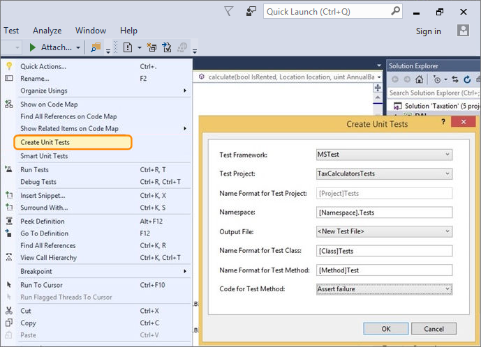

## Run unit tests

1. Open Test Explorer.
        
   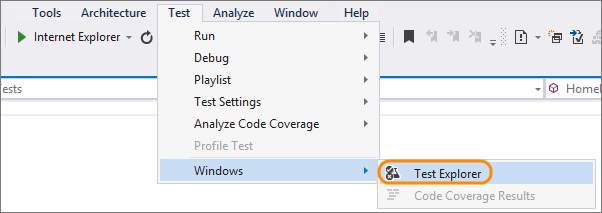 

1. Run unit tests.
        
   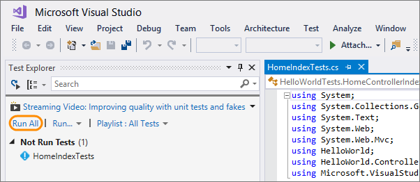 

   You can see the unit tests that passed or failed in Test Explorer.
      
   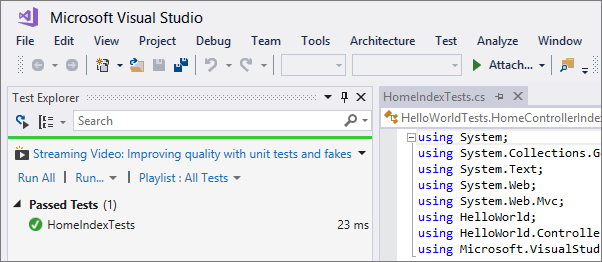 

## View live unit test results

If you are using the MSTest, xUnit, or NUnit testing framework in Visual Studio 2017 or above,
you can see live results of your unit tests within the Visual Studio UI.

1. Turn on live unit testing from the **Test** menu.

   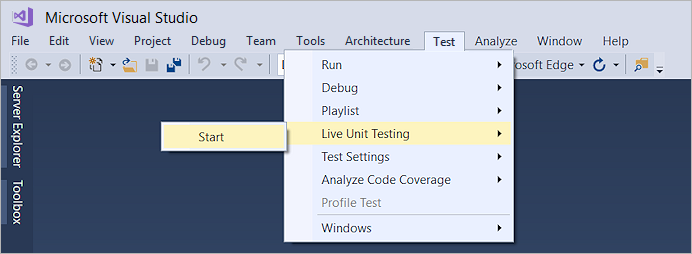 

1. View the results of the tests within the code editor window as you write and edit code.

   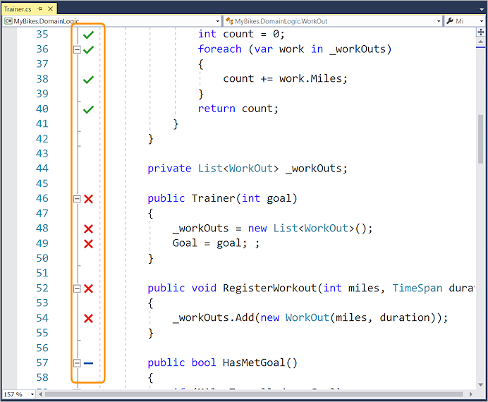 

1. Point to and click on the test result indicators to see more information.

   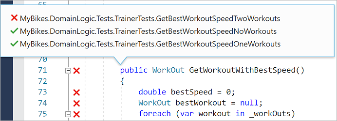 

For more details, see [Live Unit Testing in Visual Studio](https://blogs.msdn.microsoft.com/visualstudio/2016/11/18/live-unit-testing-visual-studio-2017-rc/).

## Generate unit tests with IntelliTest

When you run IntelliTest, you can easily see which 
tests are failing and add any necessary code to fix 
them. You can select which of the generated tests 
to save into a test project to provide a regression 
suite. As you change your code, rerun IntelliTest 
to keep the generated tests in sync with your code 
changes. To learn how, see
[Generating unit tests for your code with IntelliTest](https://docs.microsoft.com/visualstudio/test/generate-unit-tests-for-your-code-with-intellitest).

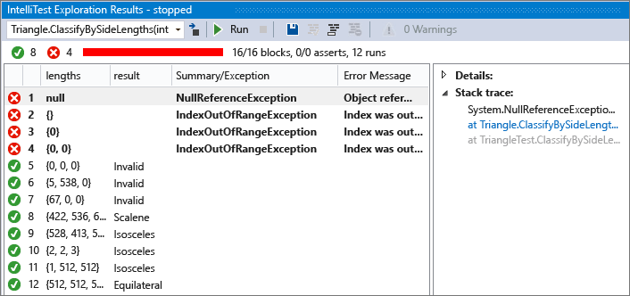

## Run unit tests with Test Explorer

Use Test Explorer to run unit tests from Visual 
Studio or third-party unit test projects, group 
tests into categories, filter the test list, and 
create, save, and run playlists of tests. You can 
also debug tests and analyze test performance and 
code coverage. To learn how, see
[Run unit tests with Test Explorer](https://docs.microsoft.com/visualstudio/test/run-unit-tests-with-test-explorer).

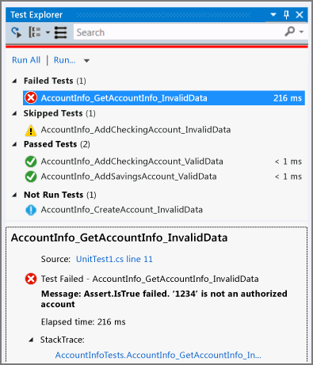

## Use code coverage to determine how much code is being tested

To determine what proportion of your project's code 
is actually being tested by coded tests such as unit
tests, you can use the code coverage feature of 
Visual Studio. To guard effectively against bugs, 
your tests should exercise or 'cover' a large 
proportion of your code. To learn how, see
[Use Code Coverage to Determine How Much Code is being Tested](https://docs.microsoft.com/visualstudio/test/using-code-coverage-to-determine-how-much-code-is-being-tested).

## Q & A

<!-- BEGINSECTION class="m-qanda" -->

####Q:    Can I run unit tests in Visual Studio if I use a different unit test framework?

A:  Yes, use the plug-in for that framework so that Visual Studio's test runner 
can work with that framework. Here are some of the
[unit testing framework plug-ins for Visual Studio](http://go.microsoft.com/fwlink/?LinkID=246630).

1. Use Visual Studio's extension manager to download your plug-in.
        
    

1. Download your plug-in from the Visual Studio Gallery under Tools/Testing, 
or search for it if you know the name.
        
    

1. Create a class library project.
        
    

   Add the project to your solution.
    
   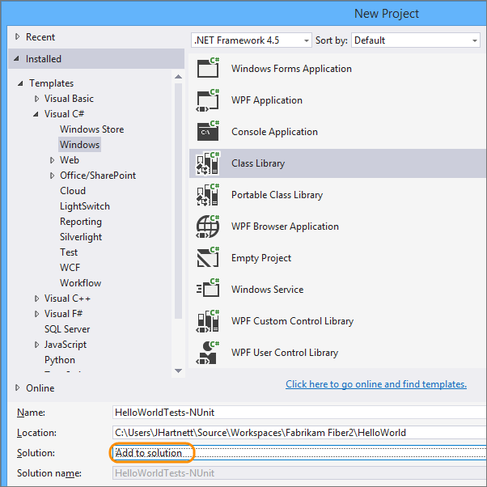 

1. In the class library project, run NuGet to install the plug-in.

   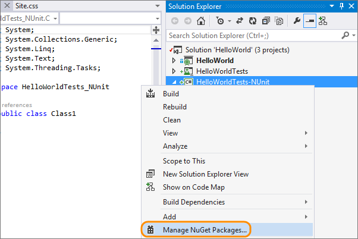 

   [NuGet](https://www.nuget.org/) is an extension of Visual Studio 
   that you can use to add and update libraries and tools for your projects.

1. Install your plug-in. If you know the name, you can search for it online.

   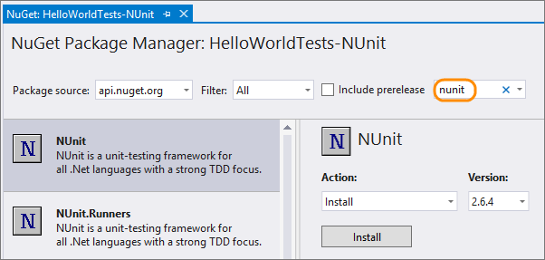 

   The framework is referenced in your project.
        
   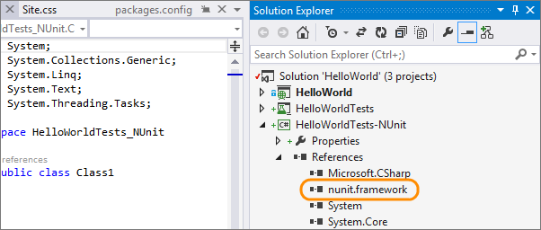 

1. In the class library project, add a reference to the project you want to test.
        
    

1. Select the project that contains the code you'll test.
        
    

1. Code your unit test.

   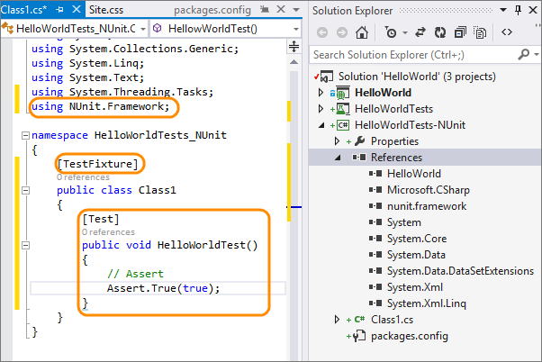   

<!-- ENDSECTION -->

## See also

* [Create Unit Tests command](create-unit-tests-menu.md)
* [Generate tests with IntelliTest](generate-unit-tests-for-your-code-with-intellitest.md)
* [Run tests with Test Explorer](run-unit-tests-with-test-explorer.md)
* [Determine code coverage](using-code-coverage-to-determine-how-much-code-is-being-tested.md)
* [Improve Code Quality](improve-code-quality.md)
