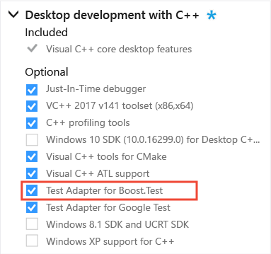

# How to use Boost.Test for C++ in Visual Studio

In **Visual Studio 2017 version 15.5** and later, the Boost.Test test adapter is integrated into the Visual Studio IDE as a component of the **Desktop development with C++** workload.



If you don't have the **Desktop development with C++** workload installed, open **Visual Studio Installer** and select **Modify**. Select the **Desktop development with C++** workload, then choose the **Modify** button.

## Install Boost

Boost.Test requires [Boost](http://www.boost.org/)! If you do not have Boost installed, we recommend that you use the Vcpkg package manager.

1. Follow the instructions at [Vcpkg: a C++ Package Manager for Windows](/cpp/vcpkg) to install vcpkg (if you don't already have it).

1. Install the Boost.Test dynamic or static library:

	- Run **vcpkg install boost-test** to install the Boost.Test dynamic library.

	   -OR-

	- Run **vcpkg install boost-test:x86-windows-static** to install the Boost.Test static library.

1. Run **vcpkg integrate install** to configure Visual Studio with the library and include paths to the Boost headers and binaries.

## Add the item template (Visual Studio 2017 version 15.6 and later)

1. To create a .cpp file for your tests, right-click on the project node in **Solution Explorer** and choose **Add New Item**.

   

1. The new file contains a sample test method. Build your project to enable **Test Explorer** to discover the method.

The item template uses the single-header variant of Boost.Test, but you can modify the #include path to use the standalone library variant. For more information, see [Add include directives](#add-include-directives).

## Create a test project (Visual Studio 2017 version 15.5)

In Visual Studio 2017 version 15.5, no pre-configured test project or item templates are available for Boost.Test. Therefore, you have to create and configure a console application project to hold your tests.

1. In **Solution Explorer**, right click on the solution node and choose **Add** > **New Project**.

1. In the left pane, choose **Visual C++** > **Windows Desktop**, and then choose the **Windows Console Application** template.

1. Give the project a name and choose **OK**.
1. Delete the `main` function in the .cpp file.

1. If you are using the single-header or dynamic library version of Boost.Test, go to [Add include directives](#add-include-directives). If you are using the static library version, then you have to perform some additional configuration:

   a. To edit the project file, first unload it. In **Solution Explorer**, right-click the project node and choose **Unload Project**. Then, right-click the project node and choose **Edit <name\>.vcxproj**.

   b. Add two lines to the **Globals** property group as shown here:

    ```xml
    <PropertyGroup Label="Globals">
    ....
        <VcpkgTriplet>x86-windows-static</VcpkgTriplet>
        <VcpkgEnabled>true</VcpkgEnabled>
    </PropertyGroup>
    ```
   c. Save and close the \*.vcxproj file, and then reload the project.

   d. To open the **Property Pages**, right-click on the project node and choose **Properties**.

   d. Expand **C/C++** > **Code Generation**, and then select **Runtime Library**. Select **/MTd** for debug static runtime library or **/MT** for release static runtime library.

   f. Expand **Linker > System**. Verify that **SubSystem** is set to **Console**.

   g. Choose **OK** to close the property pages.

## Add include directives

1. In your test .cpp file, add any needed `#include` directives to make your program's types and functions visible to the test code. Typically, the program is up one level in the folder hierarchy. If you type `#include "../"`, an IntelliSense window appears and enables you to select the full path to the header file.

   

   You can use the standalone library with:

   ```cpp
   #include <boost/test/unit_test.hpp>
   ```

   Or, use the single-header version with:

   ```cpp
   #include <boost/test/included/unit_test.hpp>
   ```

   Then, define `BOOST_TEST_MODULE`.

The following example is sufficient for the test to be discoverable in **Test Explorer**:

```cpp
#define BOOST_TEST_MODULE MyTest
#include <boost/test/included/unit_test.hpp\> //single-header
#include "../MyProgram/MyClass.h" // project being tested
#include <string>

BOOST_AUTO_TEST_CASE(my\_boost_test)
{
	std::string expected_value = "Bill";

    // assume MyClass is defined in MyClass.h
    // and get_value() has public accessibility
    MyClass mc;
	BOOST_CHECK(expected_value == mc.get_value());
}
```

## Write and run tests
You are now ready to write and run Boost Tests. See the [Boost Test Library Documentation](http://www.boost.org/doc/libs/release/libs/test/doc/html/index.html) for information about the test macros. See [Run unit tests with Test Explorer](run-unit-tests-with-test-explorer.md) for information about discovering, running, and grouping your tests by using **Test Explorer**.

## See also
[Writing Unit Tests for C/C++](writing-unit-tests-for-c-cpp.md)
