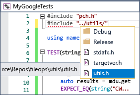

# How to use Boost.Test for C++ in Visual Studio
In **Visual Studio 2017 version 15.5** and later, Boost.Test is integrated into the Visual Studio IDE as a component of the **Desktop Develoment with C++** workload. To install it on your machine, open the Visual Studio Installer and find **Boost.Test Adapter** under the list of workload components:


## Install Boost

 Boost.Test requires [Boost](http://www.boost.org/)! If you do not have Boost installed, we recommend that you use the Vcpkg package manager. 

1. Follow the instructions at [Vcpkg: a C++ Package Manager for Windows](/cpp/vcpkg) to install vcpkg (if you don't already have it).
2. Run `vcpkg install boost` to install the Boost libraries.
3. Run the `vcpkg integrate install` command to configure Visual Studio with the library and include paths to the Boost headers and binaries. 

## Create a project for your tests
In Visual Studio 2017 version 15.5, no pre-configured test project or item templates are  available for Boost.Test. Therefore, you have to create a console application project to hold your tests. Test templates for Boost.Test are planned for inclusion in a future version of Visual Studio. 

1. In **Solution Explorer**, right click on the solution node and choose **Add | New Project**. 
2. In the left pane, choose **Windows Desktop** and then choose **Windows Console Application** in the center pane. 
3. Give the project a name and click **OK**. 

## Add include directives
In your test .cpp file, add any needed `#include` directives to make your program's types and functions visible to the test code. Typically, the program is up one level in the folder hierarchy. If you type `#include "../"`
an IntelliSense window will appear and enable you to select the full path to the header file.



At a minimum you need to include to include the [single header variant of Boost.Test](http://www.boost.org/doc/libs/1_48_0/libs/test/doc/html/utf/user-guide/usage-variants/single-header-variant.html) with `#include <path>/unit_test.hpp` and define `BOOST_TEST_MODULE`. The following example is sufficient for the test to be discoverable in **Test Explorer**:

```cpp
#include "stdafx.h"
#define BOOST_TEST_MODULE MyTest
#include <boost/test/included/unit_test.hpp>
#include "../MyProgram/MyClass.h" // project being tested
#include <string>

BOOST_AUTO_TEST_CASE(my_boost_test)
{
	std::string name = "Bill";
	MyClass mc(name);
	Assert::AreEqual();
	BOOST_CHECK(name == mc.GetName());
}
```

## Write and run tests
You are now ready to write and run Boost Tests. See the [Boost Test Library Documentation](http://www.boost.org/doc/libs/1_38_0/libs/test/doc/html/index.html) for information about the test macros. See [Run unit tests with Test Explorer](run-unit-tests-with-test-explorer.md) for information about discovering, running, and grouping your tests by using **Test Explorer**.

## See Also
[Writing Unit Tests for C/C++](writing-unit-tests-for-c-cpp.md)


  


