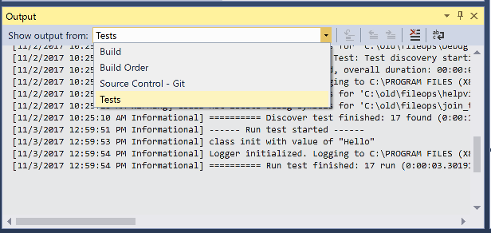

# How to use the Microsoft Unit Testing Framework for C++

The Microsoft Unit Testing Framework for C++ is included by default in the **C++ Desktop Workload**. 

##   To write unit tests in a separate project  
Typically, you run your test code in a separate project in the same solution as the code you want to test. To set up and configure a new test project, see [Writing unit tests for C/C++](writing-unit-tests-for-c-cpp.md).

##   To write unit tests in the same project  
To write unit tests in the same project as the code you want to test:
  
1.  Modify the project properties to include the headers and library files that are required for unit testing.  
  
    1.  In Solution Explorer, in the shortcut menu of the project under test, choose Properties. The project properties window opens.  
  
    2.  Choose **Configuration Properties**, **VC++ Directories**.  
  
    3.  Edit the Include and Library directories:  
  
        |||  
        |-|-|  
        |**Include Directories**|**$(VCInstallDir)UnitTest\include;$(IncludePath)**|  
        |**Library Directories**|**$(VCInstallDir)UnitTest\lib;$(LibraryPath)**|  
  
2.  Add a C++ Unit Test file:  
  
    -   In Solution Explorer, in the shortcut menu of the project, choose **Add**, **New Item**, and then choose **C++ Unit Test**.  

## Write the tests
Any .cpp file with test classes must include "CppUnitTest.h" and have a using statement for `using namespace Microsoft::VisualStudio::CppUnitTestFramework`. The test project is already configured for you. It also includes a namespace definition, and a TEST_CLASS with a TEST_METHOD to get you started. You can modify the namespace name as well as the names in parentheses in the class and method macros.

Special macros are defined for initializing test modules, classes and methods, and for cleanup of resoures when tests are completed. These macros generate code that is executed before a class or method is first accessed, and after the last test has run. For more information, see [Initialize and cleanup](microsoft-visualstudio-testtools-cppunittestframework-api-reference.md#Initialize_and_cleanup).

Use the static methods in the [Assert](microsoft-visualstudio-testtools-cppunittestframework-api-reference.md#general_asserts) class to define test conditions. Use the [Logger](microsoft-visualstudio-testtools-cppunittestframework-api-reference.md#logger) class to write messages to the **Output Window**. Add attributes to test methods
  
## Run the tests  
  
1.  On the **Test** menu, choose **Windows**, **Test Explorer**.  
2. If all your tests are not visible in the window, build the test project by right-clicking its node in **Solution Explorer** and choosing **Build** or **Rebuild**.
  
2.  In Test Explorer, choose **Run All**, or select the specific tests you want to run. Right-click on a test for other options, including running it in debug mode with breakpoints enabled.
3. In the **Output Window** choose **Tests** in the drop down to view messages written out by the `Logger` class:
4. 
5. 
  
## See Also
[Quick Start: Test Driven Development with Test Explorer](../test/quick-start-test-driven-development-with-test-explorer.md)

