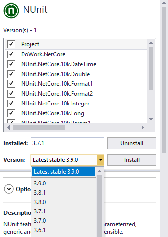

# Install third-party unit test frameworks

Visual Studio Test Explorer can run any unit test framework that has developed an adapter interface for the Explorer. The install program of the framework installs the binaries and adds Visual Studio project templates for the languages it supports. When you create a project with the template, the framework is registered with Test Explorer. A Visual Studio solution can contain unit test projects that use different frameworks and that are targeted at different languages. Test Explorer runs them all.

## Acquire third-party frameworks

You can download and install many third-party unit test frameworks by using the Visual Studio Extension Manager, or from the Visual Studio Marketplace. Frameworks can also be downloaded from other sites such as the website of the framework.

### Install from Visual Studio

1. Choose **Tools** on the standard menu, and then choose **Extensions and Updates**.

2. Expand **Online** > **Visual Studio Marketplace** > **Tools**. Choose **Testing**.

3. Browse the list to find the framework.

4. Select the framework and choose **Download**.

For more information see [Find and use Visual Studio extensions](../ide/finding-and-using-visual-studio-extensions.md).

### Install from the web

If you know the framework you are interested in:

1. Open [Visual Studio Marketplace](https://marketplace.visualstudio.com/vs).

2. Type the name of the framework in the **Find** box.

3. Choose the framework in the results list to navigate to the Visual Studio Marketplace page for the tool.

To browse a list of frameworks along with other testing tools:

1. Open [Visual Studio Marketplace](https://marketplace.visualstudio.com/vs).

2. In **Filter by category / collection**, choose **See all**.

3. In the **Category** list (labeled as **Showing**), expand the **Tools** node and then choose **Testing**.

4. Choose a framework in the results list to navigate to a Visual Studio Marketplace page for the tool.

## Update to the latest test adapters

Update to the latest stable test adapter to experience better test discovery and execution. For more information about updates to MSTest, NUnit, and xUnit test adapters, see the [Visual Studio blog](https://blogs.msdn.microsoft.com/visualstudio/2017/11/16/test-experience-improvements/).

### To update to the latest stable test adapter version

1. Open the Nuget Package Manager for your solution by navigating to **Tools** > **NuGet Package Manager** > **Manage NuGet Packages for Solution**.

2. Click on the **Updates** tab and search for NUnit or xUnit test adapters that are installed.

3. Select each test adapter, and then select the latest stable version in the drop down menu.

4. Choose the **Install** button.

   

## See also

- [Unit test your code](../test/unit-test-your-code.md)
