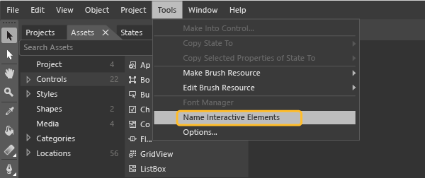

# Set a Unique Automation Property for UWP Controls for Testing

If you want to run coded UI tests for your XAML-based UWP application, each control must be identified by a unique automation property. You can assign a unique automation property based on the type of XAML control in your application.

## Static XAML definition

To specify a unique automation property for a control that is defined in your XAML file, you can set the **AutomationProperties.AutomationId** or **AutomationProperties.Name** implicitly or explicitly, as shown in the examples that follow. Setting either of these values gives the control a unique automation property that can be used to identify the control when you create a coded UI test or action recording.

### Set the property implicitly

Set **AutomationProperties.AutomationId** to **ButtonX** using the **Name** property in the XAML for the control.

```xaml
<Button Name="ButtonX" Height="31" HorizontalAlignment="Left" Margin="23,26,0,0"  VerticalAlignment="Top" Width="140" Click="ButtonX_Click" />
```

Set **AutomationProperties.Name** to **ButtonY** using the **Content** property in the XAML for the control.

```xaml
<Button Content="ButtonY" Height="31" HorizontalAlignment="Left" Margin="23,76,0,0" VerticalAlignment="Top" Width="140" Click="ButtonY_Click" />
```

### Set the property explicitly

Set **AutomationProperties.AutomationId** to **ButtonX** explicitly in the XAML for the control.

```xaml
<Button AutomationProperties.AutomationId="ButtonX" Height="31" HorizontalAlignment="Left" Margin="23,26,0,0"  VerticalAlignment="Top" Width="140" Click="ButtonX_Click" />
```

Set the **AutomationProperties.Name** to **ButtonY** explicitly in the XAML for the control.

```
<Button AutomationProperties.Name="ButtonY" Height="31" HorizontalAlignment="Left" Margin="23,76,0,0" VerticalAlignment="Top" Width="140" Click="ButtonY_Click" />
```

## Assign unique names

In Blend for Visual Studio, you can select an option to assign unique names to interactive elements such as buttons, list boxes, combo boxes, and text boxes. This gives the controls unique values for **AutomationProperties.Name**.

To assign unique names to existing controls, select **Tools** > **Name Interactive Elements**.



To automatically give unique names to new controls that you add, select **Tools** > **Options** to open the **Options** dialog. Select **XAML Designer** and then select **Automatically name interactive elements on creation**. Select **OK** to close the dialog box.

## Use a data template

You can define a simple template using **ItemTemplate** to bind the values in a list box to variables:

```xaml
<ListBox Name="listBox1" ItemsSource="{Binding Source={StaticResource employees}}">
   <ListBox.ItemTemplate>
      <DataTemplate>
         <StackPanel Orientation="Horizontal">
            <TextBlock Text="{Binding EmployeeName}" />
            <TextBlock Text="{Binding EmployeeID}" />
         </StackPanel>
      </DataTemplate>
   </ListBox.ItemTemplate>
</ListBox>
```

You can also use a template with **ItemContainerStyle** to bind the values to variables:

```xaml
<ListBox Name="listBox1" ItemsSource="{Binding Source={StaticResource employees}}">
   <ListBox.ItemContainerStyle>
      <Style TargetType="ListBoxItem">
         <Setter Property="Template">
            <Setter.Value>
               <ControlTemplate TargetType="ListBoxItem">
                  <Grid>
                     <Button Content="{Binding EmployeeName}" AutomationProperties.AutomationId="{Binding EmployeeID}"/>
                  </Grid>
               </ControlTemplate>
            </Setter.Value>
         </Setter>
      </Style>
   </ListBox.ItemContainerStyle>
</ListBox>
```

For both of these examples, you must then override the **ToString()** method of **ItemSource**, as shown using the code example that follows. This code makes sure that the **AutomationProperties.Name** value is set and is unique, because you cannot set a unique automation property for each data-bound list item using binding. Setting a unique value for the **Automation Properties.Name** is sufficient in this case.

> [!NOTE]
> Using this approach, the inner contents of the list item can also be set to a string in the Employee class through binding. As shown in the example, the button control inside each list item is assigned a unique automation id, which is the Employee ID.

```csharp
Employee[] employees = new Employee[]
{
   new Employee("john", "4384"),
   new Employee("margaret", "7556"),
   new Employee("richard", "8688"),
   new Employee("george", "1293")
};

listBox1.ItemsSource = employees;

public override string ToString()
{
    return EmployeeName + EmployeeID; // Unique Identification to be set as the AutomationProperties.Name
}
```

## Use a control template

You can use a control template so that each instance of a specific type obtains a unique automation property when it is defined in the code. Create the template so that the **AutomationProperty** binds to a unique ID in the control instance. The following XAML demonstrates one approach to create this binding with a control template:

```xaml
<Style x:Key="MyButton" TargetType="Button">
<Setter Property="Template">
   <Setter.Value>
<ControlTemplate TargetType="Button">
   <Grid>
      <CheckBox HorizontalAlignment="Left" AutomationProperties.AutomationId="{TemplateBinding Content}"></CheckBox>
      <Button Width="90" HorizontalAlignment="Right" Content="{TemplateBinding Content}" AutomationProperties.AutomationId="{TemplateBinding Content}"></Button>
   </Grid>
</ControlTemplate>
   </Setter.Value>
</Setter>
</Style>
```

When you define two instances of a button using this control template, the automation id is set to the unique content string for the controls in the template, as shown in the following XAML:

```xaml
<Button Content="Button1" Style="{StaticResource MyButton}" Width="140"/>
<Button Content="Button2" Style="{StaticResource MyButton}" Width="140"/>
```

### Dynamic controls

If you have controls that are created dynamically from your code and not created statically or through templates in XAML files, you must set the **Content** or **Name** properties for the control. This makes sure that each dynamic control has a unique automation property. For example, if you have a check box that must be displayed when you select a list item, you can set these properties, as shown here:

```csharp
private void CreateCheckBox(string txt, StackPanel panel)
{
   CheckBox cb = new CheckBox();
   cb.Content = txt; // Sets the AutomationProperties.Name
   cb.Height = 50;
   cb.Width = 100;
   cb.Name = "DynamicCheckBoxAid"+ txt; // Sets the AutomationProperties.AutomationId
   panel.Children.Add(cb);
}
```

## See also

- [Test UWP apps with Coded UI tests](../test/test-uwp-app-with-coded-ui-test.md)
