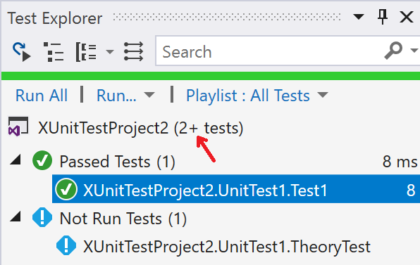

# Visual Studio Test Explorer FAQ

## Test Discovery

### 1. The Test Explorer is not discovering my tests that are dynamically defined. (For example, theories, custom adapters, custom traits, #ifdefs, etc.) How can I discover these tests?

  Build your project and make sure assembly-based discovery is turned on in **Tools > Options > Test**.

  [Real Time Test Discovery](https://go.microsoft.com/fwlink/?linkid=862824) is source-based test discovery. It can’t discover tests that use theories, custom adapters, custom traits, `#ifdef` statements, etc. because they are defined at runtime. A build is required for those tests to be accurately discovered. In the 15.6 Previews, assembly-based discovery (the traditional discoverer) runs only after builds. This setting means Real Time Test Discovery discovers as many tests as it can while you are editing, and assembly-based discovery allows dynamically defined tests to appear after a build. Real Time Test Discovery improves responsiveness, but stills allow you to get complete and accurate results after a build.

### 2. What does the '+' (plus) symbol that appears in the top line of Test Explorer mean?

  The '+' (plus) symbol indicates that more tests may be discovered after a build as long as assembly-based discovery is turned on. It appears if dynamically defined tests are detected in your project.

  

### 3. Assembly-based discovery is no longer working for my project. How do I turn it back on?

  Go to **Tools > Options > Test** and check the box for **Additionally discover tests from built assemblies after builds.**

  

### 4. Tests now appear in Test Explorer while I type, without having to build my project. What changed?

  This feature is called [Real Time Test Discovery](https://go.microsoft.com/fwlink/?linkid=862824). It uses a Roslyn analyzer to discover tests and populate Test Explorer in real time, without requiring you to build your project. For more information about test discovery behavior for dynamically defined tests such as theories or custom traits, see FAQ #1 .

### 5. What languages and test frameworks can use Real Time Test Discovery?

  [Real Time Test Discovery](https://go.microsoft.com/fwlink/?linkid=862824) only works for the managed languages (C# and Visual Basic), since it is built using the Roslyn compiler. For now, Real Time Test Discovery only works for the xUnit, NUnit, and MSTest frameworks.

### 6. How can I turn on logs for the Test Explorer?

  Navigate to **Tools > Options > Test** and find the Logging section there.

### 7. Why are my tests in UWP projects not discovered until I deploy my app?

  UWP tests target a different runtime when the app is deployed. This means that to discover tests accurately for UWP projects you not only need to build your project, but also deploy.

### 8. How does sorting test results work in the hierarchy view?

  The hierarchy view sorts tests alphabetically as opposed to by outcome. The other group by settings normally sort test results by outcome and then alphabetically. See the different group by options in the following image for comparison. You can provide feedback about the design [in this GitHub issue](https://github.com/Microsoft/vstest/issues/1425).

  

### 9. In the hierarchy view, there are passed, failed, skipped, and not run icons next to the Project, Namespace, and Class groupings. What do these icons mean?

  The icons next to the Project, Namespace, and Class groupings reflect the state of the tests within that grouping. See the following table.

  
  
### 10. There is no longer a "File Path" filter in the Test Explorer search box.

The file path filter in the **Test Explorer** search box was removed in Visual Studio 2017 version 15.7 preview 3. This feature had low usage, and the Test Explorer can retrieve test methods faster by excluding this feature. If this change interrupts your development flow, please let us know by submitting feedback on [developer community](https://developercommunity.visualstudio.com/).

## Features

### How can I turn on feature flags to try out new testing features?

Feature flags are used to ship experimental or unfinished parts of the product to avid users who would like to give feedback before the features ship officially. They may destabilize your IDE experience. Use them only in safe development environments, such as virtual machines. Feature flags are always use-at-your-own-risk settings. You can turn on experimental features with the [Feature Flags extension](https://marketplace.visualstudio.com/items?itemName=PaulHarrington.FeatureFlagsExtension), or through the developer command prompt.


To turn on a feature flag through the Visual Studio developer command prompt, use the following command. Change the path to where Visual Studio is installed on your machine, and change the registry key to the desired feature flag.

```shell
vsregedit set “C:\Program Files (x86)\Microsoft Visual Studio\Preview\Enterprise” HKLM FeatureFlags\TestingTools\UnitTesting\HierarchyView Value dword 1
```

> [!NOTE]
> You can turn off the flag with the same command, by using a value of 0 instead of 1 after dword.

## See also

- <xref:Microsoft.VisualStudio.TestTools.UnitTesting?displayProperty=fullName>
- [Creating and Running Unit Tests for Existing Code](http://msdn.microsoft.com/e8370b93-085b-41c9-8dec-655bd886f173)
- [Unit Test Your Code](unit-test-your-code.md)
- [Live Unit Testing FAQ](live-unit-testing-faq.md)
