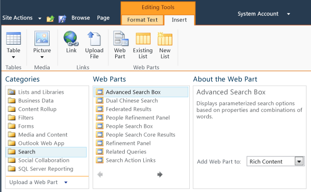

# Test SharePoint applications with Coded UI tests

Including coded UI tests in a SharePoint application lets you verify that the whole application, including its UI controls, is functioning correctly. Coded UI tests can also validate values and logic in the user interface.

To learn more about the benefits of using coded UI tests, see [Use UI automation to test your code](../test/use-ui-automation-to-test-your-code.md).

**Requirements**

- Visual Studio Enterprise

## Create a coded UI test for a SharePoint app

[Creating coded UI tests](../test/use-ui-automation-to-test-your-code.md) for your SharePoint applications is the same as creating tests for other types of applications. Record and playback is supported for all controls on the Web Editing interface. The interface for selecting categories and web parts are all standard web controls.



> [!NOTE]
> If you are recording action, validate the actions before you generate code. Since there are several behaviors associated with mouse hover, it is on by default. Be careful to remove redundant hovers from your coded UI tests. You can do this by editing the code for the test, or by using the [Coded UI Test Editor](../test/editing-coded-ui-tests-using-the-coded-ui-test-editor.md).

## Test Office controls within a SharePoint app

To enable automation for some office web parts in your SharePoint app, you have to make some minor code modifications.

> [!NOTE]
> Testing Visio and PowerPoint controls in a SharePoint application is not supported.

### Excel cell controls

To include Excel cell controls, you must make some changes in the coded UI test's code.

> [!WARNING]
> Entering text in any Excel cell, followed by an arrow key action, does not record correctly. Use the mouse to select cells.

If you are recording actions on an empty cell, you must modify the code by double clicking on the cell and then performing a set text operation. This is needed because a click on the cell followed by any keyboard action activates the `textarea` within the cell. Simply recording a `setvalue` on the empty cell would search for the `editbox` which is not present until the cell has been clicked. For example:

```csharp
Mouse.DoubliClick(uiItemCell,new Point(31,14));
uiGridKeyboardInputEdit.Text=value;
```

If you are recording actions on a non-empty cell, then recording gets a little more complicated, because the moment you add text to a cell, a new \<div> control is added as a child of the cell. The new \<div> control contains the text that you just entered. The recorder needs to record actions on the new \<div> control; however, it can't because the new \<div> control does not exist until after the test is entered. You must manually make the following code changes to accommodate this issue.

1. Go to cell initialization and make `RowIndex` and `ColumnIndex` primary properties:

    ```csharp
    this.mUIItemCell.SearchProperties[HtmlCell.PropertyNames. RowIndex] = "3";
    this.mUIItemCell.SearchProperties[HtmlCell.PropertyNames. ColumnIndex] = "3";
    ```

2. Find the `HtmlDiv` child of the cell:

    ```csharp
    private UITestControl getControlToDoubleClick(HtmlCell cell)
    {
         if (String.IsNullOrEmpty(cell.InnerText)) return cell;
         HtmlDiv pane = new HtmlDiv(cell);
         pane.FilterProperties[HtmlDiv.PropertyNames.InnerText] = cell.InnerText;
         // Class is an important property in finding pane
         pane.FilterProperties[HtmlDiv.PropertyNames.Class] = "cv-nwr";
         UITestControlCollection panes = pane.FindMatchingControls();
         return panes[0];
    }
    ```

3. Add code for a mouse double-click action on `HtmlDiv`:

    ```csharp
    Mouse.DoubleClick(uIItemPane, new Point(31, 14)); )
    ```

4. Add code to set text on `TextArea`:

    ```csharp
    uIGridKeyboardInputEdit.Text = value; }
    ``

## See also

- [Use UI Automation To Test Your Code](../test/use-ui-automation-to-test-your-code.md)
- [Create SharePoint Solutions](/office-dev/office-dev/create-sharepoint-solutions)
- [Verifying and Debugging SharePoint Code](/office-dev/office-dev/verifying-and-debugging-sharepoint-code)
- [Building and Debugging SharePoint Solutions](/office-dev/office-dev/building-and-debugging-sharepoint-solutions)
- [Profiling the Performance of SharePoint Applications](/office-dev/office-dev/profiling-the-performance-of-sharepoint-applications)
