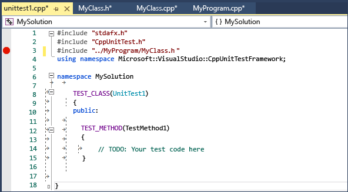
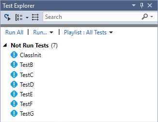

# Writing unit tests for C/C++
Visual Studio supports unit tests for C++ code using any of these frameworks:
 -  Microsoft Unit Testing Framework for C++
 -  Google Test
 -  Boost.Test
 -  CTest  

For Boost.Test support, download the extension on the Visual Studio Marketplace at [Test Adapter for Boost.Test](https://marketplace.visualstudio.com/items?itemName=VisualCPPTeam.TestAdapterforBoostTest). When the adapter is installed, you will see it in the list shown above. Additional third-party adapters for other C++ test frameworks are available on the Visual Studio marketplace.

CTest support is installed along with the CMake Tools for Visual Studio component which is part of the C++ Desktop Workload. 

In addition, you can write your own test adapter for whatever framework you would like to use within Visual Studio. For more information about installing third-party unit test frameworks, see [Install third-party unit test frameworks](install-third-party-unit-test-frameworks)
  
The following procedure shows the basic steps to get you started. It uses the Microsoft Unit Testing Framework but the basic workflow is the same for Google.Test, Boost.Test and any other framework that is implemented via a test adapter. Since CMake is supported through the Open Folder environment, there is no Visual Studio test project for it. You can run CTest tests from the CMake menu, but full IDE integration with **Test Explorer** is not yet available. 
  
## Create a test project
You define an run tests inside one or more test projects that are in the same solution as the code you want to test. To add a new test project to an existing solution, right-click on the Solution node in **Solution Explorer** and choose **Add | New Project**. Then in the left pane choose *Visual C++ Test** and choose one of the project types from the center pane. The following illustration shows the test projects that are available by default when the C++ Desktop Workload is installed:


## Create references to other projects in the solution
To enable your test code to access the functions in the project to be tested, add a reference to the project in your test project. Right- click on the test project node in **Solution Explorer** and choose **Add | Reference**. Then in the dialog choose the project(s) you want to test.


## Add #include directives for header files
Next, in your unit test .cpp file, add an `#include` directive for any header files that declare the types and functions you want to test. For a typical solution, type `#include "../` and then Intellisense will activate to help you choose. Repeat for any additional headers.


## Write test methods
The .cpp file in your test project (by default named unittest1.cpp) has a stub class and method defined for you as an example of how to write test code. Note that the signatures use the TEST_CLASS and TEST_METHOD macros, which make the methods discoverable from the Test Explorer window.



TEST_CLASS and TEST_METHOD are part of the Microsoft Native Test Framework. For more information and documentation on all the available macros and functions, see [Using Microsoft.VisualStudio.TestTools.CppUnitTestFramework](using-microsoft-visualstudio-testtools-cppunittestframework.md).

A TEST_METHOD returns void. To produce a test result, use the static methods in the Assert class to test actual results against what is expected. In the following example, assume `MyClass` has a constructor that that takes a `std::string`, and also defines a public function named `GetName` which returns the string that was used to initialize the class. We can test that the class was initialized as expected like so:

```cpp
		TEST_METHOD(TestClassInitialization)
		{
			std::string name = "Bill";
			MyClass mc(name);
			Assert::AreEqual(name, mc.GetName());
		}
```
In the previous example, the result of the `Assert::AreEqual` call determines whether the test passes or fails. The Assert class contains many other methods for comparing expected vs. actual results.


## Run the tests  
  
1.  On the **Test** menu, choose **Windows**, **Test Explorer**. The following illustration shows a test project whose tests have not yet run. 



2. If all your tests are not visible in the window, build the test project by right-clicking its node in **Solution Explorer** and choosing **Build** or **Rebuild**.
  
3.  In Test Explorer, choose **Run All**, or select the specific tests you want to run. Right-click on a test for other options, including running it in debug mode with breakpoints enabled.

After running all the tests, the window looks something like this:


For more information, see [Run unit tests with Test Explorer](run-unit-tests-with-test-explorer.md).

## See Also
[Unit Testing Existing C++ Applications](unit-testing-existing-cpp-applications.md)
