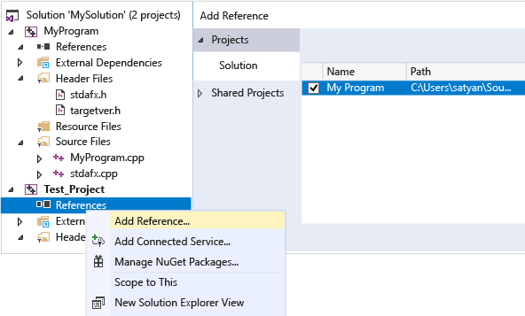
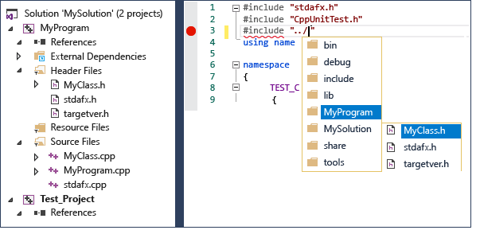
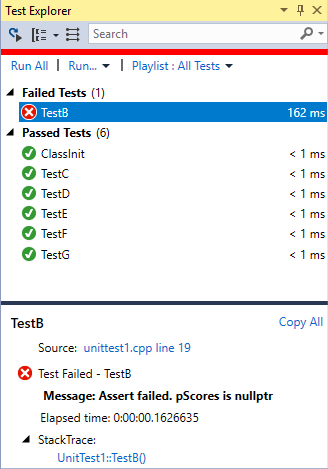

# Writing unit tests for C/C++
Visual Studio supports unit testing for C++ code using these frameworks:
 -  Microsoft Unit Testing Framework for C++
 -  Google Test
 -  Boost.Test (Visual Studio extension)
 -  CTest  

In addition, you can write your own test adapter for whatever framework you would like to use within Visual Studio. Several third-party adapters are available on the [Visual Studio Marketplace](https://marketplace.visualstudio.com). For more information, see [Install third-party unit test frameworks](install-third-party-unit-test-frameworks).

For Boost.Test integration, download the extension on the Visual Studio Marketplace at [Test Adapter for Boost.Test](https://marketplace.visualstudio.com/items?itemName=VisualCPPTeam.TestAdapterforBoostTest). 

The Microsoft and Google frameworks are included in the C++ Desktop workload. CTest support is included with the [CMake Tools for Visual Studio](/cpp/ide/cmake-tools-for-visual-cpp) component which is part of the C++ Desktop Workload. 
  
## Basic test workflow
The following sections show the basic steps to get you started with the Microsoft Unit Testing Framework. The workflow is similar for any other framework that is implemented via a test adapter, with some differences in configuration and test code syntax. 

> [!NOTE] 
> Since CMake is supported through the [Open Folder](/cpp/non-msbuild-projects) environment, there is no Visual Studio test project for CTest.
  
### Create a test project
You define and run tests inside one or more test projects that are in the same solution as the code you want to test. To add a new test project to an existing solution, right-click on the Solution node in **Solution Explorer** and choose **Add | New Project**. Then in the left pane choose *Visual C++ Test** and choose one of the project types from the center pane. The following illustration shows the test projects that are available by default when the C++ Desktop Workload is installed:


### Create references to other projects in the solution
To enable your test code to access the functions in the project to be tested, add a reference to the project in your test project. Right- click on the test project node in **Solution Explorer** and choose **Add | Reference**. Then in the dialog choose the project(s) you want to test. 
Google.Test might require additional configuration, see []() for more information.



### Add #include directives for header files
Next, in your unit test .cpp file, add an `#include` directive for any header files that declare the types and functions you want to test. For a typical solution, type `#include "../` and then Intellisense will activate to help you choose. Repeat for any additional headers.



### Write test methods
> [!NOTE] 
> This section shows syntax for the Microsoft Unit Testing Framework for C/C++. Google.Test, Boost.Test and other frameworks each have their own syntax.

The .cpp file in your test project (by default named unittest1.cpp) has a stub class and method defined for you as an example of how to write test code. Note that the signatures use the TEST_CLASS and TEST_METHOD macros, which make the methods discoverable from the Test Explorer window.


TEST_CLASS and TEST_METHOD are part of the Microsoft Native Test Framework. For more information and documentation on all the available macros and functions, see [Using Microsoft.VisualStudio.TestTools.CppUnitTestFramework](using-microsoft-visualstudio-testtools-cppunittestframework.md).

A TEST_METHOD returns void. To produce a test result, use the static methods in the Assert class to test actual results against what is expected. In the following example, assume `md_utils` has a public method that that takes a `std::string` and returns a result. We can test that the function works as expected like so:

```cpp
		TEST_METHOD(get_class_name)
		{
			string s = "    title: \"CWnd Class | Microsoft Docs\"";
			md_utils mdu;
			auto result = mdu.get_class_name(s);
			Assert::AreEqual(string("CWnd"), result);
		}
```
In the previous example, the result of the `Assert::AreEqual` call determines whether the test passes or fails. The Assert class contains many other methods for comparing expected vs. actual results. 

You can add *traits* to test methods to specify test owners, priority and other information. For more information, see [Run unit tests with Test Explorer](run-unit-tests-with-test-explorer.md).


### Run the tests  
  
1.  On the **Test** menu, choose **Windows**, **Test Explorer**. The following illustration shows a test project whose tests have not yet run. 


> [!NOTE]
> CTest integration with **Test Explorer** is not yet available. Run CTest tests from the CMake main menu.

2. If all your tests are not visible in the window, build the test project by right-clicking its node in **Solution Explorer** and choosing **Build** or **Rebuild**.
  
3.  In Test Explorer, choose **Run All**, or select the specific tests you want to run. Right-click on a test for other options, including running it in debug mode with breakpoints enabled. After running all the tests, the window looks something like this:



It looks like something changed that caused the get_class_name test method to fail. The message offers details that help to diagnose the cause. If necessary, we could right-click on the failing test and choose **Debug Selected Tests** to step through the `md_utils::get_class_name` function. 

For more information about using **Test Explorer**, see [Run unit tests with Test Explorer](run-unit-tests-with-test-explorer.md).

## See Also
[Using the Microsoft Unit Testing Framework for C/C++](unit-testing-existing-cpp-applications.md)

